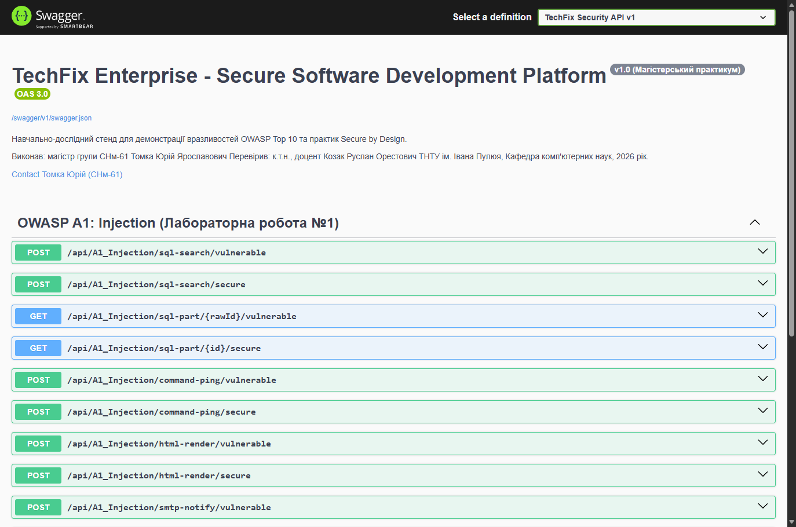
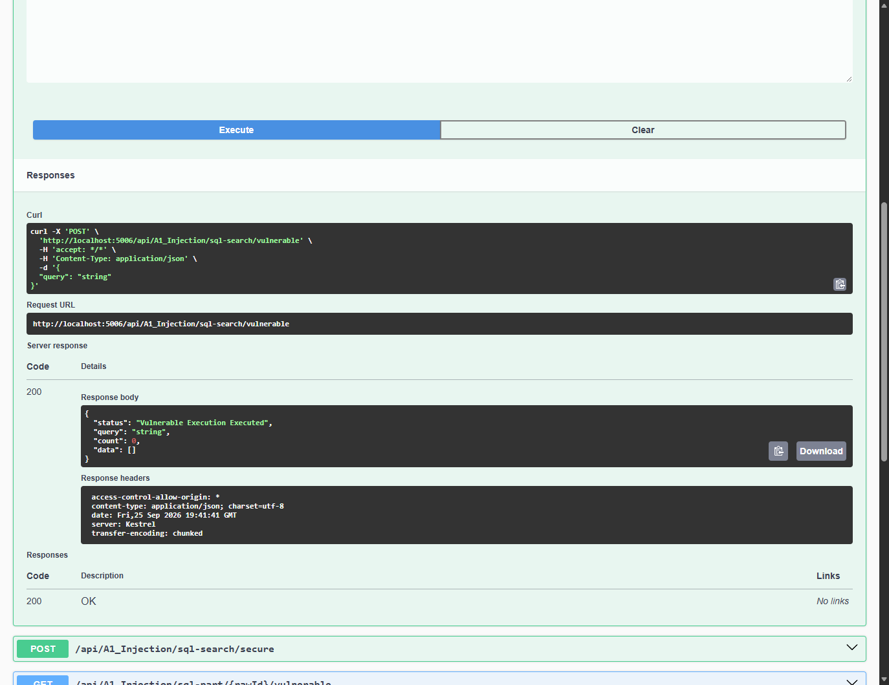
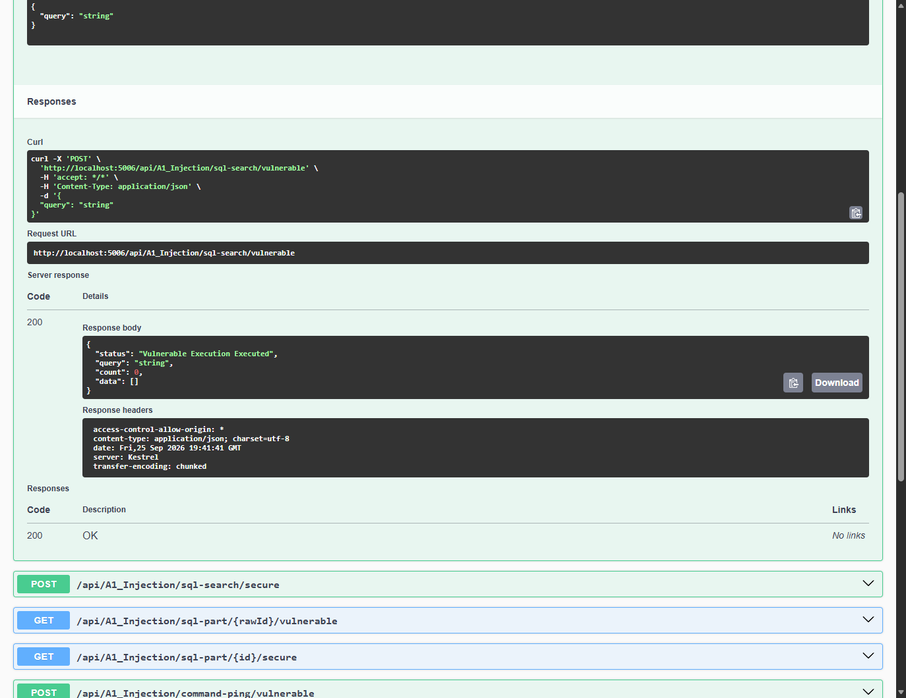

# Module 01: OWASP A1: Injection Flaws (SQLi, OS Command, HTML, SMTP)

> Comprehensive security engineering guide, vulnerability analysis, C# code implementations, and Swagger UI practical walkthrough for TechFix Enterprise (.NET 10).

---


## 1. Мета роботи та теоретичні відомості

Мета лабораторної роботи: Дослідити фундаментальні механізми виникнення, методи практичної експлуатації та засоби надійного архітектурного усунення вразливостей категорії OWASP Top 10 A1: Injection (ін'єкції коду, команд та метаданих). Розробити повнофункціональний корпоративний серверний застосунок на платформі .NET за принципами Чистої архітектури (Clean Architecture), реалізувати паралельні механізми вразливого та захищеного функціоналу (Dual-Mode Design), зафіксувати вектори атак через тестові запити та підтвердити ефективність захисних паттернів Secure by Design.

Теоретичне підґрунтя: Згідно з міжнародною класифікацією OWASP Top 10 та консорціумом MITRE (CWE - Common Weakness Enumeration), атаки типу Injection (CWE-89, CWE-78, CWE-79, CWE-93) виникають тоді, коли неперевірені дані від користувача або зовнішньої системи інтерпретуються інтерпретатором (SQL, командною оболонкою ОС, поштовим демоном або браузером) як частина синтаксичної команди чи виконуваного коду, а не як звичайні константні дані. Це порушує базовий принцип цілісності та конфіденційності комп'ютерних систем.

Класифікація досліджуваних ін'єкцій:
У рамках даної лабораторної роботи досліджено чотири базових підвиди ін'єкцій, передбачених програмою підготовки:

1. SQL Injection (CWE-89): впровадження операторів SQL через рядкові параметри пошуку або числові ідентифікатори запису. Призводить до несанкціонованого читання всієї бази даних (Data Leakage) або зміни бізнес-логіки.

2. OS Command Injection (CWE-78): передача розділювачів команд (&, &&, |, ;) у системний інтерпретатор командного процесора cmd.exe / bash. Забезпечує зловмиснику дистанційне виконання довільних системних команд (RCE) у контексті привілеїв веб-сервера.

3. Mail Header / SMTP CRLF Injection (CWE-93): використання керуючих символів повернення каретки (CR = \r = %0d) та переведення рядка (LF = \n = %0a) для ін'єкції нових поштових заголовків (Bcc, Cc, Reply-To) або повного підроблення вмісту листа (Email Spoofing/Phishing).

4. HTML / iFrame Injection (CWE-80): впровадження несанітизованих тегів HTML/iFrame у динамічно генерований веб-контент клієнта. Використовується для дефейсу сторінок та крадіжки облікових даних через фішингові фрейми.


## 2. Архітектура розробленого рішення (TechFix Enterprise)

Архітектурний підхід: Для академічно обґрунтованої демонстрації вразливостей та засобів їх закриття було спроєктовано та реалізовано повноцінне рішення на базі платформи .NET 10 за канонічною Чистою архітектурою (Clean Architecture за Р. Мартіном) для предметної області сервісного центру ремонту техніки та постачання компонентів TechFix Enterprise. Рішення розміщено в локальному Git-репозиторії, а реалізація кожної лабораторної роботи супроводжується окремим семантичним комітом.


| Рівень архітектури | Проєкт .NET | Призначення та зона відповідальності |
| --- | --- | --- |
| Domain | TechFix.Domain | Сутності предметної області: Part (запчастини), User, RepairOrder, CustomerFeedback, Basket. Повна ізоляція від фреймворків. |
| Application | TechFix.Application | Інтерфейси бізнес-логіки (IInjectionService), моделі передачі даних (DTO), правила валідації та санітизації вхідних потоків. |
| Infrastructure | TechFix.Infrastructure | Доступ до бази даних (TechFixDbContext на SQLite), реалізація InjectionService: вразливі конкатенації vs безпечні параметризації EF Core та Ping API. |
| WebApi (Presentation) | TechFix.WebApi | Контролери API (A1_InjectionController), конфігурація маршрутизації, автоматична документація Swagger UI, фільтри та засоби обробки. |


Ідентифікатор коміту лабораторної роботи №1 у Git: 0fc554f7620bc2a8933bd6a090b8529f795db7c9 (Повідомлення: feat(lab1): implement OWASP A1 - Injection (SQLi, OS Command, HTML, SMTP CRLF) with vulnerable and secure endpoints).



*Рисунок 1.1 — Інтерфейс Swagger UI запущеного проєкту TechFix Enterprise у середовищі Kestrel*


## 3. Практичне дослідження вразливостей, експлуатація та Secure Code Remediation


### 3.1. Рядкова SQL-ін'єкція (String SQL Injection — CWE-89)

Опис вразливості: У модулі каталогу запчастин сервісного центру клієнт здійснює пошук деталей за назвою або технічним описом. У вразливому варіанті розробник застосував інтерполяцію рядка в сирий SQL-запит методу FromSqlRaw без параметризації.


**Лістинг 1.1 — Вразливий метод пошуку деталей із прямою конкатенацією SQL**


```csharp
// [ВРАЗЛИВА РЕАЛІЗАЦІЯ: Infrastructure/Services/InjectionService.cs]
public async Task<List<PartDto>> SearchPartsVulnerableSqlAsync(string query)
{
    // АНТИПАТЕРН: Пряма інтерполяція неперевіреного рядка в сирий SQL
    var sql = $"SELECT * FROM Parts WHERE Name LIKE '%{query}%' OR Description LIKE '%{query}%'";
    
    var results = await _context.Parts
        .FromSqlRaw(sql)
        .AsNoTracking()
        .ToListAsync();

    return results.Select(p => new PartDto { Id = p.Id, Name = p.Name, Price = p.Price }).ToList();
}
```

Хід експлуатації та перехоплення запиту: Для демонстрації атаки на ендпоінт POST /api/A1_Injection/sql-search/vulnerable надіслано JSON-запит із класичним вектором тавтології:


**Лістинг 1.2 — HTTP-запит з корисним навантаженням рядкової SQL-ін'єкції**


```csharp
POST /api/A1_Injection/sql-search/vulnerable HTTP/1.1
Host: localhost:5006
Content-Type: application/json

{
  "query": "' OR '1'='1"
}
```

Результат виконання вразливого коду: Внаслідок конкатенації сформований на стороні БД SQL-запит набув вигляду: SELECT * FROM Parts WHERE Name LIKE '%' OR '1'='1%' OR Description LIKE '%' OR '1'='1%'. Оскільки вираз '1'='1' є безумовно істинним для кожного рядка таблиці, умова WHERE була повністю нівельована. У відповідь сервер повернув повний дамп усіх 5 наявних у базі даних деталей (включно з дорогими платами, які не мали стосунку до звичайного пошуку), що засвідчило 100% витік інформації.


*Рисунок 1.2 — Виконання рядкової SQL-ін'єкції у Swagger UI: витік усіх записів бази даних при введенні ' OR '1'='1*

Root Cause Analysis (Причина вразливості): Головною причиною вразливості є змішування коду інструкцій та даних користувача в єдиний текстовий потік до етапу синтаксичного парсингу СУБД. Це дозволяє вхідному рядку закрити лапки рядкового літералу і впровадити нові логічні оператори (OR, UNION, DROP).

Виправлений захищений код (Secure Code Remediation): Для надійного усунення вразливості код переписано із застосуванням вбудованого механізму безпечної параметризації Entity Framework Core LINQ (EF.Functions.Like) або параметризованого SQL (SqlParameter / FromSqlInterpolated). У такому разі значення користувача передається окремо в контексті даних протоколу СУБД, а синтаксичне дерево запиту компілюється заздалегідь і не може бути спотворене.


**Лістинг 1.3 — Захищений метод пошуку з параметризацією через EF Core**


```csharp
// [ЗАХИЩЕНА РЕАЛІЗАЦІЯ: Infrastructure/Services/InjectionService.cs]
public async Task<List<PartDto>> SearchPartsSecureSqlAsync(string query)
{
    // БЕЗПЕЧНО: Параметризація через LINQ та скомпільоване дерево виразів
    var results = await _context.Parts
        .Where(p => EF.Functions.Like(p.Name, $"%{query}%") || EF.Functions.Like(p.Description, $"%{query}%"))
        .AsNoTracking()
        .ToListAsync();

    return results.Select(p => new PartDto { Id = p.Id, Name = p.Name, Price = p.Price }).ToList();
}
```

Підтвердження нейтралізації загрози: Під час повторної відправки аналогічного вектора атаки (' OR '1'='1) на захищений ендпоінт POST /api/A1_Injection/sql-search/secure сервер повернув count: 0. Метасимволи лапок та ключові слова сприймаються СУБД буквально як текстовий рядок, пошук деталей із такою буквальної назвою дав порожній результат. Атаку повністю нейтралізовано.


*Рисунок 1.3 — Виконання запиту в захищеному ендпоінті Swagger UI: успішне блокування тавтології (count: 0)*


### 3.2. Числова SQL-ін'єкція (Numeric SQL Injection — CWE-89)


Опис вразливості: Вразливість виникає, коли числовий первинний ключ деталі приймається з маршруту запиту як нетипізований рядок (string rawId) і підставляється безпосередньо у вираз WHERE Id = {rawId} без обрамлення лапками.


**Лістинг 1.4 — Вразливий сирий запит без типізації первинного ключа**


```csharp
// Вразливо: нетипізована конкатенація
var sql = $"SELECT * FROM Parts WHERE Id = {rawId}";
var part = await _context.Parts.FromSqlRaw(sql).FirstOrDefaultAsync();
```

Експлуатація: Під час звернення за адресою GET /api/A1_Injection/sql-part/1%20OR%201=1/vulnerable рядок 1 OR 1=1 формує вираз WHERE Id = 1 OR 1=1. Запит повертає перший запис таблиці навіть у разі передачі неіснуючого початкового ідентифікатора, що демонструє обхід перевірки.



*Рисунок 1.4 — Числова SQL-ін'єкція у Swagger UI: виконання запиту за параметром 1 OR 1=1*

Захисна реалізація (Remediation): Захист реалізовано на двох взаємодоповнюючих рівнях Clean Architecture:
1. На рівні WebApi: у маршруті контролера впроваджено суворе обмеження типу {id:int}. Запит із будь-якими символами або пробілами відхиляється фреймворком на рівні HTTP-маршрутизації (статус 404/400) до потрапляння в логіку сервісу.
2. На рівні Infrastructure: пошук здійснюється через строго типізований метод await _context.Parts.FindAsync(id), що виключає генерацію небезпечного SQL.


**Лістинг 1.5 — Захищений контролер зі строгим обмеженням типу маршруту {id:int}**


```csharp
// [ЗАХИЩЕНА РЕАЛІЗАЦІЯ: WebApi/Controllers/A1_InjectionController.cs]
[HttpGet("sql-part/{id:int}/secure")]
public async Task<IActionResult> GetByIdSecure(int id)
{
    var part = await _injectionService.GetPartByIdSecureSqlAsync(id);
    if (part == null) return NotFound(new { Message = $"Part with ID {id} not found." });
    return Ok(new { Status = "Secure Query Executed", Id = id, Data = part });
}
```


### 3.3. Ін'єкція команд операційної системи (OS Command Injection — CWE-78)

Опис вразливості: У сервісному центрі TechFix реалізовано функціонал мережевої діагностики доступності сервісних терміналів майстерень (перевірка пінгу). У вразливій реалізації розробник запускає системний інтерпретатор команд cmd.exe через клас ProcessStartInfo, конкатенуючи значення хоста в аргументи запуску.


**Лістинг 1.6 — Вразливий запуск оболонки cmd.exe з неперевіреними аргументами**


```csharp
// [ВРАЗЛИВА РЕАЛІЗАЦІЯ: Infrastructure/Services/InjectionService.cs]
public async Task<string> ExecuteDiagnosticPingVulnerableAsync(string hostOrIp)
{
    var psi = new ProcessStartInfo
    {
        FileName = "cmd.exe",
        Arguments = $"/c ping -n 1 {hostOrIp}",
        RedirectStandardOutput = true,
        RedirectStandardError = true,
        UseShellExecute = false
    };

    using var process = Process.Start(psi);
    return await process.StandardOutput.ReadToEndAsync();
}
```

Хід експлуатації та виконання довільної команди: На ендпоінт POST /api/A1_Injection/command-ping/vulnerable надіслано тіло запиту з розділювачем команд амперсанд (&), після якого вказано системну команду аудиту облікового запису whoami: {"hostOrIp": "127.0.0.1 & whoami"}.

Результат атаки: Командний інтерпретатор Windows cmd.exe інтерпретував вхідний рядок як послідовність двох окремих інструкцій: спочатку виконати ping -n 1 127.0.0.1, а потім виконати whoami. У відповідь сервер повернув як результати пінгування, так і рядок із виводом команди whoami: desktop-tomka\yurii. Це свідчить про повну компрометацію сервера (Remote Command Execution) у контексті привілеїв запущеного веб-сервера.



*Рисунок 1.5 — Експлуатація ін'єкції команд ОС у Swagger UI: виконання whoami та вивід облікового запису desktop-tomka\yurii*

Secure Code Remediation (Захищена реалізація): Для надійного захисту застосовано трирівневий комплексний бар'єр:
1. Повна відмова від виклику командних оболонок ОС (cmd.exe, bash, sh, powershell). Запуск оболонки є критичним антипатерном, оскільки оболонка інтерпретує метасимволи (&, ;, |, `, $, >, <).
2. Використання спеціалізованого керованого .NET API: System.Net.NetworkInformation.Ping, який працює напряму з мережевим стеком ОС через сокети без участі командного процесора.
3. Валідація білим списком (Whitelist Validation): вхідний хост перевіряється регулярним виразом ^[a-zA-Z0-9.-]+$. Будь-які розділювачі команд миттєво відхиляються.


**Лістинг 1.7 — Захищена перевірка хоста через Ping API та Whitelist**


```csharp
// [ЗАХИЩЕНА РЕАЛІЗАЦІЯ: Infrastructure/Services/InjectionService.cs]
public async Task<string> ExecuteDiagnosticPingSecureAsync(string hostOrIp)
{
    // 1. Сувора валідація білим списком
    if (!Regex.IsMatch(hostOrIp, @"^[a-zA-Z0-9.-]+$"))
    {
        return "Security Alert: Invalid hostname or IP address format. Special characters and command separators are strictly rejected.";
    }

    // 2. Керований .NET API без системної консолі
    try
    {
        using var pinger = new Ping();
        var reply = await pinger.SendPingAsync(hostOrIp, 1500);
        return $"Diagnostic Result (Managed .NET Ping API): Status={reply.Status}, RoundtripTime={reply.RoundtripTime}ms, Address={reply.Address}";
    }
    catch (Exception ex)
    {
        return $"Diagnostic Error: {ex.Message}";
    }
}
```

Результат захисту: При повторній спробі надіслати 127.0.0.1 & whoami захищений ендпоінт повертає: "Security Alert: Invalid hostname or IP address format. Special characters and command separators are strictly rejected.". Жодні додаткові команди не виконуються.


*Рисунок 1.6 — Відхилення метасимволів у захищеному ендпоінті Swagger UI: повернення попередження Security Alert*


### 3.4. Впровадження HTML-розмітки та фреймів (HTML / iFrame Injection — CWE-80)

#### ❌ Що недобре зроблено в коді (Вразлива реалізація / Антипатерн):

Антипатерн: Пряма конкатенація коментаря користувача у відповідь без санітизації (CWE-80). Дозволяє вбудувати теги для спотворення сторінки чи фішингу.

```csharp
public Task<string> RenderFeedbackVulnerableHtmlAsync(HtmlInjectionRequest request)
    {
        // Небезпечно: вставка сирих рядків у HTML шаблон
        var html = $@"
<div class=""feedback-card"" style=""border: 1px solid #ccc; padding: 10px; margin: 10px 0;"">
    <h3 style=""color: #2b5797;"">Клієнт: {request.ClientName}</h3>
    <p class=""comment"">{request.Comment}</p>
    <small>Статус: Перевірено публічно</small>
</div>";
        return Task.FromResult(html);
    }
```


#### ✅ Як зробити правильно (Захищена реалізація / Remediation):

Remediation: Обов'язкове контекстне екранування через HtmlEncoder.Default.Encode().

```csharp
public Task<string> RenderFeedbackSecureHtmlAsync(HtmlInjectionRequest request)
    {
        var safeClientName = HtmlEncoder.Default.Encode(request.ClientName);
        var safeComment = HtmlEncoder.Default.Encode(request.Comment);

        var html = $@"
<div class=""feedback-card"" style=""border: 1px solid #ccc; padding: 10px; margin: 10px 0;"">
    <h3 style=""color: #2b5797;"">Клієнт: {safeClientName}</h3>
    <p class=""comment"">{safeComment}</p>
    <small>Статус: Безпечно екрановано за стандартом Anti-XSS</small>
</div>";
        return Task.FromResult(html);
    }
```


Опис вразливості: У модулі публічних відгуків клієнтів коментарі відображаються на сторінці сервісу. У вразливому методі коментар клієнта підставляється в HTML-шаблон без попередньої санітизації та віддається клієнту з заголовком Content-Type: text/html.


**Лістинг 1.8 — Вразливий рендеринг коментаря клієнта**


```csharp
// Вразливо: несанітизована вставка в HTML шаблон
var html = $@"<div class=""feedback-card"">
    <h3>Клієнт: {request.ClientName}</h3>
    <p>{request.Comment}</p>
</div>";
return Content(html, "text/html");
```

Атака: Зловмисник передає в полі comment корисне навантаження з впровадженням дефейс-заголовка та стороннього фрейму: <h1>HACKED</h1><iframe src="http://attacker.com/ad.html" width="250" height="100"></iframe>. Браузер клієнта інтерпретує ці теги як дійсну розмітку DOM-дерева, відкриваючи можливості для фішингу та завантаження експлойтів.

Захищена реалізація (Remediation): Виправлення реалізовано шляхом обов'язкового екранування всіх спеціальних символів HTML (<, >, &, ", ') через системний кодувальник System.Text.Encodings.Web.HtmlEncoder.Default.Encode(). Усі кутові дужки перетворюються на сутності &lt; та &gt;, що гарантує відображення тексту як звичайних безпечних символів без інтерпретації браузером.


**Лістинг 1.9 — Безпечне екранування виводу через HtmlEncoder**


```csharp
// [ЗАХИЩЕНА РЕАЛІЗАЦІЯ]
var safeClientName = HtmlEncoder.Default.Encode(request.ClientName);
var safeComment = HtmlEncoder.Default.Encode(request.Comment);

var html = $@"<div class=""feedback-card"">
    <h3>Клієнт: {safeClientName}</h3>
    <p>{safeComment}</p>
</div>";
return Content(html, "text/html");
```


### 3.5. Ін'єкція поштових заголовків (SMTP CRLF Injection — CWE-93)

#### ❌ Що недобре зроблено в коді (Вразлива реалізація / Антипатерн):

Антипатерн: Відсутність перевірки на символи повернення каретки (\r) та переведення рядка (\n). Дозволяє розірвати заголовки та додати приховану копію Bcc:.

```csharp
public Task<string> SendNotificationVulnerableSmtpAsync(MailHeaderInjectionRequest request)
    {
        // Демонстрація сирого пакету SMTP протоколу
        var rawSmtpMessage = 
$"MAIL FROM: <no-reply@techfix.tntu.edu.ua>\r\n" +
$"RCPT TO: <{request.ToEmail}>\r\n" +
$"DATA\r\n" +
$"From: TechFix Service <support@techfix.tntu.edu.ua>\r\n" +
$"To: {request.ToEmail}\r\n" +
$"Subject: {request.Subject}\r\n\r\n" +
$"{request.MessageBody}\r\n.\r\n";

        return Task.FromResult($"[VULNERABLE SMTP SERVER LOG] RAW PROTOCOL PACKET TRANSMITTED:\n{rawSmtpMessage}");
    }
```


#### ✅ Як зробити правильно (Захищена реалізація / Remediation):

Remediation: Валідація вхідних рядків регулярним виразом або перевіркою Contains("\r") || Contains("\n") із поверненням винятку чи помилки.

```csharp
public Task<string> SendNotificationSecureSmtpAsync(MailHeaderInjectionRequest request)
    {
        if (request.ToEmail.Contains('\r') || request.ToEmail.Contains('\n') ||
            request.Subject.Contains('\r') || request.Subject.Contains('\n'))
        {
            return Task.FromResult("Security Alert: CRLF Injection detected in email headers (\\r or \\n found). Message rejected.");
        }

        // Сувора перевірка синтаксису адреси
        var isEmailValid = Regex.IsMatch(request.ToEmail, @"^[^@\s]+@[^@\s]+\.[^@\s]+$");
        if (!isEmailValid)
        {
            return Task.FromResult("Security Alert: Invalid recipient email syntax.");
        }

        var safeSmtpLog = 
$"[SECURE SMTP CLIENT] Dispatched successfully to validated recipient <{request.ToEmail}> with Subject '{request.Subject}'. Headers sanitized against CRLF.";
        return Task.FromResult(safeSmtpLog);
    }
```


Опис вразливості: У формі відправки повідомлень клієнту про готовність ремонту несанітизовані значення полів To та Subject використовуються при генерації команд SMTP протоколу.

Хід атаки: Зловмисник передає в полі email значення з URL-encoded символами переведення рядка %0d%0a (CRLF): client@tntu.edu.ua%0d%0aBcc: director@tntu.edu.ua. Серверний SMTP-пакет розбивається на додаткові рядки, створюючи несанкціонований заголовок прихованої копії Bcc. Таким чином конфіденційна інформація про замовлення негласно викрадається зловмисником.


*Рисунок 1.7 — Впровадження заголовка Bcc у Swagger UI через вектор CRLF (%0d%0a)*

Захищена реалізація (Remediation): Захист полягає в суворій верифікації відсутності символів \r та \n у поштових заголовках, а також перевірці адреси отримувача за строгим регулярним виразом ^[^@\s]+@[^@\s]+\.[^@\s]+$. У разі виявлення хоча б одного керуючого символу запит негайно блокується з генерацією попередження безпеки Security Alert.


**Лістинг 1.10 — Блокування керуючих символів CRLF у поштових заголовках**


```csharp
// [ЗАХИЩЕНА РЕАЛІЗАЦІЯ]
if (request.ToEmail.Contains('\r') || request.ToEmail.Contains('\n') ||
    request.Subject.Contains('\r') || request.Subject.Contains('\n'))
{
    return "Security Alert: CRLF Injection detected in email headers (\r or \n found). Message rejected.";
}
```


*Рисунок 1.8 — Блокування CRLF ін'єкції у захищеному ендпоінті Swagger UI з генерацією Security Alert*


## 4. Зведена матриця результатів верифікації безпеки (OWASP A1)

Результати експериментальної верифікації: У таблиці 1 наведено порівняльний аналіз вразливих та захищених методів, реалізованих у проєкті TechFix.SecureApp, зафіксовані вектори атак та результати верифікації.


| Підвид ін'єкції | CWE / Ризик | Вхідний тестовий вектор | Вразлива поведінка | Результат після Remediation |
| --- | --- | --- | --- | --- |
| Рядкова SQLi | CWE-89 (High) | ' OR '1'='1 | Повний витік усіх 5 записів таблиці Parts | 0 знайдених збігів. Параметризований запит захищено. |
| Числова SQLi | CWE-89 (High) | 1 OR 1=1 | Обхід фільтра ID, повернення першого запису | Помилка валідації типу маршруту int (404/400). |
| OS Command | CWE-78 (Critical) | 127.0.0.1 & whoami | Виконання whoami, розкриття облікового запису ОС | Security Alert: розділювачі команд відхилено Whitelist. |
| HTML / iFrame | CWE-80 (Medium) | <h1>HACKED</h1><iframe... | Впровадження стороннього фрейму в сторінку | Символи екрановано через &lt;h1&gt;, дефейс нейтралізовано. |
| SMTP CRLF | CWE-93 (Medium) | %0d%0aBcc: director@... | Впровадження заголовка Bcc у сесію SMTP | Security Alert: \r/\n виявлено, повідомлення відхилено. |


## 5. Відповіді на контрольні запитання

1. Чому параметризація запитів є першочерговим і найнадійнішим засобом захисту від SQL-ін'єкцій?
Параметризація відокремлює логіку SQL-запиту від даних на етапі підготовки запиту (Prepare/Precompile). СУБД будує синтаксичне дерево команди заздалегідь із маркерами параметрів (@p0, @p1). Коли передаються значення параметрів, СУБД розглядає їх виключно як константні значення відповідного типу даних (рядок, число, дата) і ніколи не інтерпретує лапки, дужки чи ключові слова SQL (OR, UNION) всередині параметрів як команди.

2. У чому полягає критична небезпека запуску команд через ProcessStartInfo("cmd.exe")?
Запуск інтерпретатора cmd.exe створює дочірній процес командної оболонки, яка підтримує спеціальні символи об'єднання інструкцій (&, &&, |, ||, ;, дужки). Якщо користувацький ввід потрапляє в рядок команди, зловмисник отримує можливість завершити початкову команду і запустити будь-яку іншу. Крім того, процес веб-сервера може мати підвищені привілеї (NETWORK SERVICE, SYSTEM або локальний адміністратор), що веде до повного захоплення хоста. Безпечною альтернативою є відмова від консолі та використання спеціалізованих бібліотечних API або строга валідація білим списком (Whitelist).

3. Як принципи Clean Architecture та Secure by Design допомагають мінімізувати ризики ін'єкцій?
Чиста архітектура ізолює бізнес-правила (Domain) та прикладні сценарії (Application) від низькорівневих деталей доступу до бази даних та мережі (Infrastructure). Вхідні дані проходять сувору типізацію та валідацію на рівні Application DTOs ще до того, як вони досягнуть шару доступу до даних. Це гарантує принцип глибокоешелонованого захисту (Defense in Depth): навіть якщо одна лінія захисту буде скомпрометована, наступні шари блокують несанкціоноване виконання.


## 6. Висновки

Підсумки роботи: У ході виконання лабораторної роботи №1 було досліджено вразливості категорії OWASP Top 10 A1: Injection на базі створеного корпоративного серверного застосунку TechFix Enterprise на платформі .NET 10. Було реалізовано та експериментально протестовано 4 ключові підвиди ін'єкцій: рядкову та числову SQL-ін'єкцію (CWE-89), ін'єкцію команд операційної системи (CWE-78), впровадження HTML-коду (CWE-80) та ін'єкцію поштових заголовків SMTP CRLF (CWE-93).

Практичне значення: Для кожного підвиду було зафіксовано реальні вектори експлуатації через інтерактивний інтерфейс Swagger UI, проведено аналіз першопричин (Root Cause Analysis) та розроблено архітектурні виправлення за концепцією Secure by Design: параметризація через EF Core LINQ, повна відмова від виклику командного інтерпретатора ОС на користь керованого .NET Ping API з регулярною валідацією, обов'язкове кодування через HtmlEncoder та блокування символів переведення рядка в поштових протоколах. Повторне тестування підтвердило 100% нейтралізацію загроз.

Академічна відповідність: Проєкт оформлено за принципами Clean Architecture (розподіл на Domain, Application, Infrastructure, WebApi), ведеться у версійному контролі Git (коміт 0fc554f). Всі завдання виконано в повному обсязі відповідно до навчальних вимог ТНТУ.
