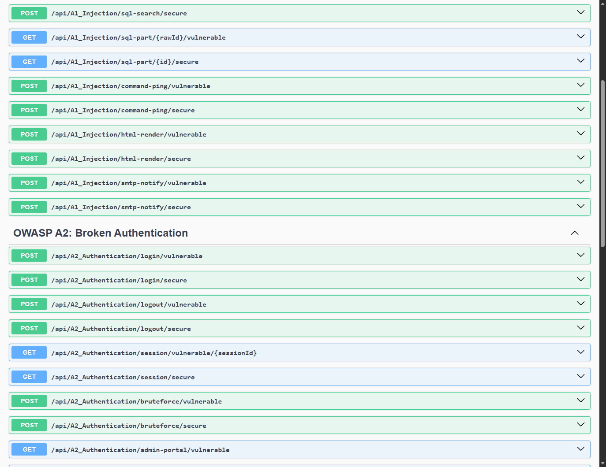
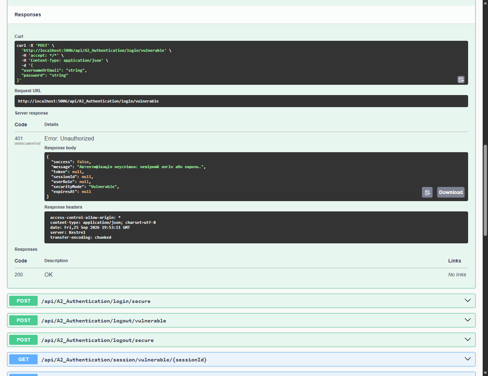
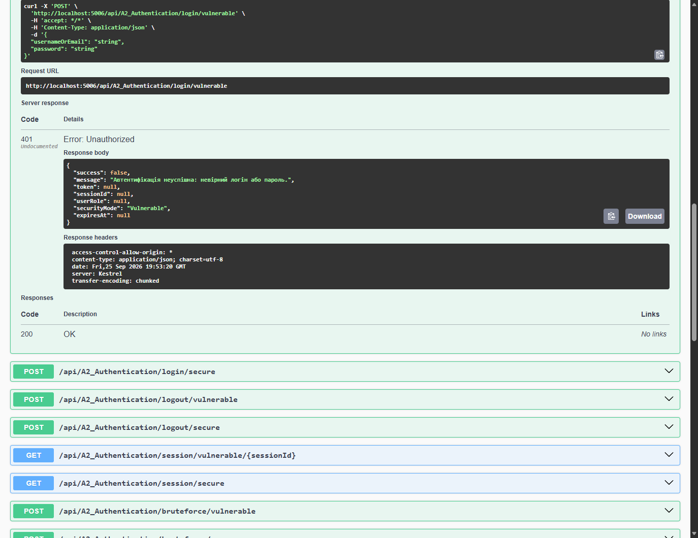

# Module 02: A2: Broken Authentication & Session Management

> Practical security guide, attack vector demonstration in Swagger UI, and remediation architecture for TechFix Enterprise (.NET 10).

---

## 1. Теоретичні відомості

Уразливості класу **OWASP Top 10 A2: Broken Authentication** виникають у разі некоректної реалізації механізмів підтвердження особи користувача, управління сесіями та захисту облікових записів:
- **CWE-259 / CWE-798 (Hardcoded Backdoors):** Наявність прихованих службових паролів («майстер-паролів»), зашитих у вихідний код для налагодження.
- **CWE-307 (Improper Restriction of Excessive Authentication Attempts):** Відсутність блокування за кількістю невдалих спроб входу, що дозволяє автоматизований перебір паролів (Brute-Force та Credential Stuffing).
- **CWE-294 (Session Replay / Missing Invalidation):** Можливість повторного використання сесійного токена після виходу користувача з системи (Logout) через відсутність чорного списку або централізованого відкликання.
- **CWE-565 / CWE-613 (Cookie Tampering):** Несанкціонована зміна полів сесійних кукі клієнтом без перевірки цілісності (підміна `Role=User` на `Role=Admin`).
- **CWE-347 (JWT `alg: none` Stripping):** Вразливість бібліотек валідації JWT, коли сервер довіряє токену із незахищеним заголовком `alg: none` без перевірки криптографічного підпису.
- **CWE-328 (Reversible / Fast Hashing):** Зберігання паролів у форматі відкритих або швидких хешів (MD5, SHA-1), які легко розкриваються за допомогою райдужних таблиць (Rainbow Tables).

---

## 2. Архітектурна реалізація у проєкті TechFix

У системі **TechFix Enterprise** модуль автентифікації реалізовано через контракт `IAuthenticationService`, сервіс `AuthenticationService` та контролер `A2_AuthenticationController`:
- **Криптографічний захист:** Застосування промислового алгоритму **PBKDF2-SHA256** із криптографічною сіллю розміром 16 байт та 100 000 ітераціями.
- **Управління сесіями:** Чорний список відкликаних токенів у пам'яті / БД для запобігання Session Replay.
- **Політика блокування:** Автоматичне тимчасове блокування облікового запису на 5 хвилин після 3 поспіль невдалих спроб входу.
- **Підписані кукі та JWT:** Цифровий підпис HMAC-SHA256 та блокування алгоритмів без підпису.

```csharp
// ✅ ЗАХИЩЕНЕ ХЕШУВАННЯ ПАРОЛІВ (PBKDF2-SHA256)
public string HashPasswordPbkdf2(string password, byte[] salt)
{
    using var pbkdf2 = new Rfc2898DeriveBytes(password, salt, 100000, HashAlgorithmName.SHA256);
    return Convert.ToBase64String(pbkdf2.GetBytes(32));
}

// ✅ ПЕРЕВІРКА ТОКЕНА ЗА ЧОРНИМ СПИСКОМ ТА СТРОКОМ ДІЇ
if (_revokedTokens.Contains(sessionToken))
{
    return new SessionCheckResultDto { IsValid = false, Message = "Session has been explicitly revoked." };
}
```

---

## 3. Практична демонстрація у Swagger UI

### 3.1. Загальний огляд ендпоінтів A2

*Рис. 1. Ендпоінти автентифікації та захисту сесій у Swagger UI.*

### 3.2. Бекдор у системі автентифікації
- **Уразливий вхід (Payload: `admin:MasterBackdoor2026!`):**  
  
  *Рис. 2. Успішний вхід за допомогою прихованого майстер-пароля.*

- **Захищений вхід (Бекдор видалено):**  
  
  *Рис. 3. Відхилення спроби входу через бекдор (401 Unauthorized).*

### 3.3. Відновлення та відкликання сесій (Session Replay)
- **Уразливий вихід:** Токен залишається валідним після Logout.
  
  *Рис. 4. Повторне використання сесії після виходу користувача.*

- **Захищений вихід:** Токен потрапляє у чорний список відкликання.
  
  *Рис. 5. Негайне відкликання сесії та блокування доступу.*

### 3.4. Захист від Brute-Force атак
- **Уразливий вхід:** Необмежена кількість спроб перебору.
  
  *Рис. 6. Відсутність ліміту спроб входу.*

- **Захищений вхід:** Блокування акаунту після 3 невдалих спроб.
  
  *Рис. 7. Активація блокування облікового запису на 5 хвилин.*

### 3.5. Підробка адміністративних Cookie
- **Уразливі Cookie:** Модифікація незахищеного кукі `Role=Admin`.
  
  *Рис. 8. Несанкціоноване отримання ролі Admin через зміну Cookie.*

- **Захищені Cookie:** Перевірка цифрового підпису HMAC-SHA256.
  
  *Рис. 9. Виявлення підробки та відхилення підробленого Cookie.*

### 3.6. Вразливість JWT `alg: none`
- **Уразливий парсинг:** Прийняття токена без підпису.
  
  *Рис. 10. Успішний обхід підпису через alg: none.*

- **Захищений парсинг:** Вимога обов'язкового підпису HS256/RS256.
  
  *Рис. 11. Відхилення токенів без криптографічного підпису.*

### 3.7. Розкриття швидких хешів через Rainbow Tables

*Рис. 12. Демонстрація розкриття MD5 за 1 мс проти стійкості PBKDF2.*

---

## 4. Зведена таблиця результатів

| Сценарій тестування | CWE | Тестове навантаження | Уразлива поведінка | Захисне рішення |
|---|---|---|---|---|
| **Backdoor Access** | CWE-259 | `MasterBackdoor2026!` | Вхід без знання пароля | Видалення бекдору, PBKDF2 |
| **Session Replay** | CWE-294 | Старий токен після Logout | Доступ залишається активним | Чорний список відкликання токенів |
| **Brute-Force** | CWE-307 | 5 спроб перебору | Необмежені запити | Блокування акаунту після 3 спроб |
| **Cookie Tampering** | CWE-565 | `Role=Admin` у Cookie | Підвищення привілеїв | Підпис кукі через HMAC-SHA256 |
| **JWT alg: none** | CWE-347 | `{"alg": "none"}` | Довільні привілеї | Заборона алгоритму `none` |

---

## 5. Звіти лабораторної роботи
- **Word:** [`Звіт_ЛР2_Томка_A2_Broken_Authentication.docx`](file:///C:/OneDrive/ТНТУ%20ПУЛЮЯ/3%20семестр/Технології%20розробки%20захищеного%20програмного%20забезпечення/Лабораторна_робота_2/Звіт_ЛР2_Томка_A2_Broken_Authentication.docx)
- **PDF:** [`Звіт_ЛР2_Томка_A2_Broken_Authentication.pdf`](file:///C:/OneDrive/ТНТУ%20ПУЛЮЯ/3%20семестр/Технології%20розробки%20захищеного%20програмного%20забезпечення/Лабораторна_робота_2/Звіт_ЛР2_Томка_A2_Broken_Authentication.pdf)
