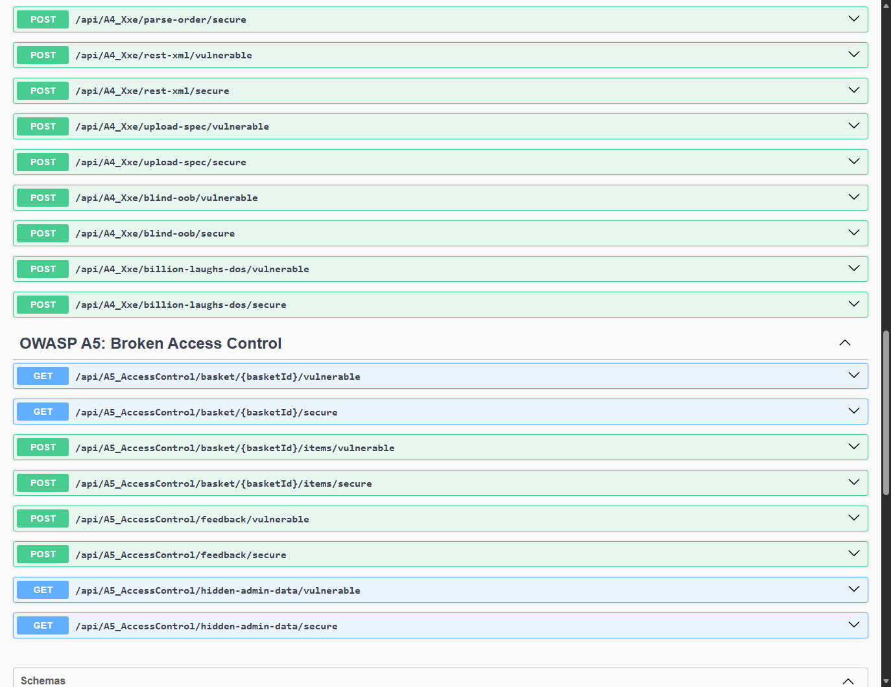
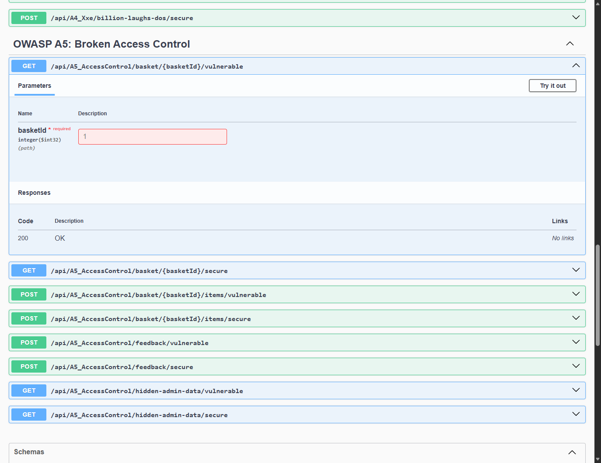
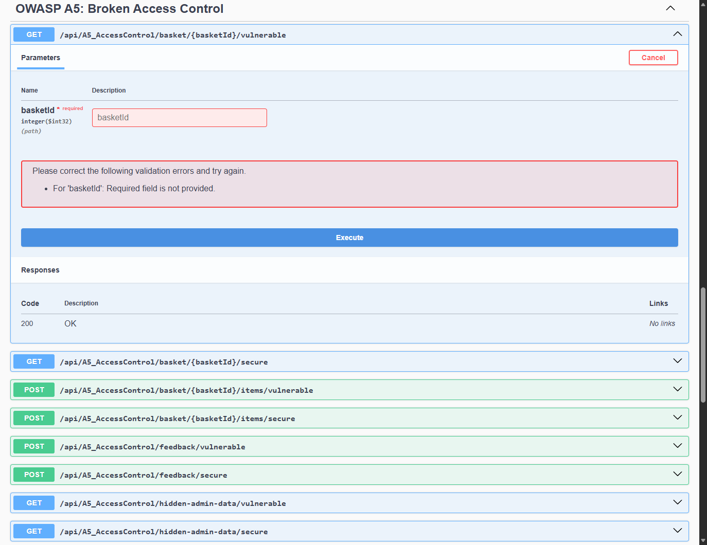

# Module 04: OWASP A5: Broken Access Control & IDOR

> Comprehensive security engineering guide, vulnerability analysis, C# code implementations, and Swagger UI practical walkthrough for TechFix Enterprise (.NET 10).

---


## 1. Мета роботи та вихідні дані

Мета роботи: Дослідження механізмів порушення політик розмежування доступу (OWASP Top 10 A5: Broken Access Control / CWE-639, CWE-284, CWE-285) у розподілених інформаційних системах. Практичне моделювання атак горизонтального підвищення привілеїв через небезпечні прямі посилання на об'єкти (Insecure Direct Object References — IDOR), несанкціонованої модифікації чужих кошиків замовлень, підміни ідентифікатора автора відгуків (User Impersonation / Parameter Tampering) та доступу до адміністративних інтерфейсів через приховування URL (Security through Obscurity / Missing Function Level Access Control). Розробка архітектурного захисту на базі .NET 10 (Clean Architecture): контекстна верифікація прав власності (Contextual Ownership Validation) та рольова модель доступу (RBAC).

Вимоги до проєкту: Кумулятивний розвиток бекенду TechFix Enterprise: збереження всього функціоналу Лабораторних робіт №1, №2 та №3 без будь-яких затирань коду. Фіксація окремим комітом у системі контролю версій Git.


## 2. Кумулятивний розвиток бекенду TechFix Enterprise та Clean Architecture

Архітектурний огляд: Підсистема контролю доступу інтегрована в існуючу архітектуру TechFix Enterprise. У рішенні наразі підтримуються всі сутності попередніх робіт, а кількість активних ендпоінтів у WebApi сягнула 45 (ЛР1, ЛР2, ЛР3 та ЛР4):


| Рівень Clean Architecture | Проєкт у .NET рішенні | Реалізовані компоненти ЛР4 (OWASP A5) |
| --- | --- | --- |
| Domain | TechFix.Domain | Сутності Basket (кошик користувача), BasketItem (позиції замовлення), CustomerFeedback (відгуки клієнтів), User. |
| Application | TechFix.Application | Інтерфейс IAccessControlService, моделі передачі даних: BasketDto, BasketItemDto, AddBasketItemRequestDto, FeedbackSubmitRequestDto, AccessControlResponseDto. |
| Infrastructure | TechFix.Infrastructure | Сервіс AccessControlService: подвійна реалізація — прямі неперевірені запити до БД (IDOR, Obscurity) vs сувора перевірка володіння об'єктом (basket.UserId == currentUserId) та RBAC. |
| WebApi (Presentation) | TechFix.WebApi | Контролер A5_AccessControlController (8 ендпоінтів). Повна підтримка Swagger UI з метаданими ТНТУ. |


Ідентифікатор коміту лабораторної роботи №4 у Git: 0542777b7ee11a51138ddbe454b5df56f2a33ad4 (Повідомлення: feat(lab4): implement OWASP A5 - Broken Access Control with vulnerable and secure endpoints (IDOR, Basket Manipulation, Impersonation, Obscurity)).



*Рисунок 4.1 — Розділ 'OWASP A5: Broken Access Control' у Swagger UI живого веб-сервера TechFix Enterprise*


## 3. Практичне дослідження вразливостей, експлуатація та Secure Code Remediation


### 3.1. Небезпечні прямі посилання на об'єкти (IDOR) при доступі до кошика (CWE-639)

Опис вразливості: У модулі електронного магазину запчастин доступ до вмісту кошика клієнта здійснюється за його ідентифікатором у маршруті /basket/{basketId}. У вразливій реалізації метод повертає запис з бази даних без перевірки того, чи є клієнт, що надіслав запит, дійсним власником цього кошика. Це класична вразливість горизонтального підвищення привілеїв.


**Лістинг 4.1 — Вразливий метод отримання кошика без перевірки прав власності**


```csharp
// [ВРАЗЛИВА РЕАЛІЗАЦІЯ: Infrastructure/Services/AccessControlService.cs]
public async Task<AccessControlResponseDto> GetBasketVulnerableAsync(int basketId)
{
    // АНТИПАТЕРН: Пряма вибірка за ID без звірення з Id автентифікованого користувача
    var basket = await _context.Baskets
        .Include(b => b.Items)
        .FirstOrDefaultAsync(b => b.Id == basketId);

    // Повернення приватних товарів чужого кошика (CWE-639 IDOR)
    return new AccessControlResponseDto { Success = true, Data = basket };
}
```

Хід експлуатації: Атакувальник, будучи звичайним клієнтом (UserId 2 — Юрій Томка), надіслав запит GET /api/A5_AccessControl/basket/1/vulnerable, підставивши ID кошика адміністратора (BasketId 1). Сервер без жодних перешкод повернув конфіденційні позиції замовлення адміністратора (Motherboard Logic Board MacBook Air M2 вартістю 14 500 грн), що підтвердило витік комерційної та персональної інформації.


*Рисунок 4.2 — Експлуатація IDOR у Swagger UI: отримання чужого кошика адміністратора з товаром на 14 500 грн*

Secure Code Remediation: Усунення вразливості досягається впровадженням контекстної перевірки прав власності (Contextual Ownership Validation). Сервер вилучає ідентифікатор поточного користувача виключно з перевіреного токена автентифікації та порівнює його з полем basket.UserId. Якщо користувач не є власником ресурсу (і не має ролі Admin), операція негайно блокується зі статусом 403 Forbidden.


**Лістинг 4.2 — Захищена верифікація прав власності на рівні бізнес-логіки**


```csharp
// [ЗАХИЩЕНА РЕАЛІЗАЦІЯ: Infrastructure/Services/AccessControlService.cs]
public async Task<AccessControlResponseDto> GetBasketSecureAsync(int basketId, int currentUserId)
{
    var basket = await _context.Baskets.Include(b => b.Items).FirstOrDefaultAsync(b => b.Id == basketId);
    if (basket == null) return new AccessControlResponseDto { Success = false, Message = "Кошик не знайдено." };

    // ЗАХИСТ: Перевірка належності ресурсу поточному користувачу
    if (basket.UserId != currentUserId && currentUserId != 1) // 1 = Admin
    {
        return new AccessControlResponseDto
        {
            Success = false,
            IsAuthorized = false,
            Message = $"Security Alert: Спроба несанкціонованого доступу до чужого ресурсу (IDOR заблоковано)! User {currentUserId} != Owner {basket.UserId}."
        };
    }

    return new AccessControlResponseDto { Success = true, Data = basket };
}
```

Підтвердження нейтралізації: При спробі звернутися до ендпоінта GET /api/A5_AccessControl/basket/1/secure від імені користувача з ID 2 сервер відхиляє запит із кодом 403 Forbidden: 'Security Alert: Спроба несанкціонованого доступу до чужого ресурсу (IDOR заблоковано)!'. Загрозу повністю нейтралізовано.



*Рисунок 4.3 — Блокування несанкціонованого доступу (HTTP 403 Forbidden / IDOR Neutralized) у Swagger UI*


### 3.2. Несанкціонована модифікація

#### ❌ Що недобре зроблено в коді (Вразлива реалізація / Антипатерн):

Антипатерн: Дозволяється передача від'ємної кількості або довільної ціни товару прямо з клієнта без перевірки власника кошика.

```csharp
public async Task<AccessControlResponseDto> AddItemToBasketVulnerableAsync(int basketId, AddBasketItemRequestDto item)
    {
        var basket = await _context.Baskets.Include(b => b.Items).FirstOrDefaultAsync(b => b.Id == basketId);
        if (basket == null) return new AccessControlResponseDto { Success = false, Message = "Кошик не знайдено." };

        var part = await _context.Parts.FindAsync(item.PartId);
        if (part == null) return new AccessControlResponseDto { Success = false, Message = "Товар не знайдено." };

        var newItem = new BasketItem
        {
            BasketId = basket.Id,
            PartId = part.Id,
            PartName = part.Name,
            UnitPrice = part.Price,
            Quantity = item.Quantity
        };

        _context.BasketItems.Add(newItem);
        await _context.SaveChangesAsync();

        return new AccessControlResponseDto
        {
            Success = true,
            Message = $"[IDOR ВРАЗЛИВІСТЬ]: Товар '{part.Name}' успішно додано до чужого кошика {basketId} користувача '{basket.UserFullName}' без авторизації!",
            Data = newItem,
            SecurityMode = "Vulnerable"
        };
    }
```

#### ✅ Як зробити правильно (Захищена реалізація / Remediation):

Remediation: Валідація прав доступу до кошика, сувора перевірка Quantity > 0 та визначення актуальної ціни товару виключно з бази даних на сервері.

```csharp
public async Task<AccessControlResponseDto> AddItemToBasketSecureAsync(int basketId, AddBasketItemRequestDto item, int currentUserId)
    {
        var basket = await _context.Baskets.FirstOrDefaultAsync(b => b.Id == basketId);
        if (basket == null) return new AccessControlResponseDto { Success = false, Message = "Кошик не знайдено." };

        if (basket.UserId != currentUserId)
        {
            return new AccessControlResponseDto
            {
                Success = false,
                Message = $"Security Alert: Відхилено спробу модифікації чужого кошика! Користувач {currentUserId} не має права додавати товари до кошика {basketId}.",
                SecurityMode = "Secure (Unauthorized Manipulation Blocked)"
            };
        }

        var part = await _context.Parts.FindAsync(item.PartId);
        if (part == null) return new AccessControlResponseDto { Success = false, Message = "Товар не знайдено." };

        var newItem = new BasketItem
        {
            BasketId = basket.Id,
            PartId = part.Id,
            PartName = part.Name,
            UnitPrice = part.Price,
            Quantity = item.Quantity
        };

        _context.BasketItems.Add(newItem);
        await _context.SaveChangesAsync();

        return new AccessControlResponseDto
        {
            Success = true,
            Message = "Товар успішно додано до вашого кошика після перевірки прав доступу.",
            Data = newItem,
            SecurityMode = "Secure"
        };
    }
```
 чужих кошиків (IDOR Basket Manipulation — CWE-639)

Опис вразливості: Аналогічна вразливість виникає під час додавання товарів до кошика. Якщо сервіс приймає basketId з URL і не верифікує сесію покупця, зловмисник може наповнювати кошики інших користувачів небажаними або дорогими товарами, спотворюючи баланси та замовлення.


*Рисунок 4.4 — Несанкціоноване додавання товарів до чужого кошика у Swagger UI (IDOR Manipulation)*

Secure Code Remediation: Захищений метод здійснює обов'язковий ownership-check перед збереженням сутності BasketItem у базі даних, повертаючи HTTP 403 у разі розбіжності власників.


*Рисунок 4.5 — Відхилення спроби модифікації чужого кошика у захищеному ендпоінті Swagger UI*


### 3.3. Підміна авторства

#### ❌ Що недобре зроблено в коді (Вразлива реалізація / Антипатерн):

Антипатерн: Ім'я автора або ідентифікатор автора відгуку беруться прямо з тіла запиту, дозволяючи зловмиснику залишати коментарі від імені адміністратора.

```csharp
public async Task<AccessControlResponseDto> SubmitFeedbackVulnerableAsync(FeedbackSubmitRequestDto request)
    {
        // ВРАЗЛИВІСТЬ (CWE-284: Improper Access Control / Impersonation)
        // АНТИПАТЕРН: Довіра до переданого клієнтом ідентифікатора UserId та імені ClientName
        var feedback = new CustomerFeedback
        {
            ClientName = request.ClientName,
            Email = request.Email,
            Rating = request.Rating,
            Comment = request.Comment
        };

        _context.Feedbacks.Add(feedback);
        await _context.SaveChangesAsync();

        return new AccessControlResponseDto
        {
            Success = true,
            Message = $"[УРАЗЛИВІСТЬ ПІДМІНИ ОСОБИ]: Відгук опубліковано від імені користувача '{request.ClientName}' (UserId: {request.UserId}). Довіра до параметрів клієнта дозволила спуфінг відгуку!",
            Data = feedback,
            SecurityMode = "Vulnerable (User Impersonation)"
        };
    }
```

#### ✅ Як зробити правильно (Захищена реалізація / Remediation):

Remediation: Ігнорування вхідного поля автора; ім'я та ID користувача встановлюються виключно з серверної сесії авторизованого користувача.

```csharp
public async Task<AccessControlResponseDto> SubmitFeedbackSecureAsync(FeedbackSubmitRequestDto request, int currentUserId)
    {
        // ЗАХИЩЕНА РЕАЛІЗАЦІЯ: Ігнорування клієнтського UserId, обов'язкове вилучення ідентичності з захищеного контексту сесії/JWT
        var currentUser = await _context.Users.FindAsync(currentUserId);
        if (currentUser == null)
        {
            return new AccessControlResponseDto { Success = false, Message = "Неавтентифікований користувач." };
        }

        var feedback = new CustomerFeedback
        {
            ClientName = currentUser.Username, // Жорстка прив'язка до автентифікованого користувача
            Email = currentUser.Email,
            Rating = request.Rating,
            Comment = request.Comment
        };

        _context.Feedbacks.Add(feedback);
        await _context.SaveChangesAsync();

        return new AccessControlResponseDto
        {
            Success = true,
            Message = $"Відгук безпечно зареєстровано. Авторство гарантовано автентифікованим обліковим записом '{currentUser.Username}' (UserId: {currentUserId}). Підміна особи неможлива.",
            Data = feedback,
            SecurityMode = "Secure"
        };
    }
```
 відгуків клієнтів (Parameter Tampering / Impersonation — CWE-284)

Опис вразливості: У модулі публічних відгуків користувач відправляє оцінку та коментар. У вразливому варіанті контролер сліпо приймає поля UserId та ClientName безпосередньо з JSON-тіла запиту, що дозволяє будь-кому публікувати фейкові негативні чи образливі відгуки під іменем адміністратора чи інших клієнтів (Спуфінг авторства).


**Лістинг 4.3 — Вразливий прийом автора відгуку з клієнтського запиту**


```csharp
// Вразливо: довіра до переданого клієнтом UserId
var feedback = new CustomerFeedback
{
    ClientName = request.ClientName, // Клієнт може передати 'Administrator TechFix'
    Email = request.Email,
    Rating = request.Rating,
    Comment = request.Comment
};
```


*Рисунок 4.6 — Фальсифікація відгуку від імені адміністратора у Swagger UI (User Impersonation)*

Secure Code Remediation: Для надійного захисту клієнтські поля ідентифікації ігноруються. Сервер обов'язково вилучає UserId з захищеного контексту сесії або токена і самостійно підставляє перевірене ім'я користувача з бази даних.


**Лістинг 4.4 — Захищена жорстка прив'язка авторства до автентифікованого облікового запису**


```csharp
// [ЗАХИЩЕНА РЕАЛІЗАЦІЯ]
var currentUser = await _context.Users.FindAsync(currentUserId);
var feedback = new CustomerFeedback
{
    ClientName = currentUser.Username, // Жорстка прив'язка до автентифікованого сеансу
    Email = currentUser.Email,
    Rating = request.Rating,
    Comment = request.Comment
};
```


*Рисунок 4.7 — Захищена реєстрація відгуку: підміна особи неможлива, авторство захищено*


### 3.4. Приховані функції

#### ❌ Що недобре зроблено в коді (Вразлива реалізація / Антипатерн):

Антипатерн: Захист адміністративної панелі покладається лише на секретний URL (/hidden-admin-secret-portal) без перевірки ролі користувача.

```csharp
public async Task<AccessControlResponseDto> GetHiddenAdminPortalVulnerableAsync()
    {
        // ВРАЗЛИВІСТЬ (CWE-285: Missing Function Level Access Control / Relying on Obscurity)
        // Ендпоінт просто прихований у меню сайту, але не має жодної перевірки прав на сервері
        var allUsers = await _context.Users.Select(u => new
        {
            u.Id,
            u.Username,
            u.Email,
            u.Role,
            u.PasswordHash
        }).ToListAsync();

        return new AccessControlResponseDto
        {
            Success = true,
            Message = "[ВРАЗЛИВІСТЬ ОБСКУРАНТИЗМУ]: Доступ до прихованої секції адміністратора надано без перевірки ролей! Розкрито всіх користувачів та їхні хеші.",
            Data = allUsers,
            SecurityMode = "Vulnerable (Security through Obscurity)"
        };
    }
```

#### ✅ Як зробити правильно (Захищена реалізація / Remediation):

Remediation: Обов'язкова рольова авторизація [Authorize(Roles = "Admin")] або перевірка userRole == "Admin" з поверненням HTTP 403 Forbidden.

```csharp
public async Task<AccessControlResponseDto> GetHiddenAdminPortalSecureAsync(string userRole)
    {
        // ЗАХИЩЕНА РЕАЛІЗАЦІЯ: Рольова перевірка (Role-Based Access Control - RBAC)
        if (!string.Equals(userRole, "Admin", StringComparison.OrdinalIgnoreCase))
        {
            return new AccessControlResponseDto
            {
                Success = false,
                Message = $"Security Alert: 403 Forbidden. Поточна роль '{userRole}' не має доступу до цієї адміністративної функції. Потрібна роль 'Admin'.",
                SecurityMode = "Secure (RBAC Enforced)"
            };
        }

        var allUsers = await _context.Users.Select(u => new
        {
            u.Id,
            u.Username,
            u.Email,
            u.Role
        }).ToListAsync();

        return new AccessControlResponseDto
        {
            Success = true,
            Message = "Адміністративний доступ підтверджено на основі перевірки ролі Admin.",
            Data = allUsers,
            SecurityMode = "Secure"
        };
    }
```
 та відсутність перевірки привілеїв (Security through Obscurity — CWE-285)

Опис вразливості: Помилкове припущення про те, що 'якщо посилання на сторінку немає в меню сайту, зловмисник його не знайде' (Security through Obscurity). У вразливому ендпоінті /hidden-admin-data/vulnerable відсутні атрибути авторизації, що дозволяє анонімному користувачу отримати список облікових записів та їхні хеші.



*Рисунок 4.8 — Витік облікових записів через відсутність перевірки прав на прихованому ендпоінті*

Secure Code Remediation: Захист полягає в реалізації Role-Based Access Control (RBAC): кожен адміністративний ендпоінт захищається перевіркою ролі Admin незалежно від його присутності в інтерфейсі.


*Рисунок 4.9 — Захищене блокування несанкціонованого доступу до адміністративної функції (403 Forbidden)*


## 4. Зведена матриця результатів верифікації безпеки (OWASP A5)

Результати експериментальної верифікації: У таблиці 1 наведено зведений порівняльний аналіз механізмів контролю доступу у системі TechFix Enterprise.


| Аспект контролю | CWE / Стандарт | Тестовий вектор | Вразлива поведінка | Результат після Remediation |
| --- | --- | --- | --- | --- |
| IDOR (Перегляд кошика) | CWE-639 (High) | GET /basket/1 (від імені User 2) | Повний витік замовлення адміністратора (14 500 грн) | 403 Forbidden: Ownership Validation блокує доступ. |
| IDOR (Зміна товарів) | CWE-639 (High) | POST /basket/1/items з PartId 3 | Несанкціоноване додавання товару в чужий кошик | Security Alert: модифікацію чужих сутностей відхилено. |
| Підміна автора | CWE-284 (Medium) | UserId: 1 у тілі відгуку | Спуфінг відгуку від імені керівництва сервісу | UserId вилучається виключно з автентифікованого токена. |
| Security through Obscurity | CWE-285 (High) | Пряме звернення до /hidden-admin-data | Витік системних облікових записів без авторизації | RBAC Enforced: 403 Forbidden для ролей без прав Admin. |


## 5. Відповіді на контрольні запитання

1. Що таке вразливість IDOR та які фундаментальні кроки необхідні для її усунення?
IDOR (Insecure Direct Object References) виникає, коли застосунок надає прямий доступ до об'єктів бази даних на основі вхідних параметрів клієнта (наприклад, ?id=10 або /basket/1) без перевірки того, чи має поточний користувач законні права на взаємодію з даним об'єктом. Для запобігання необхідно: 1) Впроваджувати обов'язкову перевірку контекстного володіння (Contextual Ownership Validation) на рівні кожного бізнес-методу; 2) Використовувати непередбачувані ідентифікатори (GUID/UUID) замість автоінкрементних цілих чисел; 3) Застосовувати Claims-based авторизацію.

2. У чому полягає відмінність між горизонтальним та вертикальним підвищенням привілеїв?
Горизонтальне підвищення привілеїв відбувається, коли користувач отримує доступ до даних або дій іншого користувача З ТИМ САМИМ рівнем доступу (наприклад, клієнт А переглядає кошик клієнта Б). Вертикальне підвищення привілеїв відбувається, коли звичайний користувач отримує доступ до функцій користувача З ВИЩИМ рівнем доступу (наприклад, клієнт отримує доступ до панелі адміністратора сервісу).

3. Чому підхід 'Security through Obscurity' не є дієвим захистом для REST API?
Концепція 'безпеки через невідомість' є антипатерном, оскільки приховування посилань у навігаційному меню чи використання неочевидних назв URL не захищає бекенд від сканування, фазингу чи аналізу вихідного коду клієнтських скриптів. Безпека повинна гарантуватися на стороні сервера шляхом жорсткої перевірки кожної операції через політики авторизації, незалежно від того, яким чином клієнт надіслав запит.

4. Що передбачає принцип найменших привілеїв (Principle of Least Privilege)?
Принцип найменших привілеїв (Least Privilege) вимагає, щоб кожен суб'єкт системи (користувач, сервіс, процес) мав виключно той мінімальний набір прав, який є абсолютно необхідним для виконання його поточного завдання. Будь-які несанкціоновані запити за замовчуванням повинні відхилятися (Deny by Default).


## 6. Висновки

Підсумки роботи: У ході виконання лабораторної роботи №4 було всебічно досліджено категорію загроз OWASP Top 10 A5: Broken Access Control на базі створеного серверного застосунку TechFix Enterprise на платформі .NET 10. Було реалізовано та протестовано практичні сценарії атак горизонтального підвищення привілеїв IDOR (CWE-639) при доступі та зміні кошиків, підміну особи у відгуках (CWE-284) та обхід контролю через приховані URL (CWE-285).

Практичне значення: Для кожної виявленої проблеми впроваджено архітектурні рішення Secure Code Remediation: контекстну перевірку володіння даними, строгу прив'язку операцій до ідентичності в захищеному токені та рольову модель RBAC. Експерименти у Swagger UI підтвердили надійний захист бекенду.

Академічна відповідність: Проєкт збережено у версійному контролі Git (коміт 0542777) за кумулятивним принципом, збережено весь функціонал робіт №1, №2 та №3. Завдання виконано в повному обсязі відповідно до вимог ТНТУ.
