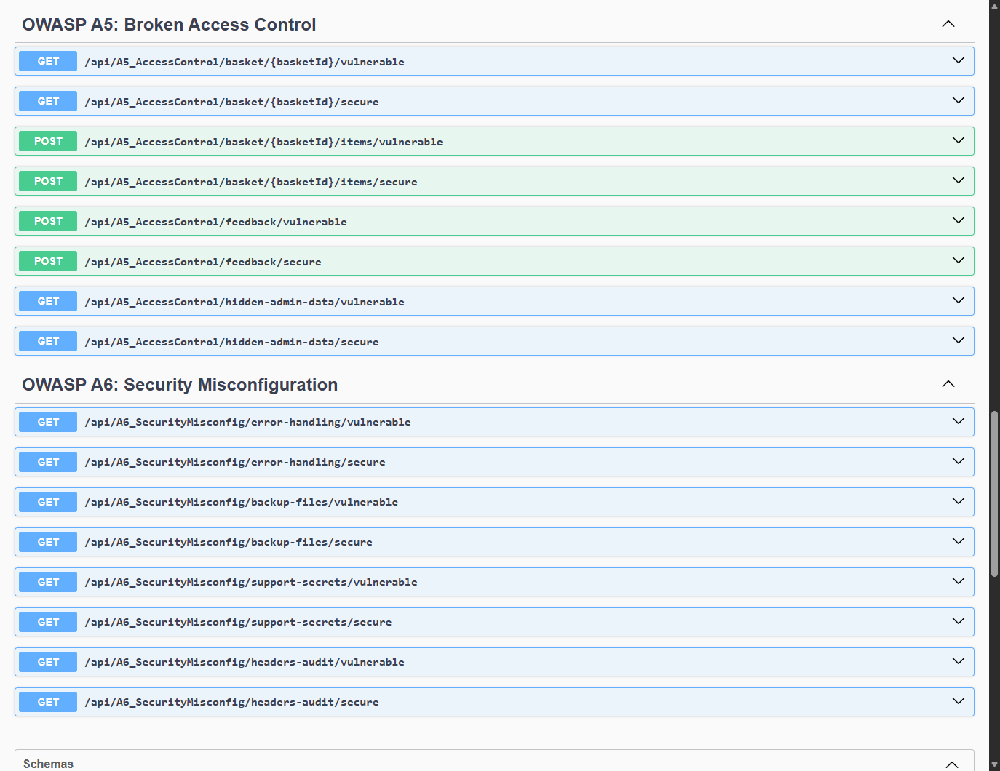
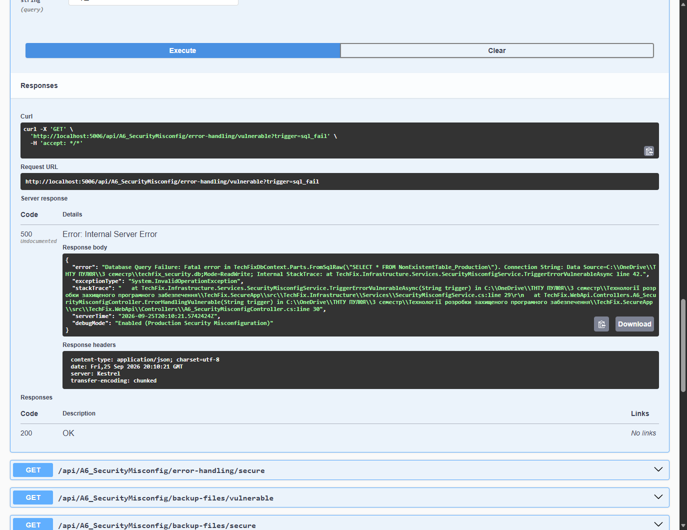
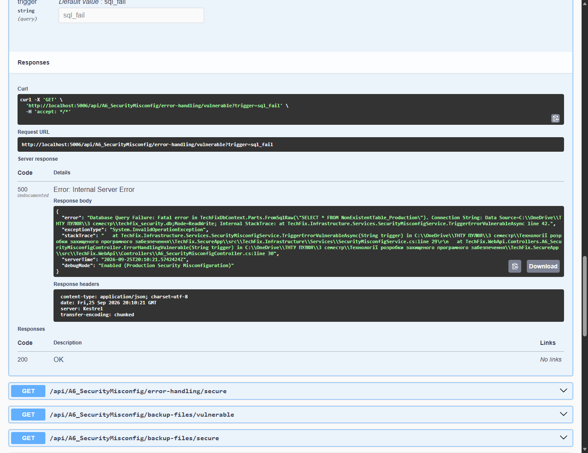

# Module 05: A6: Security Misconfiguration & Information Leakage

> Practical security guide, attack vector demonstration in Swagger UI, and remediation architecture for TechFix Enterprise (.NET 10).

---

## 1. Теоретичні відомості

Уразливості класу **OWASP Top 10 A6: Security Misconfiguration** виникають, коли параметри безпеки компонентів системи (веб-серверів, СКБД, фреймворків, середовищ хмари) налаштовані некоректно, за замовчуванням або містять надмірні дозволи:
- **CWE-209 (Generation of Error Message Containing Sensitive Information):** Витік налагоджувальних стек-трейсів (CLR Stack Trace), версій ОС, бібліотек та абсолютних шляхів до файлової системи сервера клієнтам у разі виникнення необроблених винятків.
- **CWE-530 (Exposure of Backup File to an Unauthorized Control Sphere):** Залишення файлів резервних копій бази даних (`.bak`, `.sql`, `.dump`) або конфігураційних файлів у загальнодоступних каталогах веб-сервера (WebRoot).
- **CWE-615 (Inclusion of Sensitive Information in Source Code Comments):** Залишення розробниками конфіденційних коментарів (тестові логіни/паролі, внутрішні IP-адреси, API-ключі сторонніх сервісів) у публічних ресурсах.
- **CWE-16 (Configuration Errors / Missing Security Headers):** Відсутність обов'язкових захисних HTTP-заголовків (`Content-Security-Policy`, `Strict-Transport-Security`, `X-Frame-Options`, `X-Content-Type-Options`) та витік банерів сервера (`Server: Kestrel`, `X-Powered-By: ASP.NET`).

---

## 2. Архітектурна реалізація у проєкті TechFix

У проєкті **TechFix Enterprise** модуль реалізовано через контракт `ISecurityMisconfigService`, сервіс `SecurityMisconfigService` та контролер `A6_SecurityMisconfigController`:
- **Стандарт RFC 7807 (Problem Details for HTTP APIs):** Перехоплення винятків та повернення уніфікованого JSON-об'єкта з типом помилки, безпечним повідомленням та унікальним `CorrelationId` для аудиту без витоку деталей коду.
- **Ізоляція бекапів:** Заборона прямого доступу до резервних копій (`403 Forbidden`) та винесення архівів за межі публічного каталогу веб-сервера.
- **Санітизація коментарів:** Автоматичне видалення внутрішніх коментарів перед передачею даних клієнту.
- **Налаштування Security Headers:** Примусове встановлення заголовків CSP, HSTS, X-Frame-Options: DENY, X-Content-Type-Options: nosniff та видалення банерів Kestrel / ASP.NET.

```csharp
// ✅ ВПРОВАДЖЕННЯ СТАНДАРТУ RFC 7807 ІЗ CORRELATION ID
public async Task<ProblemDetailsSecureDto> ProvokeUnhandledErrorSecureAsync(string trigger)
{
    var correlationId = Guid.NewGuid().ToString("N");
    try { /* ... */ }
    catch (Exception ex)
    {
        return new ProblemDetailsSecureDto
        {
            Type = "https://techfix.local/errors/unhandled-server-error",
            Title = "Internal Server Error",
            Status = 500,
            Detail = "An unexpected error occurred. Please contact support with the correlation ID.",
            CorrelationId = correlationId
        };
    }
}
```

---

## 3. Практична демонстрація у Swagger UI

### 3.1. Загальний огляд ендпоінтів A6

*Рис. 1. Ендпоінти аудиту конфігурації у Swagger UI.*

### 3.2. Витік стек-трейсів (CWE-209)
- **Уразлива обробка помилки:**  
  
  *Рис. 2. Витік версії ОС, CLR та абсолютних шляхів до вихідного коду C#.*

- **Захищена обробка за RFC 7807:**  
  
  *Рис. 3. Уніфікований ProblemDetails із CorrelationId без технічних подробиць.*

### 3.3. Доступ до резервних копій бази даних (CWE-530)
- **Уразливе завантаження дампа бекапу:**  
  
  *Рис. 4. Пряме завантаження дампа клієнтської бази сервісу TechFix.*

- **Захищене блокування доступу:**  
  
  *Рис. 5. Блокування прямого завантаження (HTTP 403 Forbidden).*

### 3.4. Витік конфіденційних даних у коментарях (CWE-615)
- **Уразливий витік:**  
  
  *Рис. 6. Витік пароля admin_debug та токенів інтеграцій у коментарях.*

- **Захищена санітизація:**  
  
  *Рис. 7. Очищення вихідного контенту від службових коментарів.*

### 3.5. Аудит HTTP Security Headers (CWE-16)
- **Уразлива конфігурація заголовків:**  
  
  *Рис. 8. Відсутність CSP/HSTS та розкриття банерів Kestrel / ASP.NET.*

- **Захищена конфігурація заголовків:**  
  
  *Рис. 9. Впровадження CSP, X-Frame-Options: DENY, HSTS та маскування банерів.*

---

## 4. Зведена таблиця результатів

| Фактор конфігурації | CWE | Уразливий стан | Захисний стан (Remediation) |
|---|---|---|---|
| **Стек-трейси винятків** | CWE-209 | Витік шляхів до дисків, версії CLR | RFC 7807 ProblemDetails + CorrelationId |
| **Файли резервних копій** | CWE-530 | Прямий дамп БД через HTTP | 403 Forbidden, винесення за WebRoot |
| **Коментарі розробників** | CWE-615 | Витік паролів та ключів API | Автоматична санітизація коду |
| **HTTP Security Headers** | CWE-16 | Відсутність CSP/HSTS/X-Frame | Впроваджено CSP, HSTS, DENY, nosniff |

---

## 5. Звіти лабораторної роботи
- **Word:** [`Звіт_ЛР5_Томка_A6_Security_Misconfiguration.docx`](file:///C:/OneDrive/ТНТУ%20ПУЛЮЯ/3%20семестр/Технології%20розробки%20захищеного%20програмного%20забезпечення/Лабораторна_робота_5/Звіт_ЛР5_Томка_A6_Security_Misconfiguration.docx)
- **PDF:** [`Звіт_ЛР5_Томка_A6_Security_Misconfiguration.pdf`](file:///C:/OneDrive/ТНТУ%20ПУЛЮЯ/3%20семестр/Технології%20розробки%20захищеного%20програмного%20забезпечення/Лабораторна_робота_5/Звіт_ЛР5_Томка_A6_Security_Misconfiguration.pdf)
