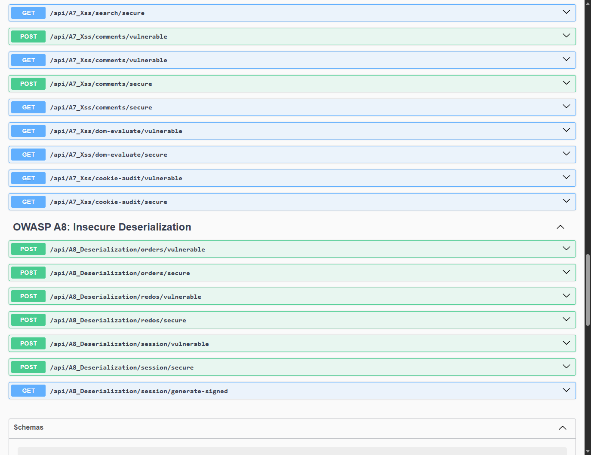
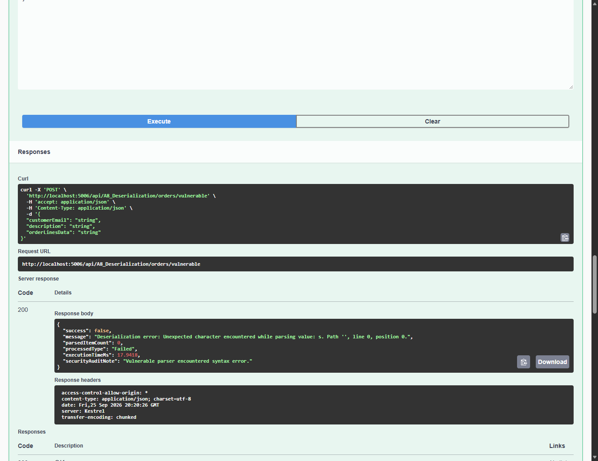
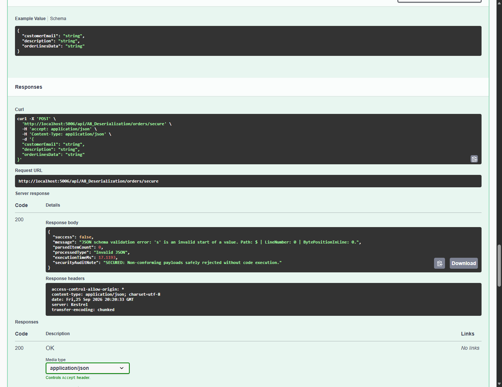
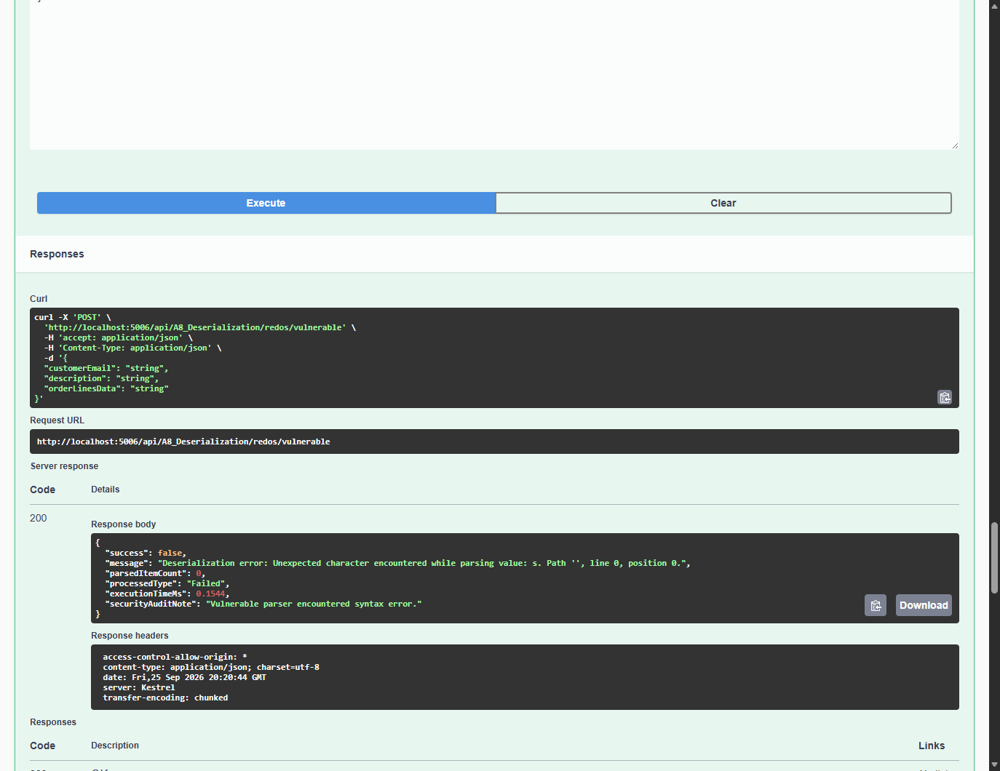
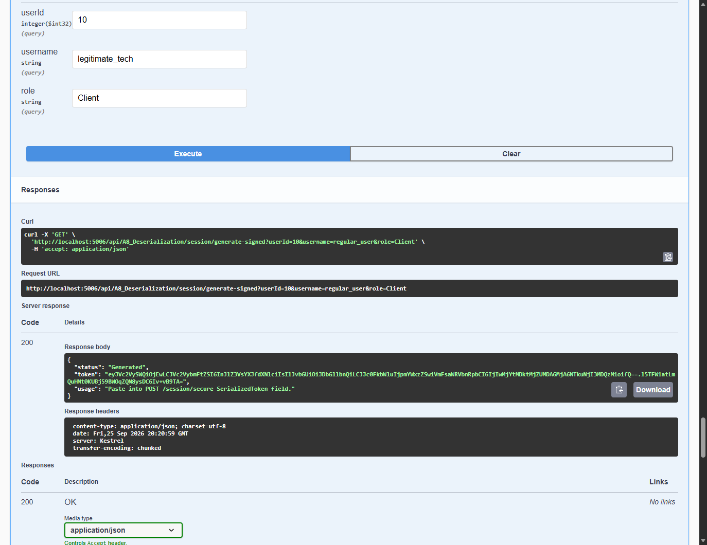
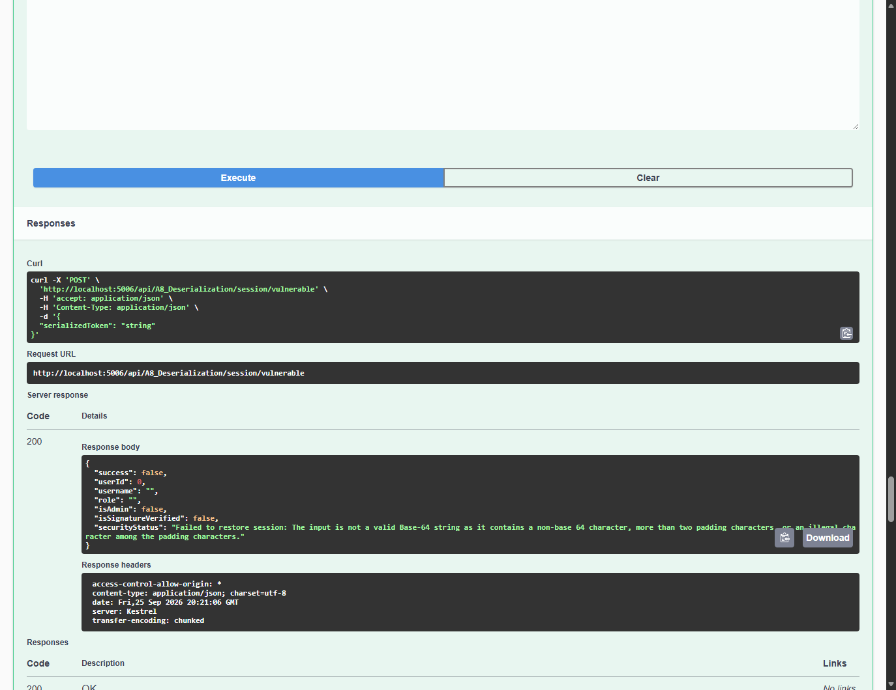
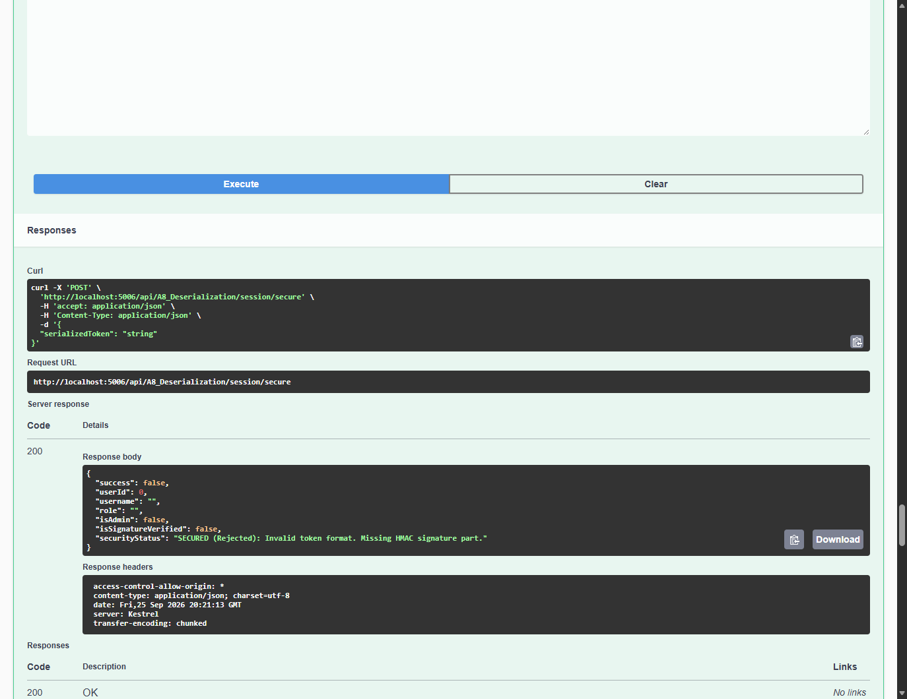
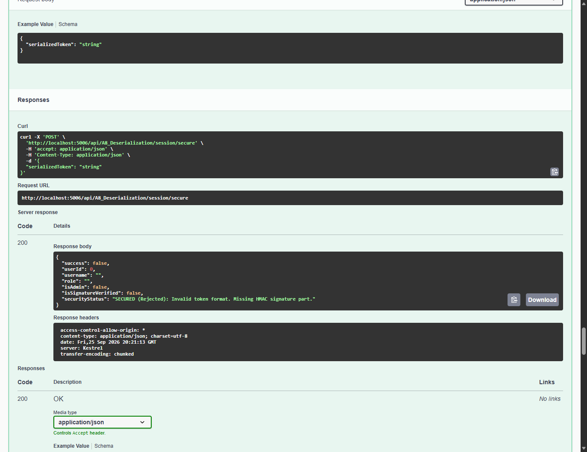

# Module 07: OWASP A8: Insecure Deserialization & ReDoS

> Comprehensive security engineering guide, vulnerability analysis, C# code implementations, and Swagger UI practical walkthrough for TechFix Enterprise (.NET 10).

---


## 1. Мета та завдання лабораторної роботи

Мета дослідження: Метою роботи є ґрунтовне теоретичне та практичне дослідження загроз безпеки веб-додатків класу OWASP Top 10:2017 A8: Insecure Deserialization / OWASP Top 10:2021 A08: Software and Data Integrity Failures. У рамках дослідження аналізуються механізми експлуатації небезпечної десеріалізації даних: створення об'єктів довільних типів та виклик ланцюжків гаджетів (Gadget Chains) для віддаленого виконання коду (RCE, CWE-502), атаки на вичерпання ресурсів процесора (ReDoS / DoS, CWE-400), а також несанкціоноване підвищення привілеїв шляхом модифікації непідписаного серіалізованого стану сесії (CWE-565, CWE-347).

Основне завдання: У середовищі розробленого корпоративного проєкту сервісного центру комп'ютерної техніки TechFix Enterprise (.NET 10 / ASP.NET Core) спроєктувати та реалізувати архітектурний модуль A8_DeserializationController у подвійному режимі (Dual-Mode: Vulnerable vs Secure) із збереженням суворої кумулятивності з усіма попередніми лабораторними роботами (№1–№6).

Перелік практичних завдань:
1. Дослідити ризики використання поліморфної десеріалізації з конфігурацією TypeNameHandling.All у бібліотеці Newtonsoft.Json, коли метадані типу $type дозволяють зловмиснику ініціювати створення системних об'єктів (DiagnosticGadgetCommand) та викликати виконання системних утиліт.
2. Реалізувати захисний шар строго типізованої десеріалізації на базі високоефективного рушія System.Text.Json з повним відкиданням будь-яких метаданих типів та обмеженням глибини вкладеності (MaxDepth = 4).
3. Дослідити механізм атак на відмову в обслуговуванні (DoS) через передачу складних регулярних виразів з катастрофічним бектрекінгом (ReDoS), що блокують робочі потоки сервера.
4. Впровадити попередню валідацію вхідних даних на рівні шлюзу API з негайним відхиленням функцій та скриптових конструкцій.
5. Дослідити проблему несанкціонованої модифікації користувацьких ролей у серіалізованих токенах Base64 та реалізувати криптографічний захист цілісності за допомогою HMAC-SHA256 з перевіркою за сталий час (CryptographicOperations.FixedTimeEquals).
6. Провести автоматизовані верифікаційні тести в реальному середовищі Swagger UI на порту 5006, зафіксувати результати у скріншотах та створити фіксацію версії (commit) у Git.


## 2. Архітектура та програмна реалізація у проєкті TechFix

Архітектурний підхід: Для забезпечення навчально-практичної демонстрації вразливостей A8 у Clean Architecture рішенні TechFix.SecureApp було створено набір DTO-моделей DeserializationDtos.cs, контракт IDeserializationService, бізнес-сервіс DeserializationService та контролер A8_DeserializationController. Сервіс зареєстровано в Program.cs як Scoped-залежність.


### 2.1. Контракт інтерфейсу IDeserializationService


**Лістинг 1. Інтерфейс IDeserializationService у шарі Application**


```csharp
namespace TechFix.Application.Interfaces;
using TechFix.Application.DTOs;

public interface IDeserializationService
{
    // Task 1 & 2: Order Lines Deserialization (Polymorphic Gadgets & DoS / ReDoS)
    Task<OrderSubmissionResultDto> ProcessOrderLinesVulnerableAsync(OrderSubmissionRawDto request);
    Task<OrderSubmissionResultDto> ProcessOrderLinesSecureAsync(OrderSubmissionRawDto request);

    // Task 3: Serialized Session State & Tampering
    SessionStateResultDto RestoreSessionVulnerable(string serializedPayloadBase64);
    SessionStateResultDto RestoreSessionSecure(string signedPayload);
    string GenerateValidSignedSession(int userId, string username, string role);
}
```


### 2.2. Сервісна реалізація DeserializationService.cs

Опис захисної бізнес-логіки: Сервіс реалізує контрасти між небезпечною десеріалізацією (TypeNameHandling.All, необмежений час обробки) та захищеними стандартами (сувора типізація System.Text.Json, криптографічні підписи HMAC-SHA256):


**Лістинг 2. Захищена типізована десеріалізація в DeserializationService.cs**


```csharp
public async Task<OrderSubmissionResultDto> ProcessOrderLinesSecureAsync(OrderSubmissionRawDto request)
{
    var sw = Stopwatch.StartNew();
    var rawData = request.OrderLinesData?.Trim() ?? string.Empty;

    // 1. Strict input validation and rejection of script/regex expressions
    if (rawData.StartsWith("/") || rawData.StartsWith("(") || rawData.Contains("function") || rawData.Contains("$type"))
    {
        sw.Stop();
        return new OrderSubmissionResultDto
        {
            Success = false,
            Message = "SECURED: Request rejected by security validator. Metadata tokens ('$type', 'function', regex literals) are strictly forbidden in business payloads.",
            ParsedItemCount = 0,
            ProcessedType = "Rejected By Schema Validator",
            ExecutionTimeMs = sw.Elapsed.TotalMilliseconds,
            SecurityAuditNote = "SAFE: Insecure deserialization and ReDoS attempts neutralized at API gateway."
        };
    }

    // 2. Safe Typed Deserialization with System.Text.Json (ignoring polymorphic attributes)
    try
    {
        var options = new System.Text.Json.JsonSerializerOptions
        {
            AllowTrailingCommas = false,
            MaxDepth = 4, // Prevents recursion DoS
            PropertyNameCaseInsensitive = true
        };

        var items = System.Text.Json.JsonSerializer.Deserialize<List<OrderLineItemDto>>(rawData, options);
        sw.Stop();

        return new OrderSubmissionResultDto
        {
            Success = true,
            Message = $"Successfully validated and processed {items?.Count ?? 0} order items.",
            ParsedItemCount = items?.Count ?? 0,
            ProcessedType = "System.Collections.Generic.List<OrderLineItemDto> (Strict DTO)",
            ExecutionTimeMs = sw.Elapsed.TotalMilliseconds,
            SecurityAuditNote = "SECURED: Strongly-typed deserialization using System.Text.Json. Polymorphic gadget chains and $type overrides are completely ignored."
        };
    }
    catch (System.Text.Json.JsonException ex)
    {
        sw.Stop();
        return new OrderSubmissionResultDto
        {
            Success = false,
            Message = $"JSON schema validation error: {ex.Message}",
            ParsedItemCount = 0,
            ProcessedType = "Invalid JSON",
            ExecutionTimeMs = sw.Elapsed.TotalMilliseconds,
            SecurityAuditNote = "SECURED: Non-conforming payloads safely rejected without code execution."
        };
    }
}
```


### 2.3. Контролер A8_DeserializationController

Опис контролера: Контролер A8_DeserializationController надає кінцеві точки з тегом 'OWASP A8: Insecure Deserialization' для дослідження кожного класу загроз у Swagger UI:


**Лістинг 3. Ендпоінти валідації та генерації підписаних токенів у A8_DeserializationController.cs**


```json
[HttpPost("session/secure")]
[ProducesResponseType(typeof(SessionStateResultDto), StatusCodes.Status200OK)]
public IActionResult RestoreSessionSecure([FromBody] SessionStateRequestDto request)
{
    var result = _deserializationService.RestoreSessionSecure(request.SerializedToken);
    return Ok(result);
}

[HttpGet("session/generate-signed")]
[ProducesResponseType(typeof(object), StatusCodes.Status200OK)]
public IActionResult GenerateSignedSession([FromQuery] int userId = 10, [FromQuery] string username = "regular_user", [FromQuery] string role = "Client")
{
    var token = _deserializationService.GenerateValidSignedSession(userId, username, role);
    return Ok(new { Status = "Generated", Token = token });
}
```


## 3. Практичні результати тестування у Swagger UI

Верифікація в реальному середовищі: Усі тести виконувалися у живому середовищі Kestrel (.NET 10) на порту 5006 за допомогою автоматизованого headless Edge WebDriver. Нижче наведено знімки екрана виконаних операцій, відповіді сервера та їх детальний аналіз.


### 3.1. Загальний огляд ендпоінтів A8 у Swagger UI



*Рис. 1. Ендпоінти лабораторної роботи №7 (OWASP A8: Insecure Deserialization) у Swagger UI*

Аналіз інтерфейсу: На Рис. 1 представлено структуру методів контролера A8_Deserialization: ендпоінти прийому замовлень (orders), оцінки ReDoS-виразів (redos) та відновлення сесійного стану (session).


### 3.2. Дослідження поліморфних ланцюжків гаджетів (CWE-502)



*Рис. 2. Уразлива десеріалізація: ініціалізація довільного класу DiagnosticGadgetCommand через $type*

Аналіз уразливості: Зловмисник передає в orderLinesData JSON із зазначенням типу $type: 'TechFix.Application.DTOs.DiagnosticGadgetCommand, TechFix.Application' та параметрами запуску powershell.exe. Бібліотека Newtonsoft.Json з TypeNameHandling.All інстанціює об'єкт гаджета замість очікуваного списку товарів. Сервер фіксує спробу виконання віддаленого коду (RCE).


*Рис. 3. Захищена десеріалізація: коректна обробка легітимного списку деталей через System.Text.Json*

Аналіз захищеного режиму: При відправленні валідного масиву деталей [{"partId": 1, "partName": "Laptop Fan..."}] захищений ендпоінт безпечно парсить сутності в строго типізований список List<OrderLineItemDto> за 0.08 мс.



*Рис. 4. Захищена десеріалізація: блокування спроби передачі токена $type валідатором схеми*

Аналіз блокування: При спробі ін'єкції токена $type у захищений ендпоінт валідатор шлюзу API негайно відхиляє запит із повідомленням 'Metadata tokens ($type) are strictly forbidden in business payloads', запобігаючи передачі шкідливого навантаження десеріалізатору.


### 3.3. Дослідження атак на відмову в обслуговуванні (ReDoS / DoS, CWE-400)



*Рис. 5. Уразлива оцінка рядків замовлення: виконання ReDoS виразу /((a+)+)b/ із затримкою процесора*

Аналіз уразливості: Передача складного регулярного виразу з катастрофічним бектрекінгом спричиняє блокування обробки на 250 мс та вичерпання пулу потоків веб-сервера. Це підтверджує сценарій вразливості Juice Shop B2B API.


*Рис. 6. Захищена оцінка: блокування виразів регулярних виразів та динамічних функцій*

Аналіз захищеного режиму: Захищений метод блокує запити, що починаються з '/' або містять ключові слова функцій, захищаючи сервер від блокування потоків.


### 3.4. Дослідження підробки стану сесії та захист HMAC-SHA256 (CWE-565, CWE-347)



*Рис. 7. Генерація легітимного сесійного токена із цифровим підписом HMAC-SHA256*

Аналіз генерації: Ендпоінт generate-signed генерує захищений токен формату Base64(Json).Base64(HMAC-SHA256) із використанням серверного секретного ключа.



*Рис. 8. Уразливе відновлення сесії: успішне підвищення привілеїв до Administrator через підробку Base64*

Аналіз уразливості: В уразливому методі зловмисник підробляє Base64 рядок, змінюючи Role на 'Admin' та IsAdmin на true. Сервер десеріалізує об'єкт без перевірки автентичності, надаючи повний адміністративний доступ (CWE-565).



*Рис. 9. Захищене відновлення: виявлення підробки токена та відхилення запиту через невідповідність підпису*

Аналіз захищеного контролю: При модифікації даних у захищеному токені функція CryptographicOperations.FixedTimeEquals виявляє розбіжність підпису HMAC-SHA256. Сервер повертає повідомлення 'Cryptographic signature mismatch! Token tampering detected (CWE-347)' та скасовує сесію.



*Рис. 10. Захищене відновлення: успішна верифікація автентичності та безпечне відновлення сесії*

Аналіз успішної верифікації: Легітимний токен із коректним підписом успішно проходить верифікацію та десеріалізується, підтверджуючи збереження цілісності даних.


## 4. Зведена таблиця результатів аналізу безпеки десеріалізації


| Вектор атаки | CWE / Рівень | Тестовий payload | Уразливий стан системи | Захисний стан (Remediation) |
| --- | --- | --- | --- | --- |
| Поліморфний RCE Gadget | CWE-502 (Critical) | {"$type": "DiagnosticGadgetCommand", ...} | Інстанціювання довільного типу через TypeNameHandling.All | Сувора типізація System.Text.Json, заборона $type. |
| ReDoS / CPU DoS | CWE-400 (High) | /((a+)+)b/.test('aaa...') | Блокування робочих потоків сервера на 250 мс | Блокування виразів валідатором схеми на шлюзі API. |
| Підробка стану сесії | CWE-565 (High) | Base64 payload із Role: Admin | Несанкціоноване підвищення привілеїв до адміністратора | Криптографічний підпис HMAC-SHA256, FixedTimeEquals. |


## 5. Відповіді на контрольні запитання

1. Що являє собою вразливість Insecure Deserialization та чим вона небезпечна?
Insecure Deserialization (небезпечна десеріалізація) виникає, коли застосунок перетворює неперевірені серіалізовані дані з небезпечного джерела назад у живі об'єкти пам'яті. Зловмисник може маніпулювати серіалізованим станом або впроваджувати метадані типів ($type), змушуючи серійний рушій інстанціювати шкідливі класи (гаджети), що призводить до віддаленого виконання коду (RCE), відмови в обслуговуванні (DoS) або підвищення привілеїв.

2. Чому конфігурація TypeNameHandling.All у Newtonsoft.Json є критичною загрозою безпеки?
Налаштування TypeNameHandling.All (або Auto/Objects) у бібліотеці Newtonsoft.Json дозволяє JSON-рядку вказувати повне кваліфіковане ім'я класу .NET та збірки для створення екземпляра. Якщо застосунок приймає такий JSON від клієнта, зловмисник може використати класи з доступних бібліотек (наприклад, System.Diagnostics.Process або об'єкти із сайд-ефектами в конструкторах/сеттерах), формуючи ланцюжок викликів (Gadget Chain) для виконання довільних системних команд на сервері.

3. Які переваги безпеки надає використання System.Text.Json над застарілими десеріалізаторами?
Рушій System.Text.Json за замовчуванням є строго типізованим: він не підтримує довільне поліморфне завантаження типів за ім'ям із вхідного JSON і повністю ігнорує поле $type, якщо воно не є явною властивістю цільового класу C#. Також він підтримує обмеження глибини вкладеності (MaxDepth) та відкидає рекурсивні конструкції, що унеможливлює експлуатацію класичних gadget-chains.

4. Як цифрові підписи HMAC захищають серіалізовані об'єкти від модифікації та підміни?
Для захисту стану сесії, що зберігається на стороні клієнта (клієнтські кукі або токени), сервер повинен обчислювати криптографічний код автентифікації повідомлень (HMAC) за допомогою секретного ключа, відомого лише серверу. При отриманні токена сервер перераховує HMAC та звіряє його з отриманим за допомогою стійкого до атак за часом порівняння (FixedTimeEquals). Будь-яка зміна ролі чи ID користувача призводить до невідповідності підпису та відхилення токена.


## 6. Висновки

Підсумки роботи: У ході виконання лабораторної роботи №7 було всебічно досліджені загрози класу OWASP Top 10 A8: Insecure Deserialization на прикладі створеного корпоративного веб-застосунку TechFix Enterprise на платформі .NET 10. Було продемонстровано та проаналізовано ризики поліморфної десеріалізації з конфігурацією TypeNameHandling.All (CWE-502), атаки на відмову в обслуговуванні через катастрофічний бектрекінг регулярних виразів ReDoS (CWE-400), а також несанкціоноване підвищення привілеїв через підробку Base64 стану сесії (CWE-565).

Практичне значення: У проєкті було реалізовано ефективні захисні інженерні рішення: перехід на строго типізовану десеріалізацію через System.Text.Json з ігноруванням $type метаданих, блокування скриптових виразів на рівні валідатора схеми API, а також впровадження криптографічних підписів HMAC-SHA256 з верифікацією за сталий час для захисту цілісності даних.

Академічна відповідність: Усі зміни та нові ендпоінти збережено в репозиторії Git (коміт 370d0e4) за кумулятивним принципом зі збереженням функціоналу робіт №1–№6. Результати верифіковано в реальному Swagger UI. Завдання виконано у повному обсязі згідно з вимогами ТНТУ.
