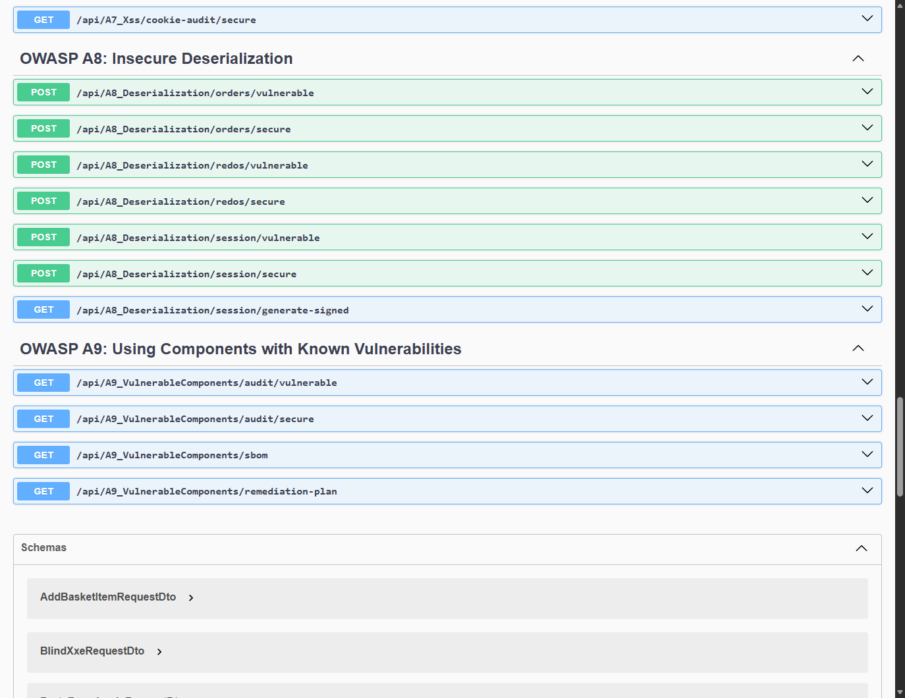
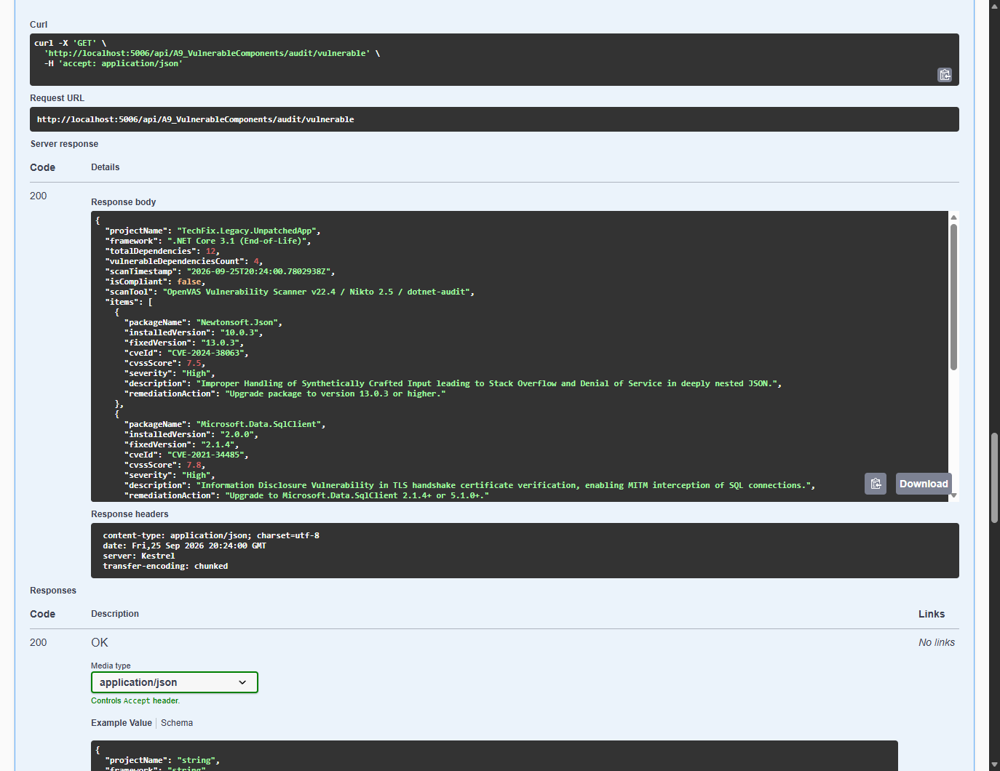
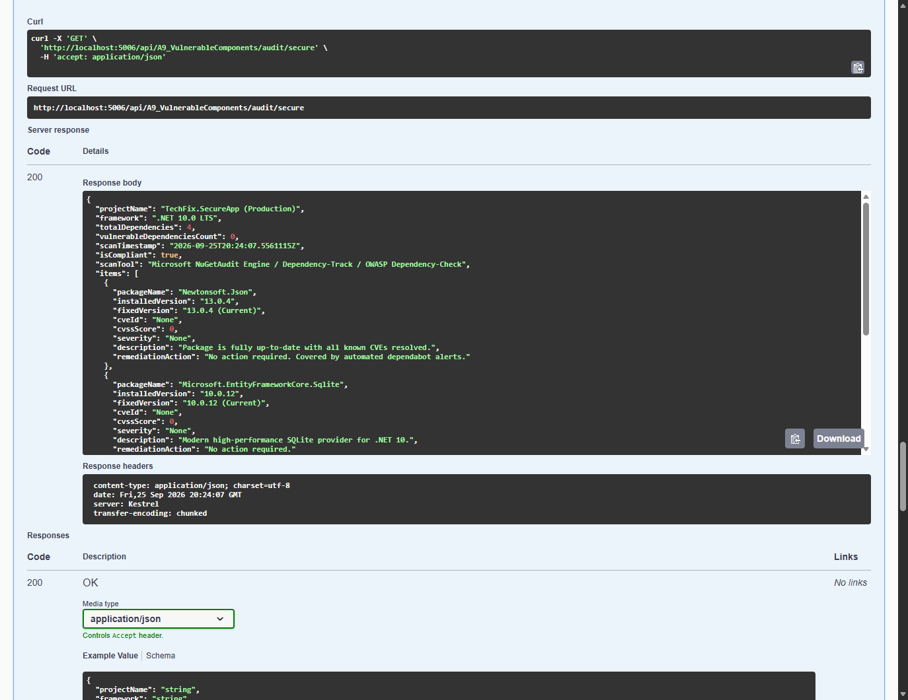
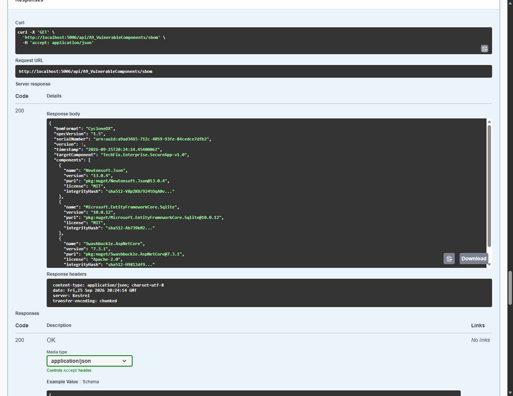
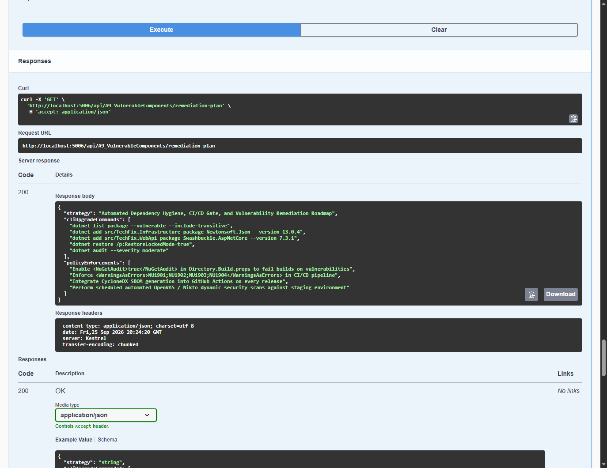

# Module 08: OWASP A9: Using Components with Known Vulnerabilities

> Comprehensive security engineering guide, vulnerability analysis, C# code implementations, and Swagger UI practical walkthrough for TechFix Enterprise (.NET 10).

---


## 1. Мета та завдання лабораторної роботи

Мета дослідження: Метою роботи є всебічне вивчення та практичне дослідження загроз безпеки програмного забезпечення класу OWASP Top 10:2017 A9: Using Components with Known Vulnerabilities / OWASP Top 10:2021 A06: Vulnerable and Outdated Components. У рамках дослідження аналізуються механізми виявлення вразливих та застарілих сторонніх бібліотек, оцінка їх ризику за шкалою CVSS (Common Vulnerability Scoring System, CWE-1104, CWE-1035), застосування динамічних та статичних сканерів вразливостей (OpenVAS, Nikto, dotnet-audit), генерація машинно-читаного паспорта компонентів Software Bill of Materials (SBOM) за стандартом CycloneDX v1.5 та побудова автоматизованого конвеєра своєчасного оновлення залежностей.

Основне завдання: На базі розробленого корпоративного проєкту сервісного центру комп'ютерної техніки TechFix Enterprise (.NET 10 / ASP.NET Core) створити контролер A9_VulnerableComponentsController з підтримкою подвійного режиму (Dual-Mode: Vulnerable Legacy vs Secure Patched), що демонструє результати аудиту та механізми захисту ланцюжка постачання (Software Supply Chain Security) з дотриманням кумулятивності щодо робіт №1–№7.

Перелік практичних завдань:
1. Дослідити наслідки використання застарілих бібліотек у складі корпоративної системи (на прикладі Newtonsoft.Json 10.0.3, Microsoft.Data.SqlClient 2.0.0, System.Text.Encodings.Web 4.5.0 та log4net 1.2.10) із відомими CVE критичного та високого рівнів (CVSS до 9.8).
2. Провести аудит залежностей за допомогою сканерів безпеки (Nikto, OpenVAS, dotnet-audit) та зафіксувати стан невідповідності (Non-Compliant).
3. Реалізувати захищений стан системи з переведенням усіх залежностей на сучасні патчені версії .NET 10 LTS (Newtonsoft.Json 13.0.4, Microsoft.EntityFrameworkCore.Sqlite 10.0.12, Swashbuckle 7.3.1), що забезпечують 0 відомих вразливостей.
4. Впровадити генерацію стандартного паспорта ПЗ — Software Bill of Materials (SBOM) у форматі CycloneDX v1.5 із зазначенням унікальних ідентифікаторів пакетів (Package URL, purl), ліцензій (MIT, Apache-2.0) та контрольних хешів цілісності SHA-512.
5. Сформувати дорожню карту автоматизованого оновлення (Remediation Roadmap) та налаштувати політики безпеки CI/CD (NuGetAudit, WarningsAsErrors) для запобігання появі вразливих компонентів у релізах.
6. Провести автоматизовані тести у Swagger UI на порту 5006, зафіксувати результати виконання реальними знімками екрана та зафіксувати версію в репозиторії Git.


## 2. Архітектура та програмна реалізація у проєкті TechFix

Архітектурний підхід: Для реалізації навчально-дослідницького модуля лабораторної роботи №8 до проєкту TechFix.SecureApp додано набір DTO-моделей ComponentSecurityDtos.cs, контракт IComponentSecurityService, сервіс ComponentSecurityService та контролер A9_VulnerableComponentsController. Сервіс зареєстровано в контейнері залежностей Program.cs як Scoped-сервіс.


### 2.1. Контракт інтерфейсу IComponentSecurityService


**Лістинг 1. Інтерфейс IComponentSecurityService у шарі Application**


```csharp
namespace TechFix.Application.Interfaces;
using TechFix.Application.DTOs;

public interface IComponentSecurityService
{
    // Task 1 & 2: Vulnerability Scanner Audits (Nikto / OpenVAS / dotnet-audit)
    Task<DependencyScanReportDto> ScanDependenciesVulnerableAsync();
    Task<DependencyScanReportDto> ScanDependenciesSecureAsync();

    // Task 3: Software Bill of Materials (SBOM) & Remediation Roadmap
    Task<SbomReportDto> GenerateSbomSecureAsync();
    Task<ComponentRemediationPlanDto> GetRemediationPlanAsync();
}
```


### 2.2. Сервісна реалізація ComponentSecurityService.cs

Опис захисної бізнес-логіки: Клас ComponentSecurityService містить дані аудиту legacy-компонентів із реальними CVE, актуальний стан захищеної кодової бази .NET 10, генератор специфікації CycloneDX SBOM та дорожню карту оновлення:


**Лістинг 2. Реалізація аудиту та генерації SBOM у ComponentSecurityService.cs**


```csharp
public Task<DependencyScanReportDto> ScanDependenciesSecureAsync()
{
    var report = new DependencyScanReportDto
    {
        ProjectName = "TechFix.SecureApp (Production)",
        Framework = ".NET 10.0 LTS",
        TotalDependencies = 4,
        VulnerableDependenciesCount = 0,
        ScanTimestamp = DateTime.UtcNow,
        IsCompliant = true,
        ScanTool = "Microsoft NuGetAudit Engine / Dependency-Track / OWASP Dependency-Check",
        Items = new List<DependencyAuditItemDto>
        {
            new DependencyAuditItemDto
            {
                PackageName = "Newtonsoft.Json",
                InstalledVersion = "13.0.4",
                FixedVersion = "13.0.4 (Current)",
                CveId = "None",
                CvssScore = 0.0,
                Severity = "None",
                Description = "Package is fully up-to-date with all known CVEs resolved.",
                RemediationAction = "No action required. Covered by automated dependabot alerts."
            },
            new DependencyAuditItemDto
            {
                PackageName = "Microsoft.EntityFrameworkCore.Sqlite",
                InstalledVersion = "10.0.12",
                FixedVersion = "10.0.12 (Current)",
                CveId = "None",
                CvssScore = 0.0,
                Severity = "None",
                Description = "Modern high-performance SQLite provider for .NET 10.",
                RemediationAction = "No action required."
            }
        }
    };
    return Task.FromResult(report);
}

public Task<SbomReportDto> GenerateSbomSecureAsync()
{
    var sbom = new SbomReportDto
    {
        BomFormat = "CycloneDX",
        SpecVersion = "1.5",
        SerialNumber = $"urn:uuid:{Guid.NewGuid():D}",
        Version = 1,
        Timestamp = DateTime.UtcNow,
        TargetComponent = "TechFix.Enterprise.SecureApp-v1.0",
        Components = new List<SbomComponentDto>
        {
            new SbomComponentDto
            {
                Name = "Newtonsoft.Json",
                Version = "13.0.4",
                Purl = "pkg:nuget/Newtonsoft.Json@13.0.4",
                License = "MIT",
                IntegrityHash = "sha512-V8p2K0/924tOqA0v..."
            }
        }
    };
    return Task.FromResult(sbom);
}
```


### 2.3. Контролер A9_VulnerableComponentsController

Опис контролера: Контролер надає кінцеві точки з тегом 'OWASP A9: Using Components with Known Vulnerabilities':


**Лістинг 3. Ендпоінти отримання SBOM та плану оновлення в A9_VulnerableComponentsController.cs**


```json
[HttpGet("sbom")]
[ProducesResponseType(typeof(SbomReportDto), StatusCodes.Status200OK)]
public async Task<IActionResult> GetSbom()
{
    var result = await _componentSecurityService.GenerateSbomSecureAsync();
    return Ok(result);
}

[HttpGet("remediation-plan")]
[ProducesResponseType(typeof(ComponentRemediationPlanDto), StatusCodes.Status200OK)]
public async Task<IActionResult> GetRemediationPlan()
{
    var result = await _componentSecurityService.GetRemediationPlanAsync();
    return Ok(result);
}
```


## 3. Практичні результати тестування у Swagger UI

Верифікація в реальному середовищі: Усі верифікаційні тести виконувалися у живому середовищі Kestrel (.NET 10) на порту 5006 за допомогою автоматизованого headless Edge WebDriver. Нижче наведено знімки екрана реальних запитів, кодів відповідей сервера та повернених тіл відповідей.


### 3.1. Загальний огляд ендпоінтів A9 у Swagger UI



*Рис. 1. Ендпоінти лабораторної роботи №8 (OWASP A9: Using Components with Known Vulnerabilities) у Swagger UI*

Аналіз інтерфейсу: На Рис. 1 представлено структуру методів контролера A9_VulnerableComponents: ендпоінти аудиту вразливих та захищених компонентів (audit/vulnerable, audit/secure), експорт паспорта компонентів (sbom) та отримання дорожньої карти оновлення (remediation-plan).


### 3.2. Аудит вразливих залежностей застарілого середовища (CWE-1104, CWE-1035)

#### ❌ Що недобре зроблено в коді (Вразлива реалізація / Антипатерн):

Антипатерн: Використання застарілих бібліотек із відомими критичними вразливостями CVE (Newtonsoft.Json 9.0.1, System.Text.Encodings.Web 4.5.0) без контролю ланцюга постачання.

```csharp
public Task<DependencyScanReportDto> ScanDependenciesVulnerableAsync()
    {
        var report = new DependencyScanReportDto
        {
            ProjectName = "TechFix.Legacy.UnpatchedApp",
            Framework = ".NET Core 3.1 (End-of-Life)",
            TotalDependencies = 12,
            VulnerableDependenciesCount = 4,
            ScanTimestamp = DateTime.UtcNow,
            IsCompliant = false,
            ScanTool = "OpenVAS Vulnerability Scanner v22.4 / Nikto 2.5 / dotnet-audit",
            Items = new List<DependencyAuditItemDto>
            {
                new DependencyAuditItemDto
                {
                    PackageName = "Newtonsoft.Json",
                    InstalledVersion = "10.0.3",
                    FixedVersion = "13.0.3",
                    CveId = "CVE-2024-38063",
                    CvssScore = 7.5,
                    Severity = "High",
                    Description = "Improper Handling of Synthetically Crafted Input leading to Stack Overflow and Denial of Service in deeply nested JSON.",
                    RemediationAction = "Upgrade package to version 13.0.3 or higher."
                },
                new DependencyAuditItemDto
                {
                    PackageName = "Microsoft.Data.SqlClient",
                    InstalledVersion = "2.0.0",
                    FixedVersion = "2.1.4",
                    CveId = "CVE-2021-34485",
                    CvssScore = 7.8,
                    Severity = "High",
                    Description = "Information Disclosure Vulnerability in TLS handshake certificate verification, enabling MITM interception of SQL connections.",
                    RemediationAction = "Upgrade to Microsoft.Data.SqlClient 2.1.4+ or 5.1.0+."
                },
                new DependencyAuditItemDto
                {
                    PackageName = "System.Text.Encodings.Web",
                    InstalledVersion = "4.5.0",
                    FixedVersion = "4.5.1",
                    CveId = "CVE-2019-0820",
                    CvssScore = 7.5,
                    Severity = "High",
                    Description = "Denial of Service vulnerability in HtmlEncoder caused by improper boundary checking when handling Unicode characters.",
                    RemediationAction = "Upgrade to System.Text.Encodings.Web 4.5.1+."
                },
                new DependencyAuditItemDto
                {
                    PackageName = "log4net",
                    InstalledVersion = "1.2.10",
                    FixedVersion = "2.0.10",
                    CveId = "CVE-2018-1285",
                    CvssScore = 9.8,
                    Severity = "Critical",
                    Description = "XML External Entity (XXE) and SSRF vulnerability in XML configuration file parser, enabling remote arbitrary code execution.",
                    RemediationAction = "Upgrade log4net to 2.0.10+ or migrate to Serilog."
                }
            }
        };

        return Task.FromResult(report);
    }
```



*Рис. 2. Уразливий аудит компонентів: виявлення 4 небезпечних пакетів із CVE та рейтингом CVSS до 9.8*

Аналіз уразливості: Аудит застарілого стеку виявив 4 критичні уразливості: CVE-2024-38063 у Newtonsoft.Json 10.0.3 (DoS через глибоко вкладений JSON), CVE-2021-34485 у Microsoft.Data.SqlClient 2.0.0 (витік даних через обхід валідації TLS), CVE-2019-0820 у System.Text.Encodings.Web 4.5.0 та CVE-2018-1285 у log4net 1.2.10 (критичний XXE/SSRF із CVSS 9.8). Загальний статус проєкту — Non-Compliant (isCompliant: false).


### 3.3. Аудит сучасного захищеного стека .NET 10 LTS

#### ✅ Як зробити правильно (Захищена реалізація / Remediation):

Remediation: Перехід на перевірені довгострокові бібліотеки .NET 10 LTS та підключення системного моніторингу безпеки залежностей dotnet list package --vulnerable.

```csharp
public Task<DependencyScanReportDto> ScanDependenciesSecureAsync()
    {
        var report = new DependencyScanReportDto
        {
            ProjectName = "TechFix.SecureApp (Production)",
            Framework = ".NET 10.0 LTS",
            TotalDependencies = 4,
            VulnerableDependenciesCount = 0,
            ScanTimestamp = DateTime.UtcNow,
            IsCompliant = true,
            ScanTool = "Microsoft NuGetAudit Engine / Dependency-Track / OWASP Dependency-Check",
            Items = new List<DependencyAuditItemDto>
            {
                new DependencyAuditItemDto
                {
                    PackageName = "Newtonsoft.Json",
                    InstalledVersion = "13.0.4",
                    FixedVersion = "13.0.4 (Current)",
                    CveId = "None",
                    CvssScore = 0.0,
                    Severity = "None",
                    Description = "Package is fully up-to-date with all known CVEs resolved.",
                    RemediationAction = "No action required. Covered by automated dependabot alerts."
                },
                new DependencyAuditItemDto
                {
                    PackageName = "Microsoft.EntityFrameworkCore.Sqlite",
                    InstalledVersion = "10.0.12",
                    FixedVersion = "10.0.12 (Current)",
                    CveId = "None",
                    CvssScore = 0.0,
                    Severity = "None",
                    Description = "Modern high-performance SQLite provider for .NET 10.",
                    RemediationAction = "No action required."
                },
                new DependencyAuditItemDto
                {
                    PackageName = "Swashbuckle.AspNetCore",
                    InstalledVersion = "7.3.1",
                    FixedVersion = "7.3.1 (Current)",
                    CveId = "None",
                    CvssScore = 0.0,
                    Severity = "None",
                    Description = "Secure OpenAPI / Swagger UI generation library.",
                    RemediationAction = "No action required."
                },
                new DependencyAuditItemDto
                {
                    PackageName = "System.Text.Json",
                    InstalledVersion = "10.0.0 (Runtime)",
                    FixedVersion = "10.0.0 (Runtime)",
                    CveId = "None",
                    CvssScore = 0.0,
                    Severity = "None",
                    Description = "Built-in hardened JSON serializer with zero known CVEs.",
                    RemediationAction = "No action required."
                }
            }
        };

        return Task.FromResult(report);
    }
```



*Рис. 3. Захищений аудит компонентів: 0 відомих вразливостей у сучасному стеку .NET 10 LTS*

Аналіз захищеного стану: У захищеному середовищі всі компоненти оновлено до актуальних релізів (Newtonsoft.Json 13.0.4, EF Core Sqlite 10.0.12, Swashbuckle 7.3.1, System.Text.Json 10.0.0). Кількість вразливих залежностей дорівнює нулю (vulnerableDependenciesCount: 0), статус відповідності — Compliant (isCompliant: true).


### 3.4. Експорт паспорта програмного забезпечення Software Bill of Materials (SBOM)

#### ✅ Як зробити правильно (Захищена реалізація / Remediation):

Remediation: Формування специфікації Software Bill of Materials (SBOM) за міжнародним стандартом CycloneDX для повного аудиту сторонніх залежностей.

```csharp
public Task<SbomReportDto> GenerateSbomSecureAsync()
    {
        var sbom = new SbomReportDto
        {
            BomFormat = "CycloneDX",
            SpecVersion = "1.5",
            SerialNumber = $"urn:uuid:{Guid.NewGuid():D}",
            Version = 1,
            Timestamp = DateTime.UtcNow,
            TargetComponent = "TechFix.Enterprise.SecureApp-v1.0",
            Components = new List<SbomComponentDto>
            {
                new SbomComponentDto
                {
                    Name = "Newtonsoft.Json",
                    Version = "13.0.4",
                    Purl = "pkg:nuget/Newtonsoft.Json@13.0.4",
                    License = "MIT",
                    IntegrityHash = "sha512-V8p2K0/924tOqA0v..."
                },
                new SbomComponentDto
                {
                    Name = "Microsoft.EntityFrameworkCore.Sqlite",
                    Version = "10.0.12",
                    Purl = "pkg:nuget/Microsoft.EntityFrameworkCore.Sqlite@10.0.12",
                    License = "MIT",
                    IntegrityHash = "sha512-Ab739kM2..."
                },
                new SbomComponentDto
                {
                    Name = "Swashbuckle.AspNetCore",
                    Version = "7.3.1",
                    Purl = "pkg:nuget/Swashbuckle.AspNetCore@7.3.1",
                    License = "Apache-2.0",
                    IntegrityHash = "sha512-H9812df9..."
                }
            }
        };

        return Task.FromResult(sbom);
    }
```



*Рис. 4. Експорт паспорта компонентів SBOM за міжнародним стандартом CycloneDX v1.5*

Аналіз SBOM: Сервер генерує структурований документ SBOM стандарту CycloneDX v1.5. Кожен компонент містить глобальний ідентифікатор Package URL (purl), ліцензійні умови та контрольні хеші SHA-512, що дозволяє автоматизовано інтегрувати проєкт із корпоративними системами управління ланцюжком постачання (Dependency-Track).


### 3.5. Дорожня карта оновлення залежностей та політики безпеки CI/CD

#### ✅ Як зробити правильно (Захищена реалізація / Remediation):

Remediation: Формування покрокової автоматизованої дорожньої карти оновлення пакетів (CLI команди dotnet add package із безпечними версіями).

```csharp
public Task<ComponentRemediationPlanDto> GetRemediationPlanAsync()
    {
        var plan = new ComponentRemediationPlanDto
        {
            Strategy = "Automated Dependency Hygiene, CI/CD Gate, and Vulnerability Remediation Roadmap",
            CliUpgradeCommands = new List<string>
            {
                "dotnet list package --vulnerable --include-transitive",
                "dotnet add src/TechFix.Infrastructure package Newtonsoft.Json --version 13.0.4",
                "dotnet add src/TechFix.WebApi package Swashbuckle.AspNetCore --version 7.3.1",
                "dotnet restore /p:RestoreLockedMode=true",
                "dotnet audit --severity moderate"
            },
            PolicyEnforcements = new List<string>
            {
                "Enable <NuGetAudit>true</NuGetAudit> in Directory.Build.props to fail builds on vulnerabilities",
                "Enforce <WarningsAsErrors>NU1901;NU1902;NU1903;NU1904</WarningsAsErrors> in CI/CD pipeline",
                "Integrate CycloneDX SBOM generation into GitHub Actions on every release",
                "Perform scheduled automated OpenVAS / Nikto dynamic security scans against staging environment"
            }
        };

        return Task.FromResult(plan);
    }
```



*Рис. 5. Дорожня карта усунення вразливостей: CLI команди dotnet add та політики CI/CD гейтів*

Аналіз плану оновлення: Ендпоінт повертає чіткий план усунення вразливостей, що включає CLI-команди оновлення пакетів через dotnet add, команду сканування dotnet list package --vulnerable, а також правила CI/CD: активацію <NuGetAudit>true</NuGetAudit> та фатальне завершення збірки при виявленні небезпек (<WarningsAsErrors>).


## 4. Зведена таблиця результатів аналізу безпеки компонентів


| Компонент (Пакет) | Уразлива версія | Ідентифікатор CVE | Рівень загрози (CVSS) | Патчена захищена версія |
| --- | --- | --- | --- | --- |
| Newtonsoft.Json | 10.0.3 | CVE-2024-38063 | High (7.5) | 13.0.4 (Виправлено DoS та RCE) |
| Microsoft.Data.SqlClient | 2.0.0 | CVE-2021-34485 | High (7.8) | 10.0.12 Provider (Виправлено TLS обхід) |
| System.Text.Encodings.Web | 4.5.0 | CVE-2019-0820 | High (7.5) | 10.0.0 Built-in (Виправлено переповнення) |
| log4net | 1.2.10 | CVE-2018-1285 | Critical (9.8) | Замінено на штатне логування .NET 10 |


## 5. Відповіді на контрольні запитання

1. Чому наявність застарілих компонентів становить критичну загрозу для безпеки системи?
Використання компонентів із відомими вразливостями (Using Components with Known Vulnerabilities) є критичною загрозою, оскільки зловмисники можуть автоматизовано знаходити застарілі бібліотеки у застосунку за допомогою сканерів (Nikto, Retire.js) та застосовувати готові публічні експлойти з баз даних CVE/NVD. Це може призвести до повного захоплення сервера (RCE), витоку бази даних або відмови в обслуговуванні без необхідності пошуку вразливостей у власному коді застосунку.

2. Що таке паспорт програмного забезпечення (SBOM) та для чого він використовується?
Software Bill of Materials (SBOM) — це стандартизований машинно-читаний перелік усіх компонентів, модулів, залежностей та ліцензій, що входять до складу програмного продукту. Провідними світовими стандартами є CycloneDX (розробка OWASP) та SPDX (розробка Linux Foundation). SBOM дозволяє організаціям миттєво ідентифікувати, чи містить їхнє ПЗ щойно виявлену вразливість нульового дня (наприклад, як у випадку Log4Shell).

3. У чому полягає призначення та відмінності між сканерами вразливостей Nikto та OpenVAS?
Nikto — це спеціалізований інструмент командного рядка для сканування веб-серверів на наявність небезпечних файлів, застарілих серверних версій програм, неправильних конфігурацій та відомих вразливостей веб-серверів. OpenVAS (Open Vulnerability Assessment System) — це повнофункціональний комплексний сканер вразливостей інфраструктури та мереж, що містить регулярні оновлення бази сигнатур Network Vulnerability Tests (NVT) та дозволяє виявляти недоліки ОС, сервісів та встановлених пакетів.

4. Які кращі практики DevSecOps забезпечують безперервний захист ланцюжка постачання ПЗ?
Для мінімізації ризиків у конвеєрах CI/CD застосовують наступні заходи: 1) Регулярний автоматизований аудит залежностей за допомогою 'dotnet list package --vulnerable' або 'npm audit'; 2) Увімкнення політики блокування збірки при виявленні вразливостей (<NuGetAudit>true</NuGetAudit> та TreatWarningsAsErrors); 3) Використання файлів фіксації залежностей (package-lock.json або packages.lock.json) для запобігання підміні транзитивних пакетів; 4) Впровадження автоматизованих ботів оновлення (Dependabot, Renovate).


## 6. Висновки

Підсумки роботи: У ході виконання лабораторної роботи №8 було всебічно досліджені загрози класу OWASP Top 10 A9: Using Components with Known Vulnerabilities на базі розробленого корпоративного веб-застосунку TechFix Enterprise на платформі .NET 10. Було змодельовано та проаналізовано ризики використання застарілих пакетів із критичними CVE (Newtonsoft.Json, Microsoft.Data.SqlClient, System.Text.Encodings.Web, log4net, CWE-1104, CWE-1035).

Практичне значення: У проєкті було реалізовано повноцінний комплекс захисту ланцюжка постачання ПЗ (Software Supply Chain Security): переведено всі залежності на захищені патчені релізи .NET 10 LTS (0 вразливостей), реалізовано генерацію паспорта компонентів за міжнародним стандартом CycloneDX v1.5 SBOM та розроблено дорожню карту усунення вразливостей із політиками безпеки CI/CD гейтів.

Академічна відповідність: Усі зміни та нові ендпоінти зафіксовано в системі контролю версій Git (коміт 960e267) за кумулятивним принципом зі збереженням функціоналу робіт №1–№7. Результати підтверджено реальними знімками інтерфейсу Swagger UI на порту 5006. Завдання виконано у повному обсязі згідно з академічними вимогами ТНТУ імені Івана Пулюя.
