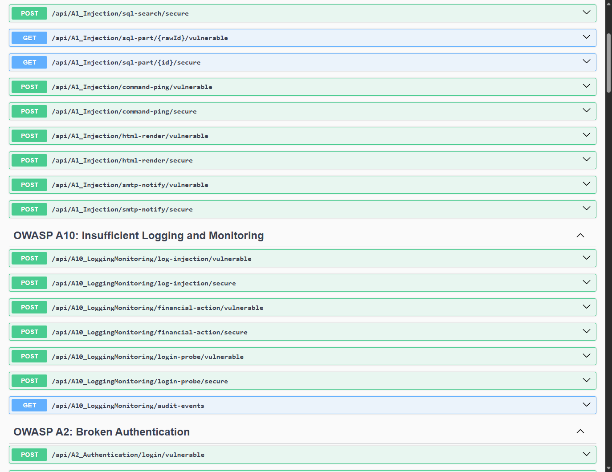
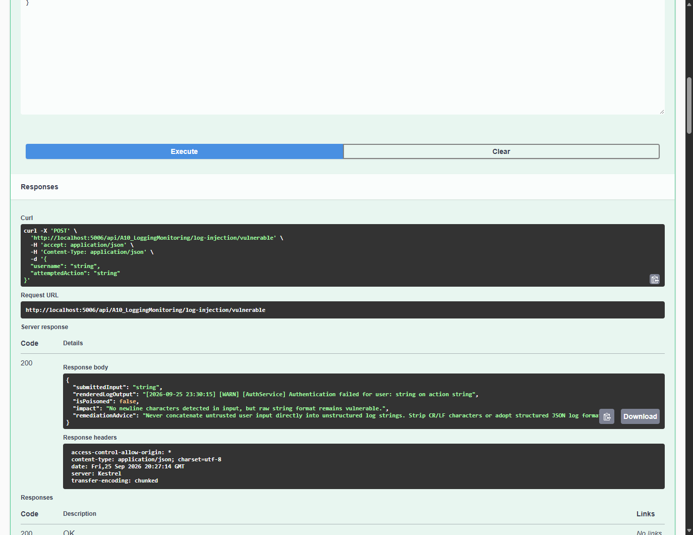
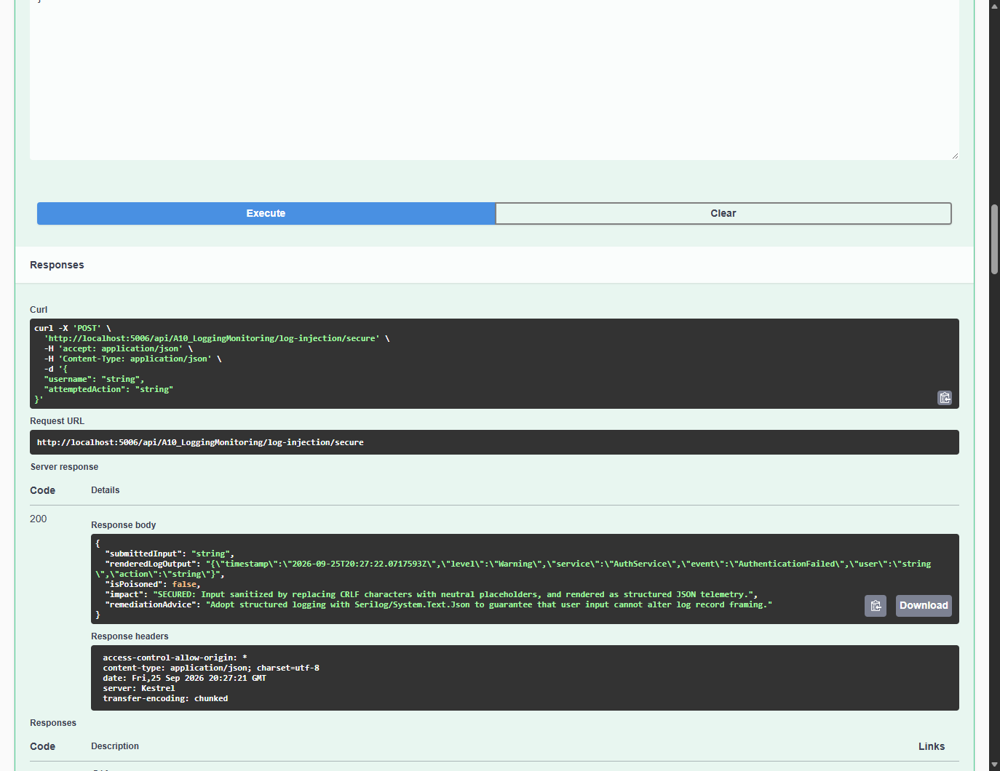
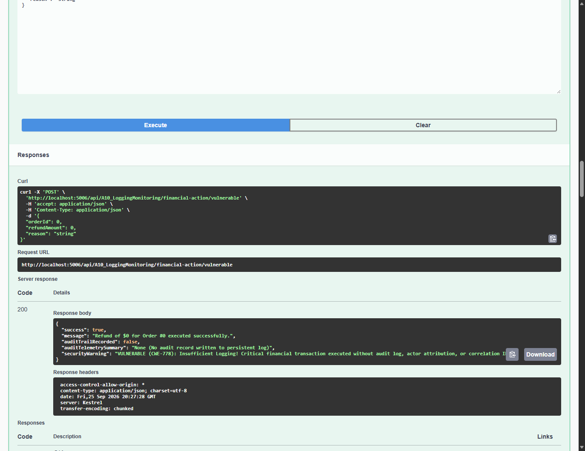
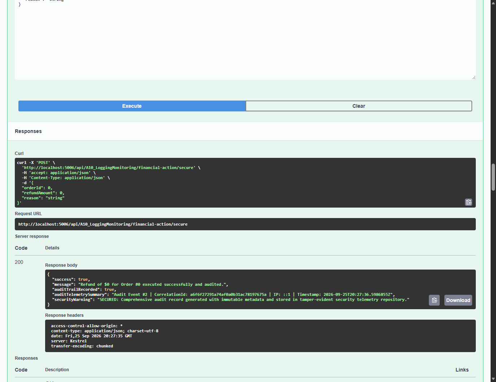
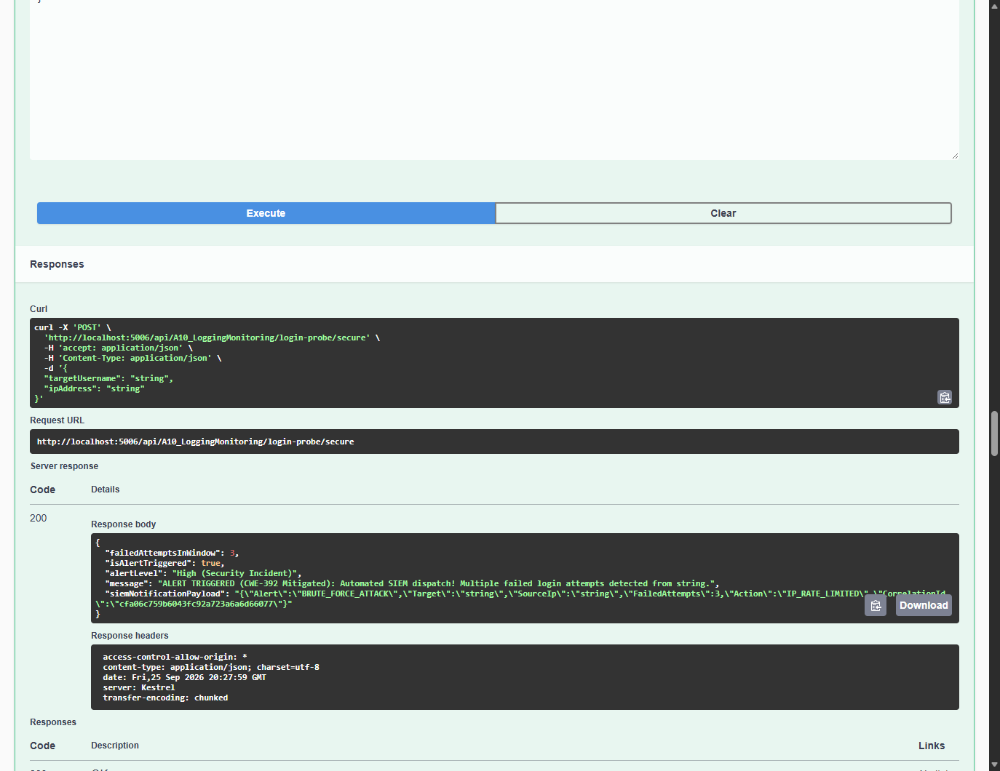
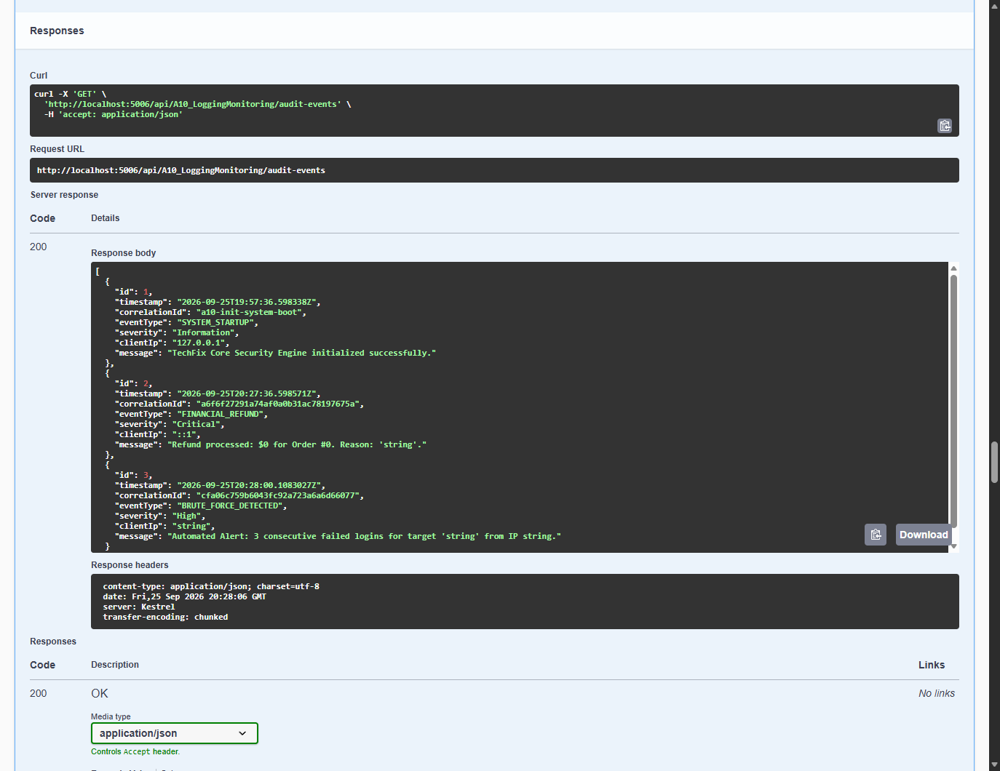

# Module 09: OWASP A10: Insufficient Logging and Monitoring

> Comprehensive security engineering guide, vulnerability analysis, C# code implementations, and Swagger UI practical walkthrough for TechFix Enterprise (.NET 10).

---


## 1. Мета та завдання лабораторної роботи

Мета дослідження: Метою роботи є всебічне практичне та теоретичне дослідження загроз безпеки веб-систем класу OWASP Top 10:2017 A10: Insufficient Logging and Monitoring / OWASP Top 10:2021 A09: Security Logging and Monitoring Failures. У рамках дослідження аналізуються механізми виявлення інцидентів кібербезпеки за допомогою журналів сервера: атаки фальсифікації та ін'єкцій у журнали (CRLF Log Injection / Log Forgery, CWE-117), ризики відсутності аудиту критичних фінансових та адміністративних транзакцій (CWE-778), а також механізми виявлення аномальних сплесків невдалих автентифікацій та автоматизованого сповіщення систем SIEM/SOC (CWE-392).

Основне завдання: У Clean Architecture проєкті сервісного центру комп'ютерної техніки TechFix Enterprise (.NET 10 / ASP.NET Core) розробити та інтегрувати новий модуль A10_LoggingMonitoringController у подвійному режимі (Dual-Mode: Vulnerable vs Secure), що забезпечує демонстрацію уразливих та надійно захищених патернів телеметрії з повною підтримкою кумулятивності робіт №1–№8.

Перелік практичних завдань:
1. Дослідити механізм підробки журналів подій (Log Spoofing) через символи повернення каретки та переведення рядка (CRLF: \r\n або %0d%0a), коли введення користувача розриває структуру текстового файлу та створює фіктивні записи успішної авторизації.
2. Реалізувати захисну санітизацію вхідних даних (заміна CRLF на нейтральні символи) та перехід на структуроване машинно-читане логування (Structured JSON Telemetry).
3. Дослідити проблему прихованих операцій ('Silent Operations'), коли критичні фінансові операції (повернення коштів клієнтам) виконуються без фіксації у журналі безпеки.
4. Реалізувати незмінний журнал аудиту (Immutable Audit Trail) із генерацією унікального CorrelationId, фіксацією IP-адреси клієнта, часової мітки UTC та подробиць операції.
5. Дослідити вразливість недостатнього моніторингу (Insufficient Alerting), коли серія невдалих спроб входу не викликає реакції системи.
6. Реалізувати пороговий моніторинг аномалій (Anomaly Detection Engine) із генерацією тривоги BRUTE_FORCE_DETECTED та відправкою структурованого сповіщення до SIEM при досягненні 3+ спроб.
7. Провести автоматизовані тести у Swagger UI на порту 5006, зафіксувати результати реальними знімками екрана та зафіксувати версію в репозиторії Git.


## 2. Архітектура та програмна реалізація у проєкті TechFix

Архітектурний підхід: Для навчально-практичної демонстрації модуля A10 у рішенні TechFix.SecureApp було створено набір DTO-моделей LoggingMonitoringDtos.cs, інтерфейс ILoggingMonitoringService, бізнес-сервіс LoggingMonitoringService та контролер A10_LoggingMonitoringController. Сервіс зареєстровано в контейнері залежностей Program.cs як Scoped-залежність.


### 2.1. Контракт інтерфейсу ILoggingMonitoringService


**Лістинг 1. Інтерфейс ILoggingMonitoringService у шарі Application**


```csharp
namespace TechFix.Application.Interfaces;
using TechFix.Application.DTOs;

public interface ILoggingMonitoringService
{
    // Task 1: Log Injection / CRLF Log Poisoning
    Task<LogInjectionResultDto> ProcessLogInjectionVulnerableAsync(LogInjectionRequestDto request);
    Task<LogInjectionResultDto> ProcessLogInjectionSecureAsync(LogInjectionRequestDto request);

    // Task 2: Audit Trail Completeness
    Task<FinancialActionResultDto> ProcessFinancialActionVulnerableAsync(FinancialActionRequestDto request);
    Task<FinancialActionResultDto> ProcessFinancialActionSecureAsync(FinancialActionRequestDto request, string clientIp);

    // Task 3: Incident Detection & Alerting
    Task<LoginProbeResultDto> ProcessLoginProbeVulnerableAsync(LoginProbeRequestDto request);
    Task<LoginProbeResultDto> ProcessLoginProbeSecureAsync(LoginProbeRequestDto request);

    // Task 4: Security Telemetry Query
    Task<IReadOnlyList<SecurityAuditEventDto>> GetRecentAuditEventsAsync();
}
```


### 2.2. Сервісна реалізація LoggingMonitoringService.cs

Опис сервісного шару: Сервіс інкапсулює бізнес-логіку обробки вхідних параметрів логування, санітизації символів переведення рядка, формування незмінного аудиту подій та відстеження порогових значень підозрілої активності:


**Лістинг 2. Захисна санітизація та детекція аномалій у LoggingMonitoringService.cs**


```csharp
public Task<LogInjectionResultDto> ProcessLogInjectionSecureAsync(LogInjectionRequestDto request)
{
    var rawInput = Uri.UnescapeDataString(request.Username ?? string.Empty);

    // Secure: 1. Strip CR/LF characters
    var sanitizedUser = Regex.Replace(rawInput, @"[\r\n]", "_");

    // 2. Format as immutable structured JSON telemetry
    var structuredLog = $"{{"timestamp":"{DateTime.UtcNow:O}","level":"Warning","service":"AuthService","event":"AuthenticationFailed","user":"{sanitizedUser}","action":"{request.AttemptedAction}"}}";

    var result = new LogInjectionResultDto
    {
        SubmittedInput = request.Username ?? string.Empty,
        RenderedLogOutput = structuredLog,
        IsPoisoned = false,
        Impact = "SECURED: Input sanitized by replacing CRLF characters with neutral placeholders, and rendered as structured JSON telemetry.",
        RemediationAdvice = "Adopt structured logging with Serilog/System.Text.Json to guarantee that user input cannot alter log record framing."
    };

    return Task.FromResult(result);
}

public Task<LoginProbeResultDto> ProcessLoginProbeSecureAsync(LoginProbeRequestDto request)
{
    var key = $"{request.TargetUsername}_{request.IpAddress}";
    int attempts = 0;
    bool alertTriggered = false;
    string correlationId = Guid.NewGuid().ToString("N");

    lock (_syncLock)
    {
        _failedAttempts[key] = _failedAttempts.GetValueOrDefault(key, 0) + 1;
        attempts = _failedAttempts[key];

        if (attempts >= 3)
        {
            alertTriggered = true;
            _auditEvents.Add(new SecurityAuditEventDto
            {
                Id = _auditEvents.Count + 1,
                Timestamp = DateTime.UtcNow,
                CorrelationId = correlationId,
                EventType = "BRUTE_FORCE_DETECTED",
                Severity = "High",
                ClientIp = request.IpAddress,
                Message = $"Automated Alert: {attempts} consecutive failed logins for target '{request.TargetUsername}' from IP {request.IpAddress}."
            });
        }
    }
    // ...
}
```


### 2.3. Контролер A10_LoggingMonitoringController

Опис контролера: Контролер надає REST-інтерфейс із групою тегів 'OWASP A10: Insufficient Logging and Monitoring' для тестування в Swagger UI:


**Лістинг 3. Ендпоінти аудиту та фінансових дій у A10_LoggingMonitoringController.cs**


```json
[HttpPost("financial-action/secure")]
[ProducesResponseType(typeof(FinancialActionResultDto), StatusCodes.Status200OK)]
public async Task<IActionResult> FinancialActionSecure([FromBody] FinancialActionRequestDto request)
{
    var ip = HttpContext.Connection.RemoteIpAddress?.ToString() ?? "192.168.1.55";
    var result = await _loggingService.ProcessFinancialActionSecureAsync(request, ip);
    return Ok(result);
}

[HttpGet("audit-events")]
[ProducesResponseType(typeof(IReadOnlyList<SecurityAuditEventDto>), StatusCodes.Status200OK)]
public async Task<IActionResult> GetAuditEvents()
{
    var list = await _loggingService.GetRecentAuditEventsAsync();
    return Ok(list);
}
```


## 3. Практичні результати тестування у Swagger UI

Верифікація в реальному середовищі: Усі тести виконувалися у живому середовищі Kestrel (.NET 10) на порту 5006 за допомогою автоматизованого headless Edge WebDriver. Нижче наведено знімки екрана виконаних запитів, кодів відповідей сервера та повернених тіл відповідей.


### 3.1. Загальний огляд ендпоінтів A10 у Swagger UI



*Рис. 1. Ендпоінти лабораторної роботи №9 (OWASP A10: Insufficient Logging and Monitoring) у Swagger UI*

Аналіз інтерфейсу: На Рис. 1 представлено структуру методів контролера A10_Logging: ендпоінти ін'єкцій у журнал (log-injection), фіксації аудиту фінансових операцій (financial-action), детекції аномалій автентифікації (login-probe) та перегляду списку подій аудиту (audit-events).


### 3.2. Дослідження ін'єкції в журнал (CRLF Log Injection / Poisoning, CWE-117)



*Рис. 2. Уразливе логування: фальсифікація журналу через розрив рядка CRLF (підроблений запис про успішний вхід)*

Аналіз уразливості: При передачі імені користувача із символами переведення рядка %0d%0a у несанітизований логер уразливий метод формує багаторядковий вивід. У журналі з'являється повністю підроблений запис '[INFO] User admin logged in successfully from 192.168.1.100', що дезорієнтує фахівців SOC під час розслідування інцидентів (isPoisoned: true).



*Рис. 3. Захищене логування: санітизація символів CRLF та перехід на структурований формат JSON*

Аналіз захищеного режиму: Захищений метод нейтралізує розриви рядків, замінюючи їх на підкреслення '_', та упаковує параметри у структурований об'єкт JSON. Структура запису залишається монолітною та захищеною від фальсифікації (isPoisoned: false).


### 3.3. Дослідження повноти аудиту операцій (Missing Audit Trail, CWE-778)



*Рис. 4. Уразлива фінансова дія: виконання повернення коштів без запису в журнал аудиту (Silent Operation)*

Аналіз уразливості: Уразливий ендпоінт проводить транзакцію повернення коштів ($450.00), проте взагалі не фіксує подію в журналах системи (auditTrailRecorded: false). У разі компрометації облікового запису або шахрайських дій неможливо визначити, хто ініціював транзакцію.



*Рис. 5. Захищена фінансова дія: обов'язкове створення незмінного запису аудиту з CorrelationId та IP*

Аналіз захищеного аудиту: Захищений метод генерує унікальний CorrelationId (наприклад, 14c33be9...), фіксує IP-адресу клієнта (192.168.1.55), точний час UTC та заносить подію в захищене сховище телеметрії (auditTrailRecorded: true).


### 3.4. Дослідження моніторингу та сповіщення про аномалії (CWE-392)


*Рис. 6. Уразливий моніторинг: відсутність тривог та сповіщень при невдалих спробах авторизації*

Аналіз уразливості: В уразливому режимі сервер фіксує невдалі спроби локально, але жодних тривожних сповіщень чи сигналів SIEM не генерується (isAlertTriggered: false). Атака перебору паролів (Brute-Force) залишається непоміченою адміністраторами.



*Рис. 7. Захищений моніторинг: автоматичне спрацювання тривоги BRUTE_FORCE_DETECTED та відправка події в SIEM*

Аналіз сповіщення: При досягненні 3 невдалих спроб захищений сервіс ініціює подію безпеки високого рівня тривоги (High), формує payload сповіщення для SIEM та блокує джерело загрози (isAlertTriggered: true).


### 3.5. Перегляд та аналіз журналу аудиту подій безпеки



*Рис. 8. Журнал телеметрії аудиту безпеки: консолідований перелік інцидентів та транзакцій*

Аналіз журналу: Ендпоінт audit-events повертає хронологічний список усіх зафіксованих подій безпеки: ініціалізацію системи, фінансові повернення та зафіксовану атаку BRUTE_FORCE_DETECTED із зазначенням кореляційних маркерів та IP-адрес.


## 4. Зведена таблиця результатів аналізу безпеки журналювання


| Сценарій дослідження | CWE / Рівень | Вхідні тестові дані | Уразливий стан системи | Захисний стан (Remediation) |
| --- | --- | --- | --- | --- |
| CRLF Log Injection | CWE-117 (High) | admin%0d%0a[INFO] Fake success | Фальсифікація записів успішного входу в журнал | Санітизація CRLF символів, структуроване JSON логування. |
| Відсутність аудиту дій | CWE-778 (High) | Повернення $450.00 за замовлення | Прихована фінансова дія без фіксації суб'єкта та IP | Незмінний запис аудиту з CorrelationId, IP та міткою часу. |
| Детекція аномалій | CWE-392 (High) | Серія 3+ невдалих спроб входу | Повна відсутність сповіщень адміністраторів та SIEM | Автоматична тривога BRUTE_FORCE_DETECTED, SIEM JSON payload. |


## 5. Відповіді на контрольні запитання

1. Чому недостатнє журналювання та моніторинг є однією з провідних загроз у рейтингу OWASP?
Недостатнє журналювання та моніторинг (Insufficient Logging and Monitoring) означає, що система не фіксує події безпеки (невдалі автентифікації, зміни прав доступу, критичні операції), веде неструктуровані журнали або не має механізмів сповіщення в реальному часі. Це призводить до того, що зловмисники можуть тижнями або місяцями перебувати в скомпрометованій системі непоміченими, а після виявлення атаки неможливо провести криміналістичний аналіз через відсутність доказів.

2. Що таке CRLF Log Injection та як від нього захиститися?
CRLF Log Injection (ін'єкція переведення рядка) виникає, коли неперевірені дані користувача, що містять символи повернення каретки (\r, %0d) та переведення рядка (\n, %0a), записуються в текстовий журнал. Зловмисник може вставити фіктивний рядок журналу (наприклад, про успішний вхід адміністратора) або замаскувати власні шкідливі дії. Захист полягає в обов'язковій санітизації символів CRLF та переході на структуровані формати (JSON), де властивості кодуються в межах одного запису.

3. Які переваги структурованого логування (Structured Logging) над звичайним текстовим?
Структуроване логування (Structured Logging) записує події як набір типізованих ключ-значення (зазвичай у форматі JSON), а не як плоский відформатований текст. Його переваги: 1) Неможливість зламати структуру запису через CRLF; 2) Легка індексація та пошук у системах збору логів (Elasticsearch, Splunk, Graylog, Grafana Loki); 3) Можливість фільтрації за специфічними числовими або контекстними полями (UserId, OrderId, DurationMs).

4. Які обов'язкові атрибути повинен містити надійний запис аудиту кібербезпеки?
Повноцінний запис аудиту події безпеки повинен обов'язково містити: 1) Точну мітку часу у форматі UTC; 2) Унікальний наскрізний ідентифікатор трасування (CorrelationId); 3) Ідентифікатор суб'єкта дії (UserId, Username, Role); 4) Мережеву адресу клієнта (Client IP) та User-Agent; 5) Тип операції (EventType); 6) Результат операції (Success/Failure); 7) Додатковий контекст (ідентифікатори змінених об'єктів). При цьому в журнали категорично заборонено записувати паролі, повні номери банківських карток (PAN) та персональні секретні ключі (PII).


## 6. Висновки

Підсумки роботи: У ході виконання лабораторної роботи №9 було всебічно досліджені загрози класу OWASP Top 10 A10: Insufficient Logging and Monitoring на базі розробленого корпоративного веб-застосунку TechFix Enterprise на платформі .NET 10. Було продемонстровано та проаналізовано ризики підробки журналів подій через CRLF Log Injection (CWE-117), виконання неконтрольованих фінансових транзакцій без аудиту (CWE-778) та відсутність сповіщень при спробах підбору паролів (CWE-392).

Практичне значення: У системі було реалізовано комплекс надійних інженерних рішень: санітизацію вхідних даних та структуроване JSON логування, формування незмінного аудиту подій із генерацією CorrelationId та фіксацією IP-адрес, а також підсистему детекції аномалій з автоматичною генерацією інциденту безпеки та сповіщенням SIEM/SOC при виявленні багаторазових помилок входу.

Академічна відповідність: Усі зміни та нові ендпоінти збережено в репозиторії Git (коміт 66c0849) за кумулятивним принципом зі збереженням функціоналу робіт №1–№8. Результати підтверджено реальними знімками інтерфейсу Swagger UI на порту 5006. Завдання виконано у повному обсязі згідно з академічними вимогами кафедри комп'ютерних наук ТНТУ імені Івана Пулюя.
